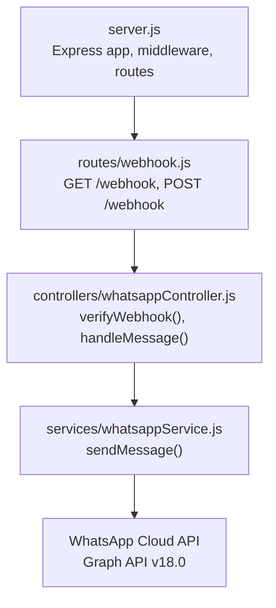
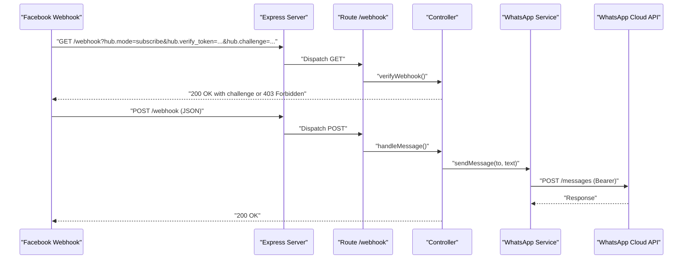
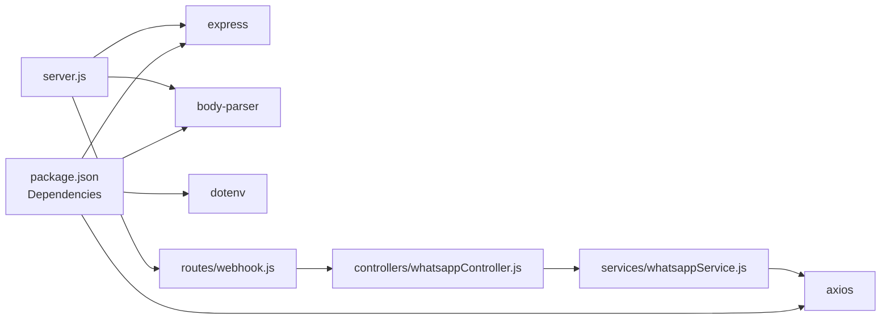

# API Reference

<cite>
**Referenced Files in This Document**
- [server.js](file://leadpilot-ai/server.js)
- [webhook.js](file://leadpilot-ai/routes/webhook.js)
- [whatsappController.js](file://leadpilot-ai/controllers/whatsappController.js)
- [whatsappService.js](file://leadpilot-ai/services/whatsappService.js)
- [package.json](file://leadpilot-ai/package.json)
</cite>

## Table of Contents
1. [Introduction](#introduction)
2. [Project Structure](#project-structure)
3. [Core Components](#core-components)
4. [Architecture Overview](#architecture-overview)
5. [Detailed Component Analysis](#detailed-component-analysis)
6. [Dependency Analysis](#dependency-analysis)
7. [Performance Considerations](#performance-considerations)
8. [Troubleshooting Guide](#troubleshooting-guide)
9. [Conclusion](#conclusion)
10. [Appendices](#appendices)

## Introduction
This document provides comprehensive API documentation for LeadPilot AI’s webhook endpoints. It covers:
- GET /webhook for Facebook challenge-response verification
- POST /webhook for inbound message processing
- WhatsApp Cloud API integration patterns and authentication
- Request/response examples, HTTP status codes, error handling, and rate limiting considerations
- Client implementation guidelines for webhook setup and testing

## Project Structure
The application is a minimal Express server that exposes a single route group for webhooks. Routing delegates to a controller, which orchestrates service calls to the WhatsApp Cloud API.

**Diagram sources**
- [server.js:1-19](file://leadpilot-ai/server.js#L1-L19)
- [webhook.js:1-12](file://leadpilot-ai/routes/webhook.js#L1-L12)
- [whatsappController.js:1-40](file://leadpilot-ai/controllers/whatsappController.js#L1-L40)
- [whatsappService.js:1-23](file://leadpilot-ai/services/whatsappService.js#L1-L23)

**Section sources**
- [server.js:1-19](file://leadpilot-ai/server.js#L1-L19)
- [webhook.js:1-12](file://leadpilot-ai/routes/webhook.js#L1-L12)
- [package.json:1-21](file://leadpilot-ai/package.json#L1-L21)

## Core Components
- Express server initializes environment, JSON body parsing, and mounts the webhook route group.
- Route module defines GET and POST handlers for the webhook endpoint.
- Controller implements verification and message handling logic.
- Service encapsulates outbound requests to the WhatsApp Cloud API using Bearer token authentication.

Key runtime behaviors:
- GET /webhook performs challenge-response verification using query parameters.
- POST /webhook processes incoming message events and auto-replies via the WhatsApp Cloud API.

**Section sources**
- [server.js:1-19](file://leadpilot-ai/server.js#L1-L19)
- [webhook.js:1-12](file://leadpilot-ai/routes/webhook.js#L1-L12)
- [whatsappController.js:1-40](file://leadpilot-ai/controllers/whatsappController.js#L1-L40)
- [whatsappService.js:1-23](file://leadpilot-ai/services/whatsappService.js#L1-L23)

## Architecture Overview
The webhook endpoints follow a layered architecture:
- HTTP transport: Express server
- Routing: Route module
- Controllers: Business logic for verification and message handling
- Services: External API integration with WhatsApp Cloud API

**Diagram sources**
- [server.js:1-19](file://leadpilot-ai/server.js#L1-L19)
- [webhook.js:1-12](file://leadpilot-ai/routes/webhook.js#L1-L12)
- [whatsappController.js:1-40](file://leadpilot-ai/controllers/whatsappController.js#L1-L40)
- [whatsappService.js:1-23](file://leadpilot-ai/services/whatsappService.js#L1-L23)

## Detailed Component Analysis

### GET /webhook — Challenge-Response Verification
Purpose:
- Verify ownership of the webhook endpoint during Facebook webhook subscription.

Behavior:
- Reads query parameters: hub.mode, hub.verify_token, hub.challenge
- Validates that hub.mode equals "subscribe" and hub.verify_token matches the configured token
- On success: responds with HTTP 200 and the hub.challenge value
- On failure: responds with HTTP 403 Forbidden

Validation rules:
- Required parameters: hub.mode, hub.verify_token, hub.challenge
- hub.mode must equal "subscribe"
- hub.verify_token must equal the configured token

Success response:
- Status: 200 OK
- Body: Plain text containing the hub.challenge value

Error scenarios:
- Missing or invalid hub.mode or hub.verify_token: 403 Forbidden
- Any unexpected error during processing: 403 Forbidden

Example request:
- GET /webhook?hub.mode=subscribe&hub.verify_token=leadpilot_token&hub.challenge=challenge_value

Example success response:
- Status: 200
- Body: challenge_value

Example error responses:
- Status: 403

Notes:
- The verify token is a constant in the controller; ensure it matches the value configured in the Facebook webhook subscription.

**Section sources**
- [whatsappController.js:4-14](file://leadpilot-ai/controllers/whatsappController.js#L4-L14)

### POST /webhook — Message Processing
Purpose:
- Receive inbound messages from the WhatsApp Cloud API and respond accordingly.

Request body schema:
- The endpoint expects a JSON payload conforming to the Facebook webhook event structure.
- The controller extracts the first message from the nested structure:
  - entry[0].changes[0].value.messages[0]
- Message fields used:
  - from: sender’s phone number
  - text.body: message text content

Processing logic:
- If a message is present, logs the phone number and text
- Sends an auto-reply via the WhatsApp Cloud API using the service layer
- Responds with HTTP 200 regardless of whether a message was processed

Response handling:
- Success: 200 OK
- Error: 500 Internal Server Error

Example request body (structure):
- entry[0].changes[0].value.messages[0].from
- entry[0].changes[0].value.messages[0].text.body

Example success response:
- Status: 200

Example error response:
- Status: 500

Security and authentication:
- The controller does not enforce authentication on the POST endpoint.
- Authentication is handled by the WhatsApp Cloud API when delivering events to the webhook.

Rate limiting considerations:
- No explicit rate limiting is implemented in the controller or service.
- Facebook may apply platform-level rate limits; design clients to handle retries with backoff.

**Section sources**
- [whatsappController.js:16-39](file://leadpilot-ai/controllers/whatsappController.js#L16-L39)

### WhatsApp Cloud API Integration
Integration pattern:
- Outbound messages are sent to the Graph API endpoint for the configured phone ID.
- Uses Bearer token authentication via Authorization header.
- Content-Type is set to application/json.

Endpoint:
- https://graph.facebook.com/v18.0/{PHONE_ID}/messages

Headers:
- Authorization: Bearer {WHATSAPP_TOKEN}
- Content-Type: application/json

Request body:
- messaging_product: "whatsapp"
- to: recipient phone number
- type: "text"
- text.body: message text

Example request:
- POST https://graph.facebook.com/v18.0/{PHONE_ID}/messages
- Headers: Authorization: Bearer {WHATSAPP_TOKEN}, Content-Type: application/json
- Body: { messaging_product: "whatsapp", to: "+1234567890", type: "text", text: { body: "Hello" } }

**Section sources**
- [whatsappService.js:6-22](file://leadpilot-ai/services/whatsappService.js#L6-L22)

## Dependency Analysis
External libraries and their roles:
- express: HTTP server and routing framework
- body-parser: JSON body parsing middleware
- dotenv: Environment variable loading
- axios: HTTP client for external API calls

**Diagram sources**
- [package.json:13-19](file://leadpilot-ai/package.json#L13-L19)
- [server.js:1-19](file://leadpilot-ai/server.js#L1-L19)
- [webhook.js:1-12](file://leadpilot-ai/routes/webhook.js#L1-L12)
- [whatsappController.js:1-40](file://leadpilot-ai/controllers/whatsappController.js#L1-L40)
- [whatsappService.js:1-23](file://leadpilot-ai/services/whatsappService.js#L1-L23)

**Section sources**
- [package.json:13-19](file://leadpilot-ai/package.json#L13-L19)

## Performance Considerations
- The controller performs synchronous logging and asynchronous outbound API calls. Ensure the service layer handles timeouts and retries appropriately.
- Avoid blocking operations in the request handler; the current implementation delegates to an async service.
- Consider adding circuit breakers and exponential backoff for the WhatsApp Cloud API calls to mitigate transient failures.

## Troubleshooting Guide
Common issues and resolutions:
- 403 Forbidden on GET /webhook
  - Cause: hub.mode is not "subscribe" or hub.verify_token does not match the configured token.
  - Resolution: Ensure the verify token and mode match the Facebook subscription configuration.
- 403 Forbidden on POST /webhook
  - Cause: The controller does not enforce authentication; if Facebook is not sending events, verify subscription and endpoint URL.
  - Resolution: Confirm webhook subscription and endpoint URL in the Meta developer console.
- 500 Internal Server Error on POST /webhook
  - Cause: Exception thrown during message processing or service call.
  - Resolution: Check server logs for errors and ensure environment variables are set for the WhatsApp token and phone ID.
- Missing environment variables
  - Cause: WHATSAPP_TOKEN or PHONE_ID not configured.
  - Resolution: Set environment variables and restart the server.

Operational checks:
- Verify the server is reachable from the internet and the route is mounted under /webhook.
- Confirm the verify token used in the webhook subscription matches the controller’s constant.
- Ensure the WhatsApp Cloud API credentials and phone ID are correct.

**Section sources**
- [whatsappController.js:4-14](file://leadpilot-ai/controllers/whatsappController.js#L4-L14)
- [whatsappController.js:16-39](file://leadpilot-ai/controllers/whatsappController.js#L16-L39)
- [whatsappService.js:3-4](file://leadpilot-ai/services/whatsappService.js#L3-L4)

## Conclusion
LeadPilot AI’s webhook endpoints provide a straightforward integration with Facebook’s webhook platform and the WhatsApp Cloud API. The GET endpoint validates subscriptions using challenge-response, while the POST endpoint processes inbound messages and auto-replies. For production deployments, ensure secure environment configuration, implement robust error handling, and consider rate limiting and retry policies for external API calls.

## Appendices

### Endpoint Definitions

- GET /webhook
  - Purpose: Verify webhook subscription
  - Query parameters:
    - hub.mode: Must equal "subscribe"
    - hub.verify_token: Must match the configured token
    - hub.challenge: Challenge string to echo back
  - Success response:
    - Status: 200
    - Body: Plain text challenge value
  - Error responses:
    - Status: 403

- POST /webhook
  - Purpose: Process inbound message events
  - Request body:
    - entry[0].changes[0].value.messages[0].from
    - entry[0].changes[0].value.messages[0].text.body
  - Success response:
    - Status: 200
  - Error responses:
    - Status: 500

### Authentication and Security Notes
- GET /webhook uses a constant verify token in the controller. Align this with the value configured in the Facebook webhook subscription.
- POST /webhook does not implement endpoint-level authentication; rely on Facebook’s delivery mechanism.
- Outbound calls to the WhatsApp Cloud API use Bearer token authentication via Authorization header.

### Environment Variables
- WHATSAPP_TOKEN: Access token for the WhatsApp Business Platform
- PHONE_ID: Phone ID associated with the business account

### Example Requests and Responses

- GET /webhook
  - Request: GET /webhook?hub.mode=subscribe&hub.verify_token=leadpilot_token&hub.challenge=challenge_value
  - Success response: 200 OK with body challenge_value
  - Error response: 403 Forbidden

- POST /webhook
  - Request body structure:
    - entry[0].changes[0].value.messages[0].from
    - entry[0].changes[0].value.messages[0].text.body
  - Success response: 200 OK
  - Error response: 500 Internal Server Error

- WhatsApp Cloud API
  - Request:
    - POST https://graph.facebook.com/v18.0/{PHONE_ID}/messages
    - Headers: Authorization: Bearer {WHATSAPP_TOKEN}, Content-Type: application/json
    - Body: { messaging_product: "whatsapp", to: "+1234567890", type: "text", text: { body: "Hello" } }

### Rate Limiting and Reliability
- No built-in rate limiting in the controller or service.
- Design clients to handle retries with exponential backoff for transient failures.
- Monitor external API quotas and adjust throughput accordingly.