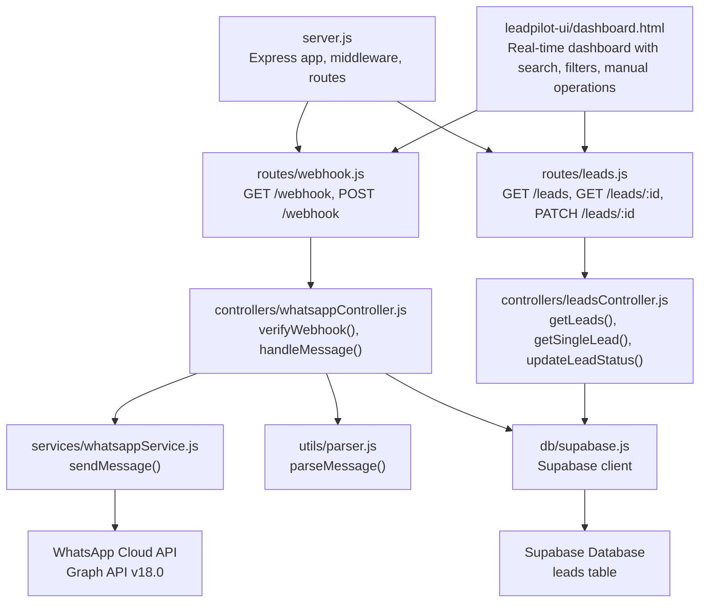
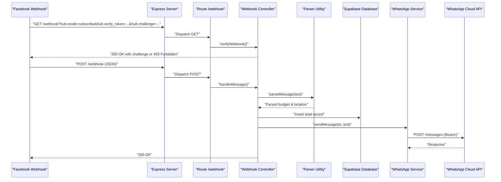
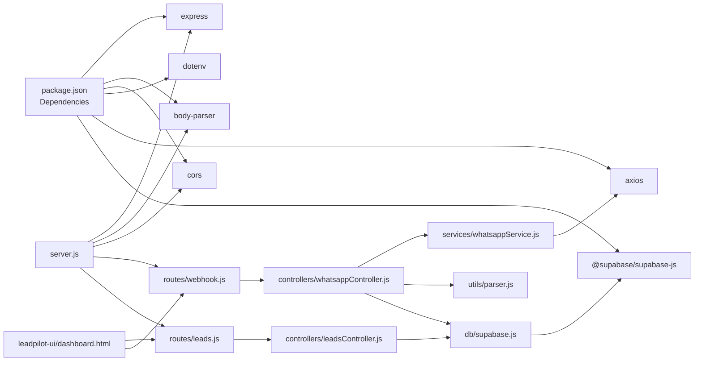

# API Reference

<cite>
**Referenced Files in This Document**
- [server.js](file://leadpilot-ai/server.js)
- [webhook.js](file://leadpilot-ai/routes/webhook.js)
- [leads.js](file://leadpilot-ai/routes/leads.js)
- [whatsappController.js](file://leadpilot-ai/controllers/whatsappController.js)
- [leadsController.js](file://leadpilot-ai/controllers/leadsController.js)
- [whatsappService.js](file://leadpilot-ai/services/whatsappService.js)
- [supabase.js](file://leadpilot-ai/db/supabase.js)
- [parser.js](file://leadpilot-ai/utils/parser.js)
- [leads.json](file://leadpilot-ai/leads.json)
- [package.json](file://leadpilot-ai/package.json)
- [dashboard.html](file://leadpilot-ai/leadpilot-ui/dashboard.html)
- [index.html](file://leadpilot-ai/leadpilot-ui/index.html)
</cite>

## Update Summary
**Changes Made**
- Enhanced documentation to include comprehensive dashboard UI system with real-time lead management
- Added detailed coverage of new dashboard.html and index.html files with their real-time features
- Updated webhook endpoint documentation to include manual lead creation capability through UI interactions
- Expanded lead management API documentation to reflect UI-driven operations and enhanced filtering
- Added new UI interaction patterns, client implementation guidelines, and real-time dashboard capabilities

## Table of Contents
1. [Introduction](#introduction)
2. [Project Structure](#project-structure)
3. [Core Components](#core-components)
4. [Architecture Overview](#architecture-overview)
5. [Detailed Component Analysis](#detailed-component-analysis)
6. [Lead Management API](#lead-management-api)
7. [Dashboard UI System](#dashboard-ui-system)
8. [UI Interactions and Manual Operations](#ui-interactions-and-manual-operations)
9. [Dependency Analysis](#dependency-analysis)
10. [Performance Considerations](#performance-considerations)
11. [Troubleshooting Guide](#troubleshooting-guide)
12. [Conclusion](#conclusion)
13. [Appendices](#appendices)

## Introduction
This document provides comprehensive API documentation for LeadPilot AI's complete API ecosystem. It covers:
- GET /webhook for Facebook challenge-response verification
- POST /webhook for inbound message processing with lead extraction and database integration, including manual lead creation
- GET /leads, GET /leads/:id, and PATCH /leads/:id for lead management operations
- WhatsApp Cloud API integration patterns and authentication
- Supabase database integration for lead storage
- Parser utility for automated lead information extraction
- Real-time dashboard UI with search, filtering, and manual operations
- Enhanced UI system with responsive design, dark mode support, and real-time data synchronization
- Request/response examples, HTTP status codes, error handling, and rate limiting considerations
- Client implementation guidelines for webhook setup and testing

## Project Structure
The application is a comprehensive Express server that exposes two main route groups: webhooks for WhatsApp integration and leads for CRM functionality. The architecture includes database integration, message parsing, and automated lead processing, along with a sophisticated real-time dashboard UI featuring responsive design and dark mode support.



**Diagram sources**
- [server.js:1-35](file://leadpilot-ai/server.js#L1-L35)
- [webhook.js:1-12](file://leadpilot-ai/routes/webhook.js#L1-L12)
- [leads.js:1-14](file://leadpilot-ai/routes/leads.js#L1-L14)
- [whatsappController.js:1-78](file://leadpilot-ai/controllers/whatsappController.js#L1-L78)
- [leadsController.js:1-57](file://leadpilot-ai/controllers/leadsController.js#L1-L57)
- [whatsappService.js:1-23](file://leadpilot-ai/services/whatsappService.js#L1-L23)
- [supabase.js:1-9](file://leadpilot-ai/db/supabase.js#L1-L9)
- [parser.js:1-37](file://leadpilot-ai/utils/parser.js#L1-L37)
- [dashboard.html:1-533](file://leadpilot-ai/leadpilot-ui/dashboard.html#L1-L533)

**Section sources**
- [server.js:1-35](file://leadpilot-ai/server.js#L1-L35)
- [webhook.js:1-12](file://leadpilot-ai/routes/webhook.js#L1-L12)
- [leads.js:1-14](file://leadpilot-ai/routes/leads.js#L1-L14)
- [package.json:1-22](file://leadpilot-ai/package.json#L1-L22)

## Core Components
- Express server initializes environment, CORS, JSON body parsing, static file serving, and mounts both webhook and leads route groups.
- Route modules define handlers for webhook verification and message processing, plus lead management operations.
- Controllers implement business logic for verification, message handling with lead extraction, and lead CRUD operations.
- Services encapsulate outbound requests to the WhatsApp Cloud API using Bearer token authentication.
- Database integration via Supabase for persistent lead storage.
- Parser utility for automated extraction of budget and location information from messages.
- Real-time dashboard UI with search, filtering, and manual lead creation capabilities, featuring responsive design and dark mode support.

Key runtime behaviors:
- GET /webhook performs challenge-response verification using query parameters.
- POST /webhook processes incoming messages, parses lead information, saves to database, and auto-replies.
- GET /leads retrieves all leads with sorting by creation date.
- GET /leads/:id retrieves a specific lead by ID.
- PATCH /leads/:id updates lead status with validation.
- Manual lead creation via UI triggers POST /webhook with custom payload.
- Real-time dashboard automatically refreshes lead data every 10 seconds.
- Dashboard supports responsive design with mobile/tablet/desktop optimization.
- Dashboard includes dark mode toggle with localStorage persistence.

**Section sources**
- [server.js:1-35](file://leadpilot-ai/server.js#L1-L35)
- [webhook.js:1-12](file://leadpilot-ai/routes/webhook.js#L1-L12)
- [leads.js:1-14](file://leadpilot-ai/routes/leads.js#L1-L14)
- [whatsappController.js:1-78](file://leadpilot-ai/controllers/whatsappController.js#L1-L78)
- [leadsController.js:1-57](file://leadpilot-ai/controllers/leadsController.js#L1-L57)
- [whatsappService.js:1-23](file://leadpilot-ai/services/whatsappService.js#L1-L23)
- [supabase.js:1-9](file://leadpilot-ai/db/supabase.js#L1-L9)
- [parser.js:1-37](file://leadpilot-ai/utils/parser.js#L1-L37)
- [dashboard.html:269-533](file://leadpilot-ai/leadpilot-ui/dashboard.html#L269-L533)

## Architecture Overview
The API follows a layered architecture with enhanced lead management capabilities and real-time UI interactions:
- HTTP transport: Express server with CORS and body parsing
- Routing: Separate route modules for webhooks and leads
- Controllers: Business logic for verification, message processing with lead extraction, and lead management
- Services: External API integration with WhatsApp Cloud API
- Database: Supabase integration for persistent lead storage
- Utilities: Parser for automated lead information extraction
- UI Layer: Real-time dashboard with search, filtering, and manual operations, featuring responsive design and dark mode



**Diagram sources**
- [server.js:1-35](file://leadpilot-ai/server.js#L1-L35)
- [webhook.js:1-12](file://leadpilot-ai/routes/webhook.js#L1-L12)
- [whatsappController.js:1-78](file://leadpilot-ai/controllers/whatsappController.js#L1-L78)
- [parser.js:1-37](file://leadpilot-ai/utils/parser.js#L1-L37)
- [supabase.js:1-9](file://leadpilot-ai/db/supabase.js#L1-L9)
- [whatsappService.js:1-23](file://leadpilot-ai/services/whatsappService.js#L1-L23)

## Detailed Component Analysis

### GET /webhook — Challenge-Response Verification
Purpose:
- Verify ownership of the webhook endpoint during Facebook webhook subscription.

Behavior:
- Reads query parameters: hub.mode, hub.verify_token, hub.challenge
- Validates that hub.mode equals "subscribe" and hub.verify_token matches the configured token
- On success: responds with HTTP 200 and the hub.challenge value
- On failure: responds with HTTP 403 Forbidden

Validation rules:
- Required parameters: hub.mode, hub.verify_token, hub.challenge
- hub.mode must equal "subscribe"
- hub.verify_token must equal the configured token

Success response:
- Status: 200 OK
- Body: Plain text containing the hub.challenge value

Error scenarios:
- Missing or invalid hub.mode or hub.verify_token: 403 Forbidden
- Any unexpected error during processing: 403 Forbidden

Example request:
- GET /webhook?hub.mode=subscribe&hub.verify_token=leadpilot_token&hub.challenge=challenge_value

Example success response:
- Status: 200
- Body: challenge_value

Example error responses:
- Status: 403

Notes:
- The verify token is a constant in the controller; ensure it matches the value configured in the Facebook webhook subscription.

**Section sources**
- [whatsappController.js:7-17](file://leadpilot-ai/controllers/whatsappController.js#L7-L17)

### POST /webhook — Enhanced Message Processing with Lead Management
Purpose:
- Receive inbound messages from the WhatsApp Cloud API, extract lead information, save to database, and respond accordingly.

Enhanced Processing Logic:
- Extracts message from nested Facebook webhook structure
- Parses lead information using the parser utility (budget, location)
- Saves lead to both file backup and Supabase database
- Sends auto-reply via WhatsApp Cloud API
- Handles various error scenarios gracefully

**Updated** Enhanced with manual lead creation capability through UI interactions.

Manual Lead Creation:
- The UI can trigger manual lead creation by calling this endpoint with custom payloads
- Payload structure allows creating leads without actual WhatsApp messages
- Maintains the same processing pipeline for consistency

Request body schema:
- The endpoint expects a JSON payload conforming to the Facebook webhook event structure.
- The controller extracts the first message from the nested structure:
  - entry[0].changes[0].value.messages[0]
- Message fields used:
  - from: sender's phone number
  - text.body: message text content

Lead Extraction Process:
- Uses parser utility to extract budget information (e.g., "3L", "80L", "1.5Cr")
- Extracts location information using pattern matching
- Creates structured lead object with phone, message, budget, location, and timestamp

Database Operations:
- Inserts lead record into Supabase leads table with status "new"
- Fields stored: phone, message, budget, location, status, created_at
- Handles database insertion errors gracefully

Auto-reply Mechanism:
- Sends automated response to confirm receipt of message
- Skips auto-reply if WhatsApp API connection fails

Response handling:
- Success: 200 OK
- Error: 500 Internal Server Error

Example request body (structure):
- entry[0].changes[0].value.messages[0].from
- entry[0].changes[0].value.messages[0].text.body

Example success response:
- Status: 200

Example error response:
- Status: 500

Security and authentication:
- The controller does not enforce authentication on the POST endpoint.
- Authentication is handled by the WhatsApp Cloud API when delivering events to the webhook.

Rate limiting considerations:
- No explicit rate limiting is implemented in the controller or service.
- Facebook may apply platform-level rate limits; design clients to handle retries with backoff.

**Section sources**
- [whatsappController.js:19-77](file://leadpilot-ai/controllers/whatsappController.js#L19-L77)

### WhatsApp Cloud API Integration
Integration pattern:
- Outbound messages are sent to the Graph API endpoint for the configured phone ID.
- Uses Bearer token authentication via Authorization header.
- Content-Type is set to application/json.

Endpoint:
- https://graph.facebook.com/v18.0/{PHONE_ID}/messages

Headers:
- Authorization: Bearer {WHATSAPP_TOKEN}
- Content-Type: application/json

Request body:
- messaging_product: "whatsapp"
- to: recipient phone number
- type: "text"
- text.body: message text

Example request:
- POST https://graph.facebook.com/v18.0/{PHONE_ID}/messages
- Headers: Authorization: Bearer {WHATSAPP_TOKEN}, Content-Type: application/json
- Body: { messaging_product: "whatsapp", to: "+1234567890", type: "text", text: { body: "Hello" } }

**Section sources**
- [whatsappService.js:6-22](file://leadpilot-ai/services/whatsappService.js#L6-L22)

## Lead Management API

### GET /leads — Retrieve All Leads
Purpose:
- Fetch all leads from the database with newest first ordering.

Behavior:
- Queries the Supabase leads table
- Returns all records ordered by created_at in descending order
- Handles database errors gracefully

Response format:
- Status: 200 OK
- Body: Array of lead objects sorted by creation date

Lead object structure:
- id: Unique identifier
- phone: Customer phone number
- message: Original message content
- budget: Extracted budget information
- location: Extracted location information
- status: Current lead status (default: "new")
- created_at: Timestamp of creation

Example response:
```json
[
  {
    "id": 1,
    "phone": "919999999999",
    "message": "Looking for 3BHK in Delhi under 1.5Cr",
    "budget": "3",
    "location": "Delhi",
    "status": "new",
    "created_at": "2026-03-31T17:11:45.710Z"
  }
]
```

Error handling:
- Database errors: 500 Internal Server Error with error message

**Section sources**
- [leadsController.js:4-18](file://leadpilot-ai/controllers/leadsController.js#L4-L18)
- [leads.js:9](file://leadpilot-ai/routes/leads.js#L9)

### GET /leads/:id — Retrieve Single Lead
Purpose:
- Fetch a specific lead by its unique identifier.

Behavior:
- Queries the Supabase leads table for the specified ID
- Returns single lead object if found
- Handles case where lead doesn't exist

Response format:
- Status: 200 OK
- Body: Lead object matching the ID

Error handling:
- Not found: 500 Internal Server Error with "Lead not found" message
- Database errors: 500 Internal Server Error with error message

Example response:
```json
{
  "id": 1,
  "phone": "919999999999",
  "message": "Looking for 3BHK in Delhi under 1.5Cr",
  "budget": "3",
  "location": "Delhi",
  "status": "new",
  "created_at": "2026-03-31T17:11:45.710Z"
}
```

**Section sources**
- [leadsController.js:21-37](file://leadpilot-ai/controllers/leadsController.js#L21-L37)
- [leads.js:10](file://leadpilot-ai/routes/leads.js#L10)

### PATCH /leads/:id — Update Lead Status
Purpose:
- Update the status of a specific lead.

Behavior:
- Extracts ID from URL parameters
- Extracts status from request body
- Updates the lead record in the database
- Returns success message upon completion

Request body schema:
- status: String representing the new lead status (e.g., "new", "contacted", "converted")

Response format:
- Status: 200 OK
- Body: { message: "Status updated" }

Error handling:
- Database errors: 500 Internal Server Error with "Failed to update status" message
- Invalid status values: Handled by database constraints

Example request:
```json
{
  "status": "contacted"
}
```

Example response:
```json
{
  "message": "Status updated"
}
```

**Section sources**
- [leadsController.js:40-56](file://leadpilot-ai/controllers/leadsController.js#L40-L56)
- [leads.js:11](file://leadpilot-ai/routes/leads.js#L11)

## Dashboard UI System

### Real-time Dashboard Features
The LeadPilot AI dashboard provides comprehensive lead management with real-time updates and interactive features:

**Responsive Design**:
- Mobile-first responsive design with adaptive layouts for phones, tablets, and desktops
- Touch-friendly interface with minimum 44px touch targets for accessibility
- Smooth animations and transitions for enhanced user experience

**Search Functionality**:
- Real-time search across phone numbers, locations, and messages
- Live filtering as users type in the search box
- Case-insensitive matching for improved usability

**Status Filtering**:
- Quick filtering by lead status (All, New, Contacted, Follow-up, Closed)
- Visual status badges with color-coded indicators
- Dynamic button styling to show active filter

**Manual Lead Creation**:
- Direct lead creation from the dashboard interface
- Prompts for phone number and requirement description
- Automatic webhook invocation to process the lead
- Immediate dashboard refresh after creation

**Automatic Data Refresh**:
- Leads table automatically refreshes every 10 seconds
- Real-time statistics updates (total leads, status counts)
- Live status dropdown for quick updates

**Dark Mode Support**:
- Toggle between light and dark themes
- Theme preference persisted in localStorage
- System-aware theme switching with smooth transitions

**Interactive Elements**:
- Hover effects and subtle animations for enhanced UX
- Status dropdowns for inline editing
- Action buttons with hover states
- Loading states and error handling

**Section sources**
- [dashboard.html:100-533](file://leadpilot-ai/leadpilot-ui/dashboard.html#L100-L533)

### Dashboard Navigation and Layout
The dashboard features a modern navigation system with sidebar and responsive layout:

**Mobile Navigation**:
- Slide-out sidebar accessible via hamburger menu
- Overlay background for improved focus
- Click-outside-to-close functionality
- Responsive breakpoint at 1024px

**Navigation Items**:
- Active state highlighting for current page
- Badge counter showing total lead count
- Icons for visual recognition
- Hover states with smooth transitions

**Main Content Area**:
- Glass-morphism design with backdrop blur
- Responsive grid system for statistics cards
- Adaptive table layout with mobile card view
- Proper spacing and typography hierarchy

**Section sources**
- [dashboard.html:100-145](file://leadpilot-ai/leadpilot-ui/dashboard.html#L100-L145)
- [dashboard.html:236-267](file://leadpilot-ai/leadpilot-ui/dashboard.html#L236-L267)

## UI Interactions and Manual Operations

### Real-time Dashboard Features
The LeadPilot AI dashboard provides comprehensive lead management with real-time updates and interactive features:

**Search Functionality**:
- Real-time search across phone numbers, locations, and messages
- Live filtering as users type in the search box
- Case-insensitive matching for improved usability

**Status Filtering**:
- Quick filtering by lead status (All, New, Contacted, Follow-up, Closed)
- Visual status badges with color-coded indicators
- Dynamic button styling to show active filter

**Manual Lead Creation**:
- Direct lead creation from the dashboard interface
- Prompts for phone number and requirement description
- Automatic webhook invocation to process the lead
- Immediate dashboard refresh after creation

**Automatic Data Refresh**:
- Leads table automatically refreshes every 10 seconds
- Real-time statistics updates (total leads, status counts)
- Live status dropdown for quick updates

**Section sources**
- [dashboard.html:150-234](file://leadpilot-ai/leadpilot-ui/dashboard.html#L150-L234)
- [dashboard.html:274-533](file://leadpilot-ai/leadpilot-ui/dashboard.html#L274-L533)

### Manual Lead Creation Workflow
The dashboard enables manual lead creation through the following process:

1. User clicks "Add Lead" button
2. System prompts for phone number and requirement description
3. Frontend constructs webhook payload with provided data
4. Calls POST /webhook endpoint with custom message structure
5. Backend processes the manual lead through the same pipeline
6. Dashboard automatically refreshes to show new lead

Payload Structure for Manual Creation:
```javascript
{
  entry: [{
    changes: [{
      value: {
        messages: [{
          from: "USER_PROVIDED_PHONE",
          text: { body: "USER_PROVIDED_MESSAGE" }
        }]
      }
    }]
  }]
}
```

**Section sources**
- [dashboard.html:456-478](file://leadpilot-ai/leadpilot-ui/dashboard.html#L456-L478)

### Dashboard JavaScript Implementation
The dashboard includes comprehensive JavaScript functionality for real-time operations:

**API Integration**:
- Configurable API base URL for development and production
- Error handling with user-friendly notifications
- Async/await for clean asynchronous operations

**Data Management**:
- Local state management for lead data
- Real-time filtering and searching
- Status update operations with immediate UI feedback

**User Experience Features**:
- Theme persistence using localStorage
- Mobile-responsive sidebar with overlay
- Touch-friendly interface elements
- Loading states and empty state handling

**Section sources**
- [dashboard.html:269-533](file://leadpilot-ai/leadpilot-ui/dashboard.html#L269-L533)

## Dependency Analysis
External libraries and their roles:
- express: HTTP server and routing framework
- body-parser: JSON body parsing middleware
- cors: Cross-origin resource sharing support
- dotenv: Environment variable loading
- axios: HTTP client for external API calls
- @supabase/supabase-js: Database client for Supabase integration



**Diagram sources**
- [package.json:13-20](file://leadpilot-ai/package.json#L13-L20)
- [server.js:1-35](file://leadpilot-ai/server.js#L1-L35)
- [webhook.js:1-12](file://leadpilot-ai/routes/webhook.js#L1-L12)
- [leads.js:1-14](file://leadpilot-ai/routes/leads.js#L1-L14)
- [whatsappController.js:1-78](file://leadpilot-ai/controllers/whatsappController.js#L1-L78)
- [leadsController.js:1-57](file://leadpilot-ai/controllers/leadsController.js#L1-L57)
- [whatsappService.js:1-23](file://leadpilot-ai/services/whatsappService.js#L1-L23)
- [supabase.js:1-9](file://leadpilot-ai/db/supabase.js#L1-L9)
- [parser.js:1-37](file://leadpilot-ai/utils/parser.js#L1-L37)
- [dashboard.html:1-533](file://leadpilot-ai/leadpilot-ui/dashboard.html#L1-L533)

**Section sources**
- [package.json:13-20](file://leadpilot-ai/package.json#L13-L20)

## Performance Considerations
- The controller performs synchronous logging and asynchronous outbound API calls. Ensure the service layer handles timeouts and retries appropriately.
- Database operations are performed asynchronously to avoid blocking the request handler.
- The parser utility uses efficient regular expressions for lead information extraction.
- Consider adding circuit breakers and exponential backoff for the WhatsApp Cloud API calls to mitigate transient failures.
- Database queries are optimized with proper ordering and filtering.
- The dashboard implements automatic refresh every 10 seconds to balance real-time updates with performance.
- Responsive design optimizations reduce bandwidth usage on mobile devices.
- Dark mode reduces battery consumption on OLED displays.

## Troubleshooting Guide
Common issues and resolutions:
- 403 Forbidden on GET /webhook
  - Cause: hub.mode is not "subscribe" or hub.verify_token does not match the configured token.
  - Resolution: Ensure the verify token and mode match the Facebook subscription configuration.
- 403 Forbidden on POST /webhook
  - Cause: The controller does not enforce authentication; if Facebook is not sending events, verify subscription and endpoint URL.
  - Resolution: Confirm webhook subscription and endpoint URL in the Meta developer console.
- 500 Internal Server Error on POST /webhook
  - Cause: Exception thrown during message processing or service call.
  - Resolution: Check server logs for errors and ensure environment variables are set for the WhatsApp token and phone ID.
- Missing environment variables
  - Cause: WHATSAPP_TOKEN, PHONE_ID, SUPABASE_URL, or SUPABASE_KEY not configured.
  - Resolution: Set environment variables and restart the server.
- Database connection issues
  - Cause: Supabase credentials or network connectivity problems.
  - Resolution: Verify Supabase credentials and network connectivity.
- Lead management errors
  - Cause: Invalid lead ID or database constraints violation.
  - Resolution: Check lead ID format and status values.
- Dashboard UI issues
  - Cause: API base URL mismatch or network connectivity problems.
  - Resolution: Verify API_BASE_URL setting and ensure backend server is reachable.
- Responsive design issues
  - Cause: CSS media queries not functioning properly.
  - Resolution: Check browser compatibility and device viewport settings.
- Dark mode not persisting
  - Cause: localStorage not available or blocked.
  - Resolution: Check browser privacy settings and localStorage availability.

Operational checks:
- Verify the server is reachable from the internet and the routes are mounted under /webhook and /leads.
- Confirm the verify token used in the webhook subscription matches the controller's constant.
- Ensure the WhatsApp Cloud API credentials and phone ID are correct.
- Verify Supabase database is accessible and has the leads table.
- Test lead parsing functionality with sample messages.
- Validate dashboard API endpoints are accessible and responding correctly.
- Check responsive breakpoints and mobile device compatibility.
- Verify dark mode functionality across different browsers.

**Section sources**
- [whatsappController.js:7-17](file://leadpilot-ai/controllers/whatsappController.js#L7-L17)
- [whatsappController.js:19-77](file://leadpilot-ai/controllers/whatsappController.js#L19-L77)
- [leadsController.js:4-56](file://leadpilot-ai/controllers/leadsController.js#L4-L56)
- [whatsappService.js:3-4](file://leadpilot-ai/services/whatsappService.js#L3-L4)
- [supabase.js:3-6](file://leadpilot-ai/db/supabase.js#L3-L6)
- [dashboard.html:269-533](file://leadpilot-ai/leadpilot-ui/dashboard.html#L269-L533)

## Conclusion
LeadPilot AI's API provides a comprehensive solution for WhatsApp-based lead management with advanced automation capabilities and rich UI interactions. The enhanced webhook endpoints now include intelligent lead parsing, database integration, automated responses, and manual lead creation capabilities. The new lead management endpoints offer full CRUD operations for lead lifecycle management, complemented by a sophisticated real-time dashboard with search, filtering, and manual operations. The dashboard enables users to create leads manually, search across lead data, filter by status, and monitor lead statistics in real-time. The responsive design ensures optimal user experience across all devices, while dark mode support enhances accessibility. For production deployments, ensure secure environment configuration, implement robust error handling, and consider rate limiting and retry policies for external API calls.

## Appendices

### Endpoint Definitions

#### Webhook Endpoints
- GET /webhook
  - Purpose: Verify webhook subscription
  - Query parameters:
    - hub.mode: Must equal "subscribe"
    - hub.verify_token: Must match the configured token
    - hub.challenge: Challenge string to echo back
  - Success response:
    - Status: 200
    - Body: Plain text challenge value
  - Error responses:
    - Status: 403

- POST /webhook
  - Purpose: Process inbound message events with lead extraction
  - Request body:
    - entry[0].changes[0].value.messages[0].from
    - entry[0].changes[0].value.messages[0].text.body
  - Success response:
    - Status: 200
  - Error responses:
    - Status: 500

#### Lead Management Endpoints
- GET /leads
  - Purpose: Retrieve all leads
  - Query parameters: None
  - Success response:
    - Status: 200
    - Body: Array of lead objects
  - Error responses:
    - Status: 500

- GET /leads/:id
  - Purpose: Retrieve a specific lead
  - Path parameters:
    - id: Lead identifier
  - Success response:
    - Status: 200
    - Body: Lead object
  - Error responses:
    - Status: 500

- PATCH /leads/:id
  - Purpose: Update lead status
  - Path parameters:
    - id: Lead identifier
  - Request body:
    - status: New lead status
  - Success response:
    - Status: 200
    - Body: { message: "Status updated" }
  - Error responses:
    - Status: 500

### Authentication and Security Notes
- GET /webhook uses a constant verify token in the controller. Align this with the value configured in the Facebook webhook subscription.
- POST /webhook does not implement endpoint-level authentication; rely on Facebook's delivery mechanism.
- Outbound calls to the WhatsApp Cloud API use Bearer token authentication via Authorization header.
- Lead management endpoints do not implement authentication; ensure proper access control at deployment level.
- Database operations use Supabase client with environment-based credentials.
- Dashboard UI uses configurable API_BASE_URL for backend communication; ensure proper CORS configuration.

### Environment Variables
- WHATSAPP_TOKEN: Access token for the WhatsApp Business Platform
- PHONE_ID: Phone ID associated with the business account
- SUPABASE_URL: Supabase project URL
- SUPABASE_KEY: Supabase project API key

### Example Requests and Responses

#### Webhook Examples
- GET /webhook
  - Request: GET /webhook?hub.mode=subscribe&hub.verify_token=leadpilot_token&hub.challenge=challenge_value
  - Success response: 200 OK with body challenge_value
  - Error response: 403 Forbidden

- POST /webhook
  - Request body structure:
    - entry[0].changes[0].value.messages[0].from
    - entry[0].changes[0].value.messages[0].text.body
  - Success response: 200 OK
  - Error response: 500 Internal Server Error

#### Lead Management Examples
- GET /leads
  - Request: GET /leads
  - Success response: 200 OK with array of lead objects
  - Error response: 500 Internal Server Error

- GET /leads/:id
  - Request: GET /leads/1
  - Success response: 200 OK with lead object
  - Error response: 500 Internal Server Error

- PATCH /leads/:id
  - Request: PATCH /leads/1 { "status": "contacted" }
  - Success response: 200 OK with { message: "Status updated" }
  - Error response: 500 Internal Server Error

#### WhatsApp Cloud API
- Request:
  - POST https://graph.facebook.com/v18.0/{PHONE_ID}/messages
  - Headers: Authorization: Bearer {WHATSAPP_TOKEN}, Content-Type: application/json
  - Body: { messaging_product: "whatsapp", to: "+1234567890", type: "text", text: { body: "Hello" } }

### Parser Utility Functions
- parseMessage(text): Extracts budget and location information from WhatsApp messages
- Budget extraction patterns: Numbers followed by "L", "lakh", or currency indicators
- Location extraction pattern: Text following "in " keyword
- Returns object with budget and location properties

### Rate Limiting and Reliability
- No built-in rate limiting in the controller or service.
- Design clients to handle retries with exponential backoff for transient failures.
- Monitor external API quotas and adjust throughput accordingly.
- Database operations should implement proper error handling and retry logic.
- Dashboard implements automatic refresh every 10 seconds to balance performance and real-time updates.

### UI Interaction Patterns
- Search: Real-time filtering as users type in the search box
- Status Filtering: Click buttons to filter by different lead statuses
- Manual Lead Creation: Add leads directly from the dashboard interface
- Real-time Updates: Automatic dashboard refresh every 10 seconds
- Status Dropdown: Inline editing of lead status from the table view
- Responsive Design: Adaptive layouts for mobile, tablet, and desktop
- Dark Mode: Toggle between light and dark themes with persistence
- Mobile Navigation: Slide-out sidebar with overlay background
- Touch-friendly Interface: Minimum 44px touch targets for accessibility