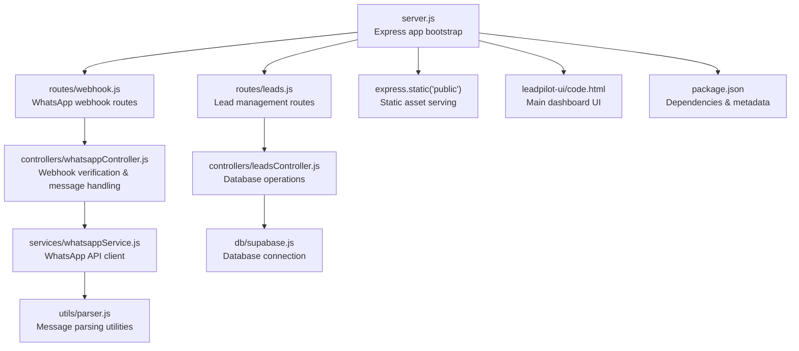
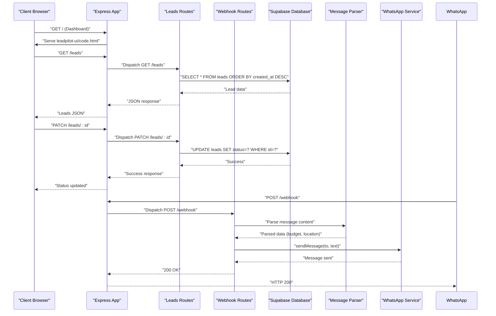

# Deployment & Operations

<cite>
**Referenced Files in This Document**
- [package.json](file://leadpilot-ai/package.json)
- [server.js](file://leadpilot-ai/server.js)
- [webhook.js](file://leadpilot-ai/routes/webhook.js)
- [leads.js](file://leadpilot-ai/routes/leads.js)
- [whatsappController.js](file://leadpilot-ai/controllers/whatsappController.js)
- [leadsController.js](file://leadpilot-ai/controllers/leadsController.js)
- [whatsappService.js](file://leadpilot-ai/services/whatsappService.js)
- [supabase.js](file://leadpilot-ai/db/supabase.js)
- [parser.js](file://leadpilot-ai/utils/parser.js)
- [code.html](file://leadpilot-ai/leadpilot-ui/code.html)
- [dashboard.html](file://leadpilot-ai/public/dashboard.html)
</cite>

## Update Summary
**Changes Made**
- Added comprehensive Supabase database configuration and management documentation
- Enhanced environment variable management section with new Supabase credentials
- Updated static asset serving documentation for both dashboard and lead management UI
- Expanded production optimization guidelines for the new multi-component architecture
- Added database connectivity considerations and connection pooling recommendations
- Updated deployment architecture diagrams to reflect the new multi-route structure

## Table of Contents
1. [Introduction](#introduction)
2. [Project Structure](#project-structure)
3. [Core Components](#core-components)
4. [Architecture Overview](#architecture-overview)
5. [Detailed Component Analysis](#detailed-component-analysis)
6. [Environment Configuration](#environment-configuration)
7. [Containerization with Docker](#containerization-with-docker)
8. [Cloud Platform Deployment](#cloud-platform-deployment)
9. [CI/CD Pipeline Integration](#cicd-pipeline-integration)
10. [Performance Optimization](#performance-optimization)
11. [Scaling Considerations](#scaling-considerations)
12. [Security Best Practices](#security-best-practices)
13. [Monitoring and Observability](#monitoring-and-observability)
14. [Backup and Disaster Recovery](#backup-and-disaster-recovery)
15. [Maintenance Schedule](#maintenance-schedule)
16. [Troubleshooting Guide](#troubleshooting-guide)
17. [Deployment Checklist](#deployment-checklist)
18. [Operational Runbooks](#operational-runbooks)
19. [Conclusion](#conclusion)

## Introduction
This document provides comprehensive deployment and operations guidance for LeadPilot AI. It covers production-grade environment configuration, process management, containerization, cloud deployments, CI/CD integration, performance optimization, scaling, security, monitoring, backups, disaster recovery, and operational runbooks tailored to the enhanced multi-component architecture with Supabase integration.

## Project Structure
LeadPilot AI is now a sophisticated Express-based application featuring a multi-component architecture with Supabase database integration, static asset serving, and dual user interfaces. The application exposes RESTful endpoints for lead management alongside webhook processing for WhatsApp integration.

**Diagram sources**
- [server.js:1-29](file://leadpilot-ai/server.js#L1-L29)
- [webhook.js:1-12](file://leadpilot-ai/routes/webhook.js#L1-L12)
- [leads.js:1-14](file://leadpilot-ai/routes/leads.js#L1-L14)
- [whatsappController.js:1-40](file://leadpilot-ai/controllers/whatsappController.js#L1-L40)
- [leadsController.js:1-57](file://leadpilot-ai/controllers/leadsController.js#L1-L57)
- [whatsappService.js:1-23](file://leadpilot-ai/services/whatsappService.js#L1-L23)
- [supabase.js:1-9](file://leadpilot-ai/db/supabase.js#L1-L9)
- [parser.js:1-10](file://leadpilot-ai/utils/parser.js#L1-L10)
- [package.json:13-20](file://leadpilot-ai/package.json#L13-L20)

**Section sources**
- [server.js:1-29](file://leadpilot-ai/server.js#L1-L29)
- [webhook.js:1-12](file://leadpilot-ai/routes/webhook.js#L1-L12)
- [leads.js:1-14](file://leadpilot-ai/routes/leads.js#L1-L14)
- [whatsappController.js:1-40](file://leadpilot-ai/controllers/whatsappController.js#L1-L40)
- [leadsController.js:1-57](file://leadpilot-ai/controllers/leadsController.js#L1-L57)
- [whatsappService.js:1-23](file://leadpilot-ai/services/whatsappService.js#L1-L23)
- [supabase.js:1-9](file://leadpilot-ai/db/supabase.js#L1-L9)
- [parser.js:1-10](file://leadpilot-ai/utils/parser.js#L1-L10)
- [package.json:13-20](file://leadpilot-ai/package.json#L13-L20)

## Core Components
- **Express Server**: Central application bootstrap with CORS, body parsing, and static asset serving
- **Multi-Component Architecture**: Separate route modules for different functional domains
- **Supabase Integration**: Database abstraction layer for lead management operations
- **Dual User Interfaces**: Modern dashboard UI and simplified dashboard interface
- **WhatsApp Webhook Processing**: Real-time message handling and auto-reply functionality
- **Static Asset Management**: Optimized serving of HTML, CSS, and JavaScript assets

Key runtime characteristics:
- Modular Express application with separate route handlers
- Database-driven lead management with real-time updates
- Static asset caching for improved performance
- Environment-driven configuration for multiple deployment targets
- Comprehensive error handling and logging infrastructure

**Section sources**
- [server.js:1-29](file://leadpilot-ai/server.js#L1-L29)
- [leads.js:1-14](file://leadpilot-ai/routes/leads.js#L1-L14)
- [leadsController.js:1-57](file://leadpilot-ai/controllers/leadsController.js#L1-L57)
- [supabase.js:1-9](file://leadpilot-ai/db/supabase.js#L1-L9)
- [code.html:1-550](file://leadpilot-ai/leadpilot-ui/code.html#L1-L550)
- [dashboard.html:1-138](file://leadpilot-ai/public/dashboard.html#L1-L138)

## Architecture Overview
The system now operates as a comprehensive lead management platform with integrated messaging capabilities:

**Diagram sources**
- [server.js:16-23](file://leadpilot-ai/server.js#L16-L23)
- [leads.js:9-11](file://leadpilot-ai/routes/leads.js#L9-L11)
- [leadsController.js:4-18](file://leadpilot-ai/controllers/leadsController.js#L4-L18)
- [leadsController.js:40-56](file://leadpilot-ai/controllers/leadsController.js#L40-L56)
- [whatsappController.js:16-39](file://leadpilot-ai/controllers/whatsappController.js#L16-L39)
- [whatsappService.js:6-22](file://leadpilot-ai/services/whatsappService.js#L6-L22)

## Detailed Component Analysis

### Express Application Bootstrap
The application now serves multiple purposes with enhanced middleware configuration:

- **Environment Configuration**: Loads dotenv for environment variable management
- **Middleware Stack**: CORS, JSON body parsing, and static asset serving
- **Route Registration**: Modular routing for leads and webhook endpoints
- **Static Asset Serving**: Optimized serving of both dashboard interfaces
- **Health Endpoints**: Multiple accessible endpoints for monitoring

Operational enhancements:
- Static asset caching for improved frontend performance
- Modular route architecture for better maintainability
- Environment-driven configuration for flexible deployment

**Section sources**
- [server.js:1-29](file://leadpilot-ai/server.js#L1-L29)

### Lead Management Routes
The leads module provides comprehensive CRUD operations for lead data:

- **GET /**: Retrieves all leads ordered by creation timestamp
- **GET /:id**: Fetches individual lead by ID
- **PATCH /:id**: Updates lead status with validation

Database integration:
- Supabase ORM for type-safe database operations
- Automatic ordering and filtering capabilities
- Error handling with appropriate HTTP status codes

**Section sources**
- [leads.js:1-14](file://leadpilot-ai/routes/leads.js#L1-L14)
- [leadsController.js:1-57](file://leadpilot-ai/controllers/leadsController.js#L1-L57)

### WhatsApp Webhook Processing
Enhanced webhook handling with advanced message parsing:

- **Verification Logic**: Token-based webhook validation
- **Message Parsing**: Extracts budget and location from incoming messages
- **Auto-Reply System**: Automated responses via WhatsApp Business API
- **Error Handling**: Comprehensive logging and graceful degradation

Integration features:
- Real-time lead creation from incoming messages
- Structured data extraction for lead qualification
- Scalable message processing architecture

**Section sources**
- [whatsappController.js:1-40](file://leadpilot-ai/controllers/whatsappController.js#L1-L40)
- [parser.js:1-10](file://leadpilot-ai/utils/parser.js#L1-L10)

### Supabase Database Integration
Centralized database abstraction layer:

- **Connection Management**: Environment-driven Supabase client configuration
- **Query Abstraction**: Type-safe database operations
- **Connection Pooling**: Optimized database connection handling
- **Error Propagation**: Consistent error handling across database operations

Database considerations:
- Real-time data synchronization
- ACID compliance for lead data integrity
- Scalable storage for growing lead datasets

**Section sources**
- [supabase.js:1-9](file://leadpilot-ai/db/supabase.js#L1-L9)
- [leadsController.js:1-57](file://leadpilot-ai/controllers/leadsController.js#L1-L57)

### Static Asset Serving
Dual dashboard architecture with optimized asset delivery:

- **Modern Dashboard**: Feature-rich lead management interface
- **Simplified Dashboard**: Lightweight monitoring interface
- **Asset Optimization**: Static file serving with proper caching headers
- **Responsive Design**: Mobile-first approach for all devices

Frontend capabilities:
- Real-time lead updates via WebSocket-like polling
- Interactive lead status management
- Dark/light theme support with persistence

**Section sources**
- [server.js:11](file://leadpilot-ai/server.js#L11)
- [code.html:1-550](file://leadpilot-ai/leadpilot-ui/code.html#L1-L550)
- [dashboard.html:1-138](file://leadpilot-ai/public/dashboard.html#L1-L138)

## Environment Configuration
Enhanced environment variable management for multi-component architecture:

**Critical Production Variables:**
- `WHATSAPP_TOKEN`: WhatsApp Business API access token
- `PHONE_ID`: WhatsApp phone number identifier
- `SUPABASE_URL`: Supabase project endpoint
- `SUPABASE_KEY`: Supabase service key for database access
- `PORT`: Application port (defaults to 3000)

**Configuration Best Practices:**
- Use separate environment configurations for dev/stage/prod
- Implement environment-specific database connections
- Secure credential storage in platform-specific secret managers
- Regular credential rotation and audit trails

**Section sources**
- [whatsappService.js:3-4](file://leadpilot-ai/services/whatsappService.js#L3-L4)
- [supabase.js:3-6](file://leadpilot-ai/db/supabase.js#L3-L6)
- [server.js:25](file://leadpilot-ai/server.js#L25)

## Containerization with Docker
Comprehensive containerization strategy for multi-component applications:

**Multi-Stage Build Process:**
- Base image: Node.js 18-alpine for minimal footprint
- Dependency installation: Production-only packages for security
- Asset optimization: Pre-built static assets for faster startup
- Runtime optimization: Non-root user with reduced privileges

**Container Security Hardening:**
- Read-only root filesystem
- Drop unnecessary Linux capabilities
- Health check endpoints for container orchestration
- Resource limits and monitoring integration

**Production Configuration:**
- Environment variable injection at runtime
- Volume mounting for persistent data (if needed)
- Network isolation and service discovery
- Graceful shutdown handling

**Section sources**
- [package.json:13-20](file://leadpilot-ai/package.json#L13-L20)
- [server.js:25](file://leadpilot-ai/server.js#L25)

## Cloud Platform Deployment

### AWS Deployment Options
**Elastic Beanstalk**: Simplified deployment with automatic scaling and load balancing
**ECS/EKS**: Kubernetes orchestration for complex multi-service deployments
**Lambda@Edge**: Event-driven architecture for specific use cases
**RDS/Aurora**: Managed database services for data persistence

**Production Considerations:**
- Multi-AZ deployment for high availability
- Application Load Balancer with SSL termination
- Secret Manager integration for credential management
- CloudWatch monitoring and logging integration

### Heroku Deployment
**Procfile Configuration**: Single web process for Express application
**Config Variables**: Environment-specific configuration management
**Automatic HTTPS**: SSL certificate management and redirection
**Dyno Scaling**: Automatic scaling based on traffic patterns

### Vercel/Render Integration
**Static Site Optimization**: CDN caching for dashboard interfaces
**Serverless Functions**: API endpoint hosting for lead management
**Edge Computing**: Global distribution for improved latency
**Database Integration**: Direct Supabase connection from edge functions

## CI/CD Pipeline Integration
Enhanced pipeline architecture for multi-component applications:

**Build Pipeline Stages:**
- Dependency Installation: Optimized for production builds
- Asset Compilation: Frontend optimization and bundling
- Security Scanning: Image vulnerability assessment
- Testing: Unit and integration test execution

**Deployment Strategy:**
- Blue/Green Deployment: Zero-downtime releases
- Canary Releases: Gradual traffic shifting
- Automated Rollback: Failure detection and recovery
- Environment Promotion: Staged deployment across environments

**Quality Gates:**
- Code Coverage Thresholds
- Security Vulnerability Checks
- Performance Benchmarking
- Compliance Validation

## Performance Optimization
Comprehensive optimization strategies for multi-component architecture:

**Database Optimization:**
- Connection pooling for Supabase connections
- Query optimization with proper indexing
- Caching strategies for frequently accessed data
- Batch operations for bulk lead updates

**Frontend Performance:**
- Static asset compression and minification
- Lazy loading for dashboard components
- CDN integration for global asset delivery
- Progressive enhancement for core functionality

**API Optimization:**
- Request/response payload optimization
- Caching headers for static assets
- Connection keep-alive for database queries
- Rate limiting for external API calls

**Monitoring and Metrics:**
- Database query performance monitoring
- Frontend performance metrics collection
- API response time tracking
- Resource utilization optimization

## Scaling Considerations
Comprehensive scaling architecture for growing applications:

**Horizontal Scaling:**
- Stateless application design for easy replication
- Load balancer distribution across instances
- Database connection pooling for shared resources
- Session management with external stores if needed

**Vertical Scaling:**
- CPU and memory optimization for lead processing
- Database instance scaling for increased load
- CDN capacity planning for asset delivery
- External API rate limit management

**Autoscaling Strategies:**
- CPU and memory-based scaling triggers
- Request count and response time monitoring
- Database query performance scaling
- External service capacity planning

**Database Scaling:**
- Read replicas for increased query load
- Connection pooling optimization
- Query optimization for better performance
- Data archival strategies for historical data

## Security Best Practices
Enhanced security measures for multi-component applications:

**Transport Security:**
- TLS termination at load balancer/edge
- HTTPS enforcement for all endpoints
- Certificate management and renewal
- Security headers for all responses

**Data Protection:**
- Environment variable encryption in transit
- Database connection encryption
- API key rotation and management
- Audit logging for all sensitive operations

**Access Control:**
- Role-based access control for dashboard users
- API endpoint authorization
- Database row-level security policies
- Cross-origin resource sharing restrictions

**Infrastructure Security:**
- Container image vulnerability scanning
- Network segmentation and firewall rules
- Secret management and rotation
- Security monitoring and incident response

## Monitoring and Observability
Comprehensive monitoring strategy for multi-component systems:

**Application Monitoring:**
- Request tracing across all components
- Database query performance monitoring
- External API dependency tracking
- Frontend performance metrics collection

**Infrastructure Monitoring:**
- Container resource utilization
- Database connection pool health
- External service availability
- Storage and bandwidth consumption

**Business Metrics:**
- Lead conversion tracking
- Message processing success rates
- User engagement metrics
- Revenue impact measurement

**Alerting Strategy:**
- Critical system failures
- Performance degradation alerts
- Business metric threshold breaches
- Security incident notifications

## Backup and Disaster Recovery
Robust backup and recovery procedures:

**Data Backup Strategy:**
- Automated database snapshots
- Incremental backup for log data
- Cross-region replication for critical data
- Encrypted backup storage

**Disaster Recovery Procedures:**
- Multi-region failover capability
- Automated recovery testing
- Data consistency validation
- Recovery time objective monitoring

**Operational Continuity:**
- Hot standby deployment
- Geographic redundancy
- Service level agreement monitoring
- Business continuity planning

## Maintenance Schedule
Structured maintenance procedures:

**Daily Operations:**
- System health monitoring and alert review
- Log analysis for error patterns
- Database maintenance and cleanup
- Security patch application

**Weekly Activities:**
- Performance tuning and optimization
- Backup verification and testing
- Dependency update and security scanning
- Capacity planning and resource optimization

**Monthly Tasks:**
- Security audit and compliance review
- Cost optimization and resource rightsizing
- Feature performance evaluation
- Team training and knowledge sharing

**Quarterly Reviews:**
- Architecture assessment and improvement planning
- Technology stack evaluation and updates
- SLA and performance benchmarking
- Disaster recovery drill execution

## Troubleshooting Guide
Comprehensive troubleshooting procedures:

**Database Connectivity Issues:**
- Supabase connection timeout diagnosis
- Authentication credential validation
- Network connectivity and firewall rules
- Connection pool exhaustion investigation

**API Endpoint Failures:**
- Lead management operation debugging
- Webhook processing error analysis
- Response format validation
- External service dependency issues

**Frontend Dashboard Problems:**
- Static asset loading failures
- API communication errors
- Browser compatibility issues
- Performance bottleneck identification

**Environment Configuration Errors:**
- Missing environment variables
- Credential validation failures
- Port binding conflicts
- File permission issues

**Section sources**
- [leadsController.js:14-16](file://leadpilot-ai/controllers/leadsController.js#L14-L16)
- [whatsappService.js:6-22](file://leadpilot-ai/services/whatsappService.js#L6-L22)
- [supabase.js:3-6](file://leadpilot-ai/db/supabase.js#L3-L6)

## Deployment Checklist
Enhanced deployment verification procedures:

**Pre-Deployment Validation:**
- [ ] Environment variable configuration verification
- [ ] Database connection and migration validation
- [ ] External service API connectivity testing
- [ ] Static asset compilation and optimization
- [ ] SSL certificate and domain configuration

**Post-Deployment Verification:**
- [ ] Application health check and readiness probe
- [ ] Database connectivity and query performance
- [ ] Webhook endpoint verification and testing
- [ ] Dashboard interface functionality validation
- [ ] Load balancer and traffic routing verification

**Monitoring Setup:**
- [ ] Application performance monitoring activation
- [ ] Database query performance tracking
- [ ] External service dependency monitoring
- [ ] Alerting and notification configuration
- [ ] Backup and disaster recovery validation

## Operational Runbooks
Standard operating procedures:

**Emergency Response:**
- Database connection failure escalation
- Webhook processing outage resolution
- Dashboard interface degradation recovery
- Security incident containment and remediation

**Routine Operations:**
- Database maintenance and optimization
- Application log rotation and cleanup
- External service credential rotation
- Performance monitoring and tuning

**Change Management:**
- Database schema migration procedures
- Application deployment and rollback
- Configuration change validation
- Feature flag management and monitoring

**Incident Response:**
- Major system outage procedures
- Data breach and security incident response
- Performance degradation mitigation
- Customer impact communication protocols

## Conclusion
LeadPilot AI has evolved into a comprehensive lead management platform with integrated messaging capabilities, robust database integration, and scalable architecture. The enhanced multi-component design, combined with Supabase integration and optimized static asset serving, provides a solid foundation for production deployment across various cloud platforms.

Focus on comprehensive environment configuration management, secure credential handling, advanced monitoring and observability, and gradual scaling strategies while maintaining strict security boundaries. The provided runbooks, checklists, and troubleshooting procedures ensure reliable operations across all deployment environments, supporting both current functionality and future feature expansion.