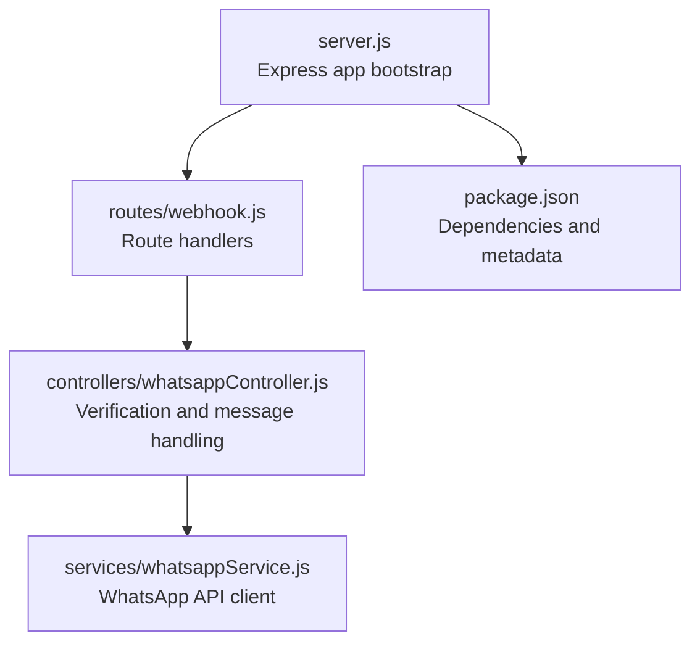
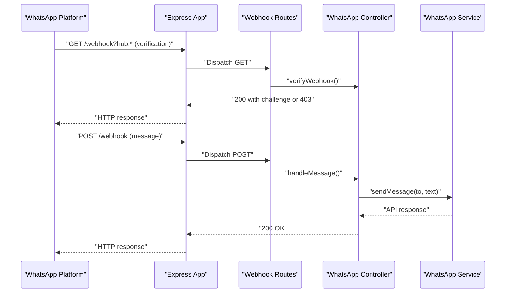

# Deployment & Operations

<cite>
**Referenced Files in This Document**
- [package.json](file://leadpilot-ai/package.json)
- [server.js](file://leadpilot-ai/server.js)
- [webhook.js](file://leadpilot-ai/routes/webhook.js)
- [whatsappController.js](file://leadpilot-ai/controllers/whatsappController.js)
- [whatsappService.js](file://leadpilot-ai/services/whatsappService.js)
</cite>

## Table of Contents
1. [Introduction](#introduction)
2. [Project Structure](#project-structure)
3. [Core Components](#core-components)
4. [Architecture Overview](#architecture-overview)
5. [Detailed Component Analysis](#detailed-component-analysis)
6. [Environment Configuration](#environment-configuration)
7. [Containerization with Docker](#containerization-with-docker)
8. [Cloud Platform Deployment](#cloud-platform-deployment)
9. [CI/CD Pipeline Integration](#cicd-pipeline-integration)
10. [Performance Optimization](#performance-optimization)
11. [Scaling Considerations](#scaling-considerations)
12. [Security Best Practices](#security-best-practices)
13. [Monitoring and Observability](#monitoring-and-observability)
14. [Backup and Disaster Recovery](#backup-and-disaster-recovery)
15. [Maintenance Schedule](#maintenance-schedule)
16. [Troubleshooting Guide](#troubleshooting-guide)
17. [Deployment Checklist](#deployment-checklist)
18. [Operational Runbooks](#operational-runbooks)
19. [Conclusion](#conclusion)

## Introduction
This document provides comprehensive deployment and operations guidance for LeadPilot AI. It covers production-grade environment configuration, process management, containerization, cloud deployments, CI/CD integration, performance optimization, scaling, security, monitoring, backups, disaster recovery, and operational runbooks tailored to the current codebase.

## Project Structure
LeadPilot AI is a small Express-based webhook service that validates WhatsApp webhooks and auto-replies to incoming messages. The application exposes a single GET endpoint for webhook verification and a POST endpoint for handling inbound messages. It relies on environment variables for credentials and external API communication.

**Diagram sources**
- [server.js:1-19](file://leadpilot-ai/server.js#L1-L19)
- [webhook.js:1-12](file://leadpilot-ai/routes/webhook.js#L1-L12)
- [whatsappController.js:1-40](file://leadpilot-ai/controllers/whatsappController.js#L1-L40)
- [whatsappService.js:1-23](file://leadpilot-ai/services/whatsappService.js#L1-L23)
- [package.json:1-21](file://leadpilot-ai/package.json#L1-L21)

**Section sources**
- [server.js:1-19](file://leadpilot-ai/server.js#L1-L19)
- [webhook.js:1-12](file://leadpilot-ai/routes/webhook.js#L1-L12)
- [whatsappController.js:1-40](file://leadpilot-ai/controllers/whatsappController.js#L1-L40)
- [whatsappService.js:1-23](file://leadpilot-ai/services/whatsappService.js#L1-L23)
- [package.json:1-21](file://leadpilot-ai/package.json#L1-L21)

## Core Components
- Express server initialization and middleware setup
- Webhook route module exposing GET and POST endpoints
- Controller module implementing verification and message handling logic
- Service module encapsulating outbound WhatsApp API calls

Key runtime characteristics:
- Single-threaded event loop via Express
- JSON body parsing enabled
- Environment-driven configuration for credentials and identifiers
- Minimal external dependencies

**Section sources**
- [server.js:1-19](file://leadpilot-ai/server.js#L1-L19)
- [webhook.js:1-12](file://leadpilot-ai/routes/webhook.js#L1-L12)
- [whatsappController.js:1-40](file://leadpilot-ai/controllers/whatsappController.js#L1-L40)
- [whatsappService.js:1-23](file://leadpilot-ai/services/whatsappService.js#L1-L23)
- [package.json:13-19](file://leadpilot-ai/package.json#L13-L19)

## Architecture Overview
The system follows a straightforward request-response pattern:
- Incoming requests hit the Express app
- Routes delegate to the controller
- Controller invokes the service to call the external WhatsApp API
- Responses are returned to the caller

**Diagram sources**
- [server.js:4-9](file://leadpilot-ai/server.js#L4-L9)
- [webhook.js:8-9](file://leadpilot-ai/routes/webhook.js#L8-L9)
- [whatsappController.js:4-14](file://leadpilot-ai/controllers/whatsappController.js#L4-L14)
- [whatsappController.js:16-39](file://leadpilot-ai/controllers/whatsappController.js#L16-L39)
- [whatsappService.js:6-22](file://leadpilot-ai/services/whatsappService.js#L6-L22)

## Detailed Component Analysis

### Express Application Bootstrap
- Loads environment variables early
- Registers JSON body parser middleware
- Mounts webhook routes under "/webhook"
- Serves a health check at "/"
- Listens on a fixed port

Operational notes:
- Port is hardcoded; configure via environment variable for flexibility
- No TLS termination in-process; offload HTTPS to reverse proxy/load balancer

**Section sources**
- [server.js:1-19](file://leadpilot-ai/server.js#L1-L19)

### Webhook Routes
- GET "/" handles verification challenge-response
- POST "/" handles inbound message events

Operational notes:
- Exposes two endpoints for Facebook webhook verification and message delivery
- No authentication enforced at route level; rely on token verification inside controller

**Section sources**
- [webhook.js:1-12](file://leadpilot-ai/routes/webhook.js#L1-L12)

### WhatsApp Controller
- Implements verification logic against a static token
- Parses inbound message payload
- Logs incoming messages
- Triggers auto-reply via service

Operational notes:
- Verification uses a static token; rotate and externalize securely
- Error handling logs and returns appropriate HTTP status codes

**Section sources**
- [whatsappController.js:1-40](file://leadpilot-ai/controllers/whatsappController.js#L1-L40)

### WhatsApp Service
- Sends outbound messages to the WhatsApp Business API
- Reads credentials and phone ID from environment variables
- Uses Axios for HTTP requests

Operational notes:
- Requires environment variables for authentication and target phone ID
- No retry/backoff logic in place; consider adding resilience for production

**Section sources**
- [whatsappService.js:1-23](file://leadpilot-ai/services/whatsappService.js#L1-L23)

## Environment Configuration
Critical environment variables:
- WHATSAPP_TOKEN: Access token for WhatsApp Business API
- PHONE_ID: Phone number ID used for messaging

Runtime behavior depends on these variables being present. The application does not define defaults, so missing variables will cause failures.

Recommended approach:
- Store secrets in a secrets manager or platform-specific secret store
- Use distinct tokens per environment (dev/staging/prod)
- Avoid committing secrets to version control

**Section sources**
- [whatsappService.js:3-4](file://leadpilot-ai/services/whatsappService.js#L3-L4)
- [whatsappController.js:1-1](file://leadpilot-ai/controllers/whatsappController.js#L1)

## Containerization with Docker
Containerization strategy:
- Use a minimal base image (e.g., distroless or slim Alpine)
- Copy package metadata and install dependencies in a dedicated stage
- Copy built/production artifacts and set NODE_ENV=production
- Set non-root user and read-only root filesystem where possible
- Define a health check endpoint (use the existing "/" route)
- Expose the configured port (externalize via environment variable)

Dockerfile outline:
- Multi-stage build to reduce attack surface
- Install only production dependencies
- Set working directory and copy application code
- Configure environment variables via build args or runtime secrets mounting

Security hardening:
- Drop unnecessary capabilities
- Disable shell in container if not needed
- Pin dependency versions in package.json

**Section sources**
- [package.json:13-19](file://leadpilot-ai/package.json#L13-L19)
- [server.js:15-18](file://leadpilot-ai/server.js#L15-L18)

## Cloud Platform Deployment

### AWS Deployment Options
- Elastic Beanstalk: Quick deployment with managed scaling and load balancing
- ECS/EKS: Full control over containers, networking, and autoscaling policies
- Lambda@Edge or API Gateway + Lambda: Event-driven scaling for low traffic
- RDS/Aurora: Not required for current stateless design; consider for future persistence needs

Operational considerations:
- Use environment-specific application versions
- Enable HTTPS via ACM and ALB
- Store secrets in AWS Secrets Manager or Parameter Store

### Heroku Deployment
- Use a Procfile to run the Express app
- Set config vars for WHATSAPP_TOKEN and PHONE_ID
- Enable automatic HTTPS and dyno scaling
- Monitor logs via Heroku CLI or Logplex

### Vercel/Render/Cloudflare Workers
- Not ideal for long-running HTTP servers; prefer serverless functions or Edge Functions
- Suitable for lightweight APIs or proxying; not recommended for continuous webhook listeners

## CI/CD Pipeline Integration
Recommended pipeline stages:
- Build: Install dependencies, lint, and test
- Secure: Scan images and secrets exposure
- Deploy: Deploy to staging, run smoke tests, promote to production
- Rollback: Automated rollback on failure using blue/green or rolling updates

Secrets handling:
- Inject environment variables at deploy time
- Use encrypted secrets vaults and least-privilege access

Automated checks:
- Pre-deploy health checks
- Canary releases
- Automated post-deploy verification of webhook endpoints

## Performance Optimization
Current bottlenecks:
- Single-threaded event loop
- Blocking synchronous operations (none observed; async usage appears correct)
- External API latency to WhatsApp Business API

Optimization techniques:
- Enable keep-alive and connection pooling for outbound HTTP
- Add request timeouts and circuit breaker patterns
- Use a reverse proxy (Nginx/Caddy) to handle TLS termination and compression
- Implement request queuing and rate limiting at the gateway
- Cache non-sensitive data where appropriate

## Scaling Considerations
- Horizontal scaling: Stateless app scales horizontally behind a load balancer
- Vertical scaling: Increase CPU/memory resources per instance
- Autoscaling: Scale based on CPU, memory, or request count metrics
- Outbound rate limits: Respect WhatsApp Business API limits; implement backpressure

## Security Best Practices
- Transport security:
  - Terminate TLS at reverse proxy/load balancer
  - Enforce HTTPS redirects
- Secrets management:
  - Store WHATSAPP_TOKEN and PHONE_ID in a secrets manager
  - Rotate tokens regularly
- Access control:
  - Restrict webhook verification token rotation and environment variable access
  - Limit platform access to deployment keys and secrets
- Input validation:
  - Sanitize and validate inbound message payloads
- Network security:
  - Place app behind a WAF/Cloudflare
  - Restrict inbound ports to necessary endpoints only

## Monitoring and Observability
- Logging:
  - Standardize logs with timestamps and correlation IDs
  - Ship logs to centralized logging (e.g., CloudWatch, ELK, Loki)
- Metrics:
  - Track request rates, latency, error rates, and upstream API metrics
  - Use platform-native metrics dashboards
- Alerting:
  - Alert on high error rates, timeouts, and downstream failures
- Health checks:
  - Use the existing "/" endpoint for liveness/readiness probes

## Backup and Disaster Recovery
- Configuration backups:
  - Store environment variables and secrets in a secure, versioned location
- Artifact backups:
  - Back up container images and immutable deployment manifests
- DR testing:
  - Periodically restore from backups and validate end-to-end webhook flow
- Recovery time objectives:
  - Automate deployment and secrets provisioning for rapid restoration

## Maintenance Schedule
- Weekly:
  - Review logs and metrics for anomalies
  - Rotate secrets and update dependencies
- Monthly:
  - Audit access controls and IAM roles
  - Rehearse disaster recovery drills
- Quarterly:
  - Review scaling policies and cost optimization
  - Update monitoring and alerting rules

## Troubleshooting Guide
Common issues and resolutions:
- 403 on webhook verification:
  - Verify the token matches the static value expected by the controller
  - Confirm the correct mode and challenge parameters are sent by the platform
- 500 errors on message handling:
  - Inspect logs for exceptions during message parsing
  - Ensure outbound service calls succeed and credentials are valid
- Outbound message failures:
  - Check WHATSAPP_TOKEN and PHONE_ID environment variables
  - Validate upstream API status and rate limits
- Port binding errors:
  - Ensure the port is not already in use
  - Externalize port via environment variable and configure container/service accordingly

Diagnostic steps:
- Enable verbose logging locally
- Test endpoints with curl or Postman
- Validate environment variables in staging/production
- Check reverse proxy logs for TLS and routing issues

**Section sources**
- [whatsappController.js:9-13](file://leadpilot-ai/controllers/whatsappController.js#L9-L13)
- [whatsappController.js:35-38](file://leadpilot-ai/controllers/whatsappController.js#L35-L38)
- [whatsappService.js:3-4](file://leadpilot-ai/services/whatsappService.js#L3-L4)

## Deployment Checklist
- [ ] Build container image and push to registry
- [ ] Configure environment variables (WHATSAPP_TOKEN, PHONE_ID)
- [ ] Deploy to target environment (ECS, EB, or similar)
- [ ] Configure HTTPS termination and domain
- [ ] Set up health checks and load balancer
- [ ] Configure monitoring and alerting
- [ ] Verify webhook subscription and challenge response
- [ ] Smoke test inbound/outbound message flow
- [ ] Document rollback procedure

## Operational Runbooks
- Emergency rollback:
  - Promote previous deployment tag
  - Restore secrets from last known good configuration
- Webhook verification failure:
  - Confirm token value and mode/challenge parameters
  - Validate domain verification and DNS records
- Outbound message throttling:
  - Reduce concurrent senders or introduce backoff
  - Review upstream rate limits and adjust queueing strategy

## Conclusion
LeadPilot AI is a lightweight webhook service suitable for containerized deployment behind a reverse proxy or managed platform. Focus on robust environment configuration, secrets management, monitoring, and gradual scaling while maintaining strict security boundaries. Use the provided runbooks and checklists to ensure reliable operations across environments.