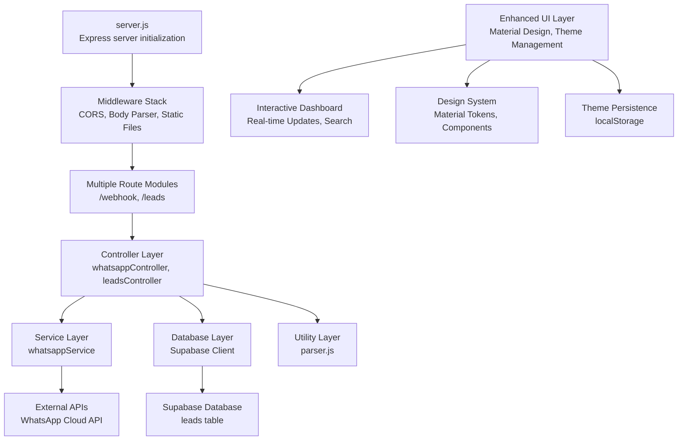
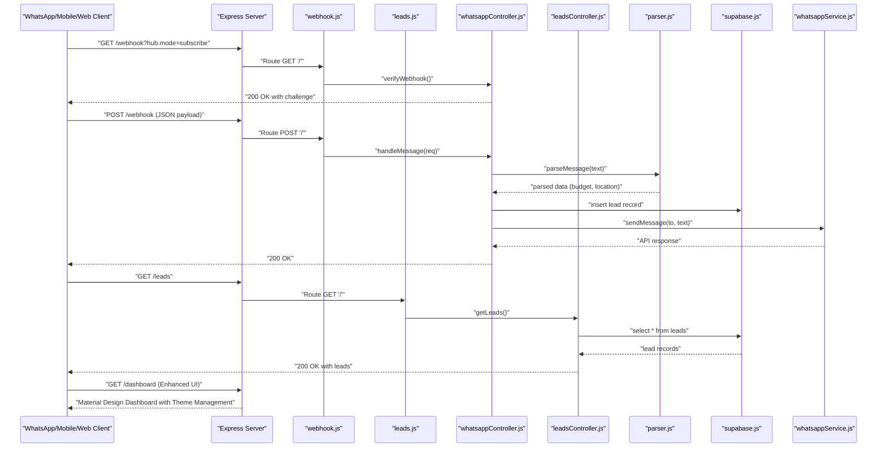
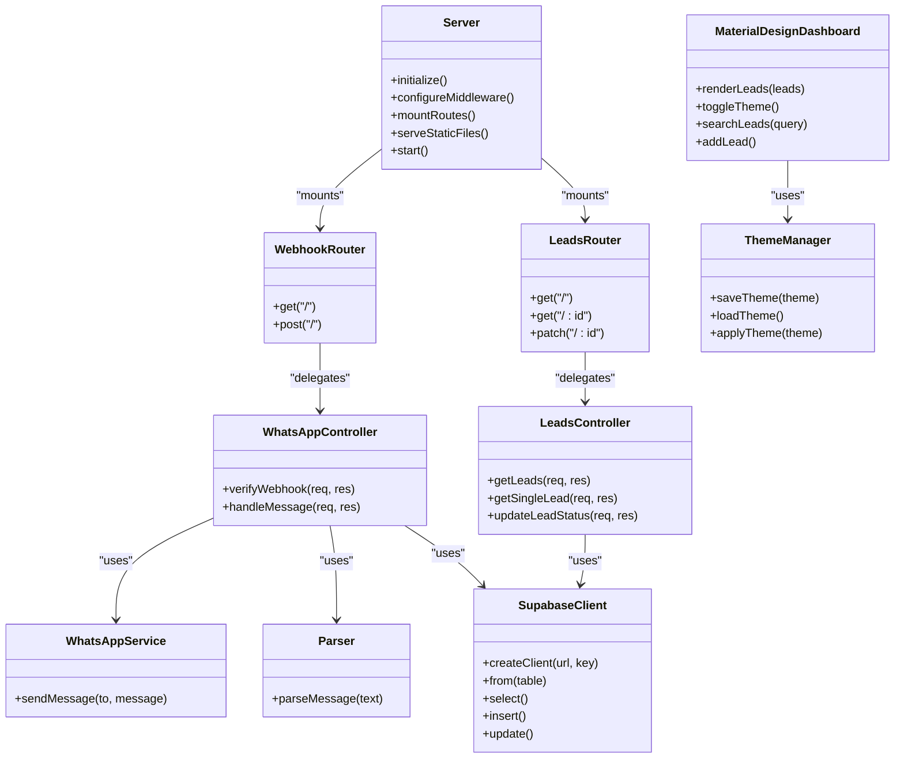
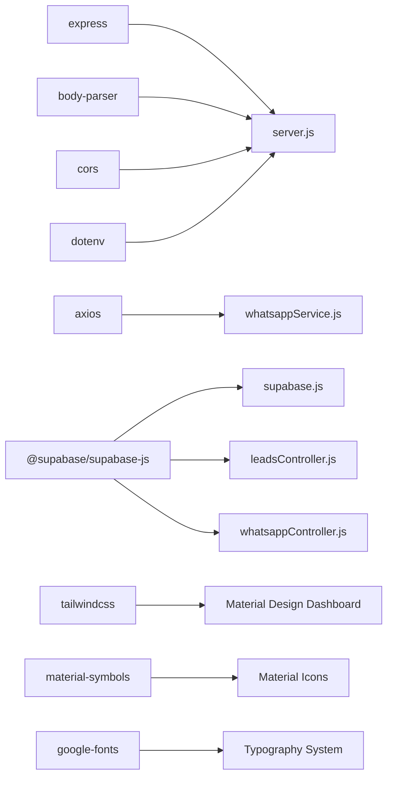

# Development Guide

<cite>
**Referenced Files in This Document**
- [package.json](file://leadpilot-ai/package.json)
- [server.js](file://leadpilot-ai/server.js)
- [webhook.js](file://leadpilot-ai/routes/webhook.js)
- [leads.js](file://leadpilot-ai/routes/leads.js)
- [whatsappController.js](file://leadpilot-ai/controllers/whatsappController.js)
- [leadsController.js](file://leadpilot-ai/controllers/leadsController.js)
- [whatsappService.js](file://leadpilot-ai/services/whatsappService.js)
- [supabase.js](file://leadpilot-ai/db/supabase.js)
- [parser.js](file://leadpilot-ai/utils/parser.js)
- [DESIGN.md](file://leadpilot-ai/leadpilot-ui/DESIGN.md)
- [README.md](file://leadpilot-ai/leadpilot-ui/README.md)
- [code.html](file://leadpilot-ai/leadpilot-ui/code.html)
- [dashboard.html](file://leadpilot-ai/public/dashboard.html)
- [README.md](file://leadpilot-ai/README.md)
</cite>

## Update Summary
**Changes Made**
- Enhanced UI development documentation with Material Design implementation details
- Added comprehensive theme management system documentation including dark/light mode toggle
- Documented interactive UI components with real-time updates and search functionality
- Updated UI customization guidance with Material Design tokens and design system principles
- Added theme persistence documentation using localStorage
- Expanded UI architecture coverage with modern dashboard implementation

## Table of Contents
1. [Introduction](#introduction)
2. [Project Structure](#project-structure)
3. [Core Components](#core-components)
4. [Architecture Overview](#architecture-overview)
5. [Detailed Component Analysis](#detailed-component-analysis)
6. [Modular Development Workflow](#modular-development-workflow)
7. [Database Connection Management](#database-connection-management)
8. [Enhanced UI Development with Material Design](#enhanced-ui-development-with-material-design)
9. [Theme Management System](#theme-management-system)
10. [Interactive UI Components](#interactive-ui-components)
11. [UI Customization and Design System](#ui-customization-and-design-system)
12. [Dependency Analysis](#dependency-analysis)
3. [Performance Considerations](#performance-considerations)
4. [Testing Strategies](#testing-strategies)
5. [Debugging and Logging](#debugging-and-logging)
6. [Error Handling Patterns](#error-handling-patterns)
7. [Extending Existing Functionality](#extending-existing-functionality)
8. [Code Quality Standards and Contribution Guidelines](#code-quality-standards-and-contribution-guidelines)
9. [Conclusion](#conclusion)

## Introduction
This development guide documents the LeadPilot AI codebase, focusing on the Express.js server configuration, middleware setup, request processing pipeline, and modular design patterns. The project now implements a comprehensive controller-based architecture with dedicated controllers for WhatsApp webhook handling and lead management, database connection management through Supabase, and modern UI development with Material Design implementation and theme management system. It provides practical guidance for adding new features, extending existing functionality, implementing custom business logic, and integrating with the WhatsApp Business API. It also covers testing strategies, debugging techniques, logging, error handling, and code quality standards.

## Project Structure
The project follows a modern layered architecture with clear separation of concerns and modular design patterns:
- Entry point initializes the Express server with CORS, body parsing, and static file serving
- Multiple route modules define endpoint handlers for different functional areas
- Dedicated controllers encapsulate request handling logic and orchestrate service calls
- Services abstract external API integrations and database operations
- Database connection management through centralized Supabase client
- Modern UI development with Material Design implementation and theme management
- Interactive dashboard with real-time updates and search functionality

**Diagram sources**
- [server.js:1-29](file://leadpilot-ai/server.js#L1-L29)
- [webhook.js:1-12](file://leadpilot-ai/routes/webhook.js#L1-L12)
- [leads.js:1-14](file://leadpilot-ai/routes/leads.js#L1-L14)
- [whatsappController.js:1-78](file://leadpilot-ai/controllers/whatsappController.js#L1-L78)
- [leadsController.js:1-57](file://leadpilot-ai/controllers/leadsController.js#L1-L57)
- [whatsappService.js:1-23](file://leadpilot-ai/services/whatsappService.js#L1-L23)
- [supabase.js:1-9](file://leadpilot-ai/db/supabase.js#L1-L9)
- [code.html:1-578](file://leadpilot-ai/leadpilot-ui/code.html#L1-L578)
- [DESIGN.md:1-95](file://leadpilot-ai/leadpilot-ui/DESIGN.md#L1-L95)

**Section sources**
- [server.js:1-29](file://leadpilot-ai/server.js#L1-L29)
- [webhook.js:1-12](file://leadpilot-ai/routes/webhook.js#L1-L12)
- [leads.js:1-14](file://leadpilot-ai/routes/leads.js#L1-L14)
- [whatsappController.js:1-78](file://leadpilot-ai/controllers/whatsappController.js#L1-L78)
- [leadsController.js:1-57](file://leadpilot-ai/controllers/leadsController.js#L1-L57)
- [whatsappService.js:1-23](file://leadpilot-ai/services/whatsappService.js#L1-L23)
- [supabase.js:1-9](file://leadpilot-ai/db/supabase.js#L1-L9)
- [code.html:1-578](file://leadpilot-ai/leadpilot-ui/code.html#L1-L578)
- [DESIGN.md:1-95](file://leadpilot-ai/leadpilot-ui/DESIGN.md#L1-L95)

## Core Components
- **Express Server**: Initializes the application with CORS support, global JSON body parsing, static file serving, and multiple route modules
- **Route Modules**: Separate modules for webhook and leads management with dedicated endpoint handlers
- **Controller Layer**: Dedicated controllers for WhatsApp webhook verification and message handling, plus lead management operations
- **Service Layer**: WhatsApp API integration service and database abstraction layer
- **Database Layer**: Centralized Supabase client configuration with environment-based credential management
- **Utility Layer**: Message parsing utilities for extracting lead information
- **Enhanced UI Layer**: Modern dashboard interface built with Material Design, theme management, and interactive components

Key implementation patterns:
- **Modular Architecture**: Clear separation between server initialization, routing, controllers, services, and UI components
- **Environment-Driven Configuration**: Comprehensive use of environment variables for tokens, identifiers, and database credentials
- **Controller-Based Design**: Dedicated controllers for specific functional domains
- **Service Abstraction**: Clear separation between business logic and external integrations
- **Database Connection Management**: Centralized database client with proper error handling
- **Material Design System**: Implementation of Google's Material Design principles with custom theming
- **Theme Management**: Persistent theme switching with localStorage integration

**Section sources**
- [server.js:1-29](file://leadpilot-ai/server.js#L1-L29)
- [webhook.js:1-12](file://leadpilot-ai/routes/webhook.js#L1-L12)
- [leads.js:1-14](file://leadpilot-ai/routes/leads.js#L1-L14)
- [whatsappController.js:1-78](file://leadpilot-ai/controllers/whatsappController.js#L1-L78)
- [leadsController.js:1-57](file://leadpilot-ai/controllers/leadsController.js#L1-L57)
- [whatsappService.js:1-23](file://leadpilot-ai/services/whatsappService.js#L1-L23)
- [supabase.js:1-9](file://leadpilot-ai/db/supabase.js#L1-L9)
- [parser.js:1-10](file://leadpilot-ai/utils/parser.js#L1-L10)
- [code.html:1-578](file://leadpilot-ai/leadpilot-ui/code.html#L1-L578)
- [DESIGN.md:1-95](file://leadpilot-ai/leadpilot-ui/DESIGN.md#L1-L95)

## Architecture Overview
The system processes inbound webhook requests and API calls through a well-defined pipeline with multiple layers:
- Express server receives HTTP requests with comprehensive middleware stack
- Body parser middleware handles JSON payloads for all routes
- Route handlers delegate to dedicated controllers based on endpoint
- Controllers validate requests, extract data, and orchestrate service/database operations
- Services handle external API integrations and database operations
- Response is returned through standardized controller methods
- Enhanced UI layer provides interactive dashboard with real-time updates and theme management

**Diagram sources**
- [server.js:1-29](file://leadpilot-ai/server.js#L1-L29)
- [webhook.js:1-12](file://leadpilot-ai/routes/webhook.js#L1-L12)
- [leads.js:1-14](file://leadpilot-ai/routes/leads.js#L1-L14)
- [whatsappController.js:1-78](file://leadpilot-ai/controllers/whatsappController.js#L1-L78)
- [leadsController.js:1-57](file://leadpilot-ai/controllers/leadsController.js#L1-L57)
- [parser.js:1-10](file://leadpilot-ai/utils/parser.js#L1-L10)
- [supabase.js:1-9](file://leadpilot-ai/db/supabase.js#L1-L9)
- [whatsappService.js:1-23](file://leadpilot-ai/services/whatsappService.js#L1-L23)
- [code.html:1-578](file://leadpilot-ai/leadpilot-ui/code.html#L1-L578)

## Detailed Component Analysis

### Express Server Initialization
The server now implements a comprehensive initialization pattern with multiple middleware layers and route modules:

- **Environment Configuration**: Loads environment variables using dotenv for secure credential management
- **Middleware Stack**: Configures CORS for cross-origin requests, global JSON body parsing, and static file serving
- **Route Modules**: Mounts separate route modules for webhook and leads management
- **Static File Serving**: Serves both the modern dashboard UI and legacy dashboard
- **Enhanced UI Routing**: Routes serve the Material Design dashboard as the main interface
- **Health Check**: Provides root endpoint for server status verification

Operational enhancements:
- **CORS Support**: Enables cross-origin requests for web-based clients
- **Static Asset Serving**: Serves both modern Material Design dashboard and legacy HTML dashboard
- **Multi-route Architecture**: Organized route modules for better maintainability
- **UI Integration**: Seamless integration between backend API and frontend dashboard

**Section sources**
- [server.js:1-29](file://leadpilot-ai/server.js#L1-L29)

### Route Layer: Modular Route Architecture
The project now implements separate route modules for different functional domains:

#### Webhook Routes Module
- **GET Handler**: Performs webhook verification for Meta platform integration
- **POST Handler**: Processes incoming WhatsApp messages with comprehensive error handling
- **Delegation Pattern**: Routes delegate to dedicated controller methods

#### Leads Routes Module
- **GET `/`**: Fetches all leads with sorting by creation timestamp
- **GET `/:id`**: Retrieves individual lead by unique identifier
- **PATCH `/:id`**: Updates lead status with validation

Design benefits:
- **Separation of Concerns**: Each route module focuses on specific domain functionality
- **Maintainability**: Easier to debug and extend individual functional areas
- **Scalability**: Supports addition of new route modules without disrupting existing functionality

**Section sources**
- [webhook.js:1-12](file://leadpilot-ai/routes/webhook.js#L1-L12)
- [leads.js:1-14](file://leadpilot-ai/routes/leads.js#L1-L14)

### Controller Layer: Dedicated Business Logic Handlers

#### WhatsApp Controller
Responsibilities:
- **Webhook Verification**: Validates subscription mode and verify token for Meta platform
- **Message Processing**: Extracts sender information, parses lead data, and orchestrates storage
- **Auto-reply System**: Sends automated responses via WhatsApp API integration
- **Data Persistence**: Saves lead information to both file backup and Supabase database

Advanced features:
- **Lead Parsing**: Uses utility functions to extract budget and location from messages
- **Dual Storage**: Maintains both file-based backup and database persistence
- **Error Resilience**: Graceful handling of API failures and database errors
- **Logging**: Comprehensive console logging for development and debugging

#### Leads Controller
Responsibilities:
- **Lead Retrieval**: Fetches all leads with sorting and pagination support
- **Individual Lead Access**: Retrieves specific leads by unique identifier
- **Status Management**: Updates lead status with validation and error handling
- **Database Abstraction**: Provides clean interface to Supabase operations

**Section sources**
- [whatsappController.js:1-78](file://leadpilot-ai/controllers/whatsappController.js#L1-L78)
- [leadsController.js:1-57](file://leadpilot-ai/controllers/leadsController.js#L1-L57)

### Service Layer: External Integration Abstraction

#### WhatsApp Service
Responsibilities:
- **Message Delivery**: Sends text messages to WhatsApp Business API using Graph API
- **Authentication**: Uses Bearer token authentication with environment-based credentials
- **API Integration**: Handles RESTful communication with Meta's WhatsApp Cloud API

#### Database Service (via Supabase)
The project uses a centralized database service pattern:
- **Client Initialization**: Creates configured Supabase client with environment credentials
- **CRUD Operations**: Provides unified interface for database operations
- **Error Handling**: Centralized error management for database operations

**Section sources**
- [whatsappService.js:1-23](file://leadpilot-ai/services/whatsappService.js#L1-L23)
- [supabase.js:1-9](file://leadpilot-ai/db/supabase.js#L1-L9)

### Utility Layer: Message Processing
The parser utility provides intelligent lead extraction:
- **Budget Detection**: Identifies numerical values and currency indicators
- **Location Extraction**: Parses location information from message text
- **Pattern Matching**: Uses regular expressions for reliable data extraction

**Section sources**
- [parser.js:1-10](file://leadpilot-ai/utils/parser.js#L1-L10)

### Class Model of Key Components

**Diagram sources**
- [server.js:1-29](file://leadpilot-ai/server.js#L1-L29)
- [webhook.js:1-12](file://leadpilot-ai/routes/webhook.js#L1-L12)
- [leads.js:1-14](file://leadpilot-ai/routes/leads.js#L1-L14)
- [whatsappController.js:1-78](file://leadpilot-ai/controllers/whatsappController.js#L1-L78)
- [leadsController.js:1-57](file://leadpilot-ai/controllers/leadsController.js#L1-L57)
- [whatsappService.js:1-23](file://leadpilot-ai/services/whatsappService.js#L1-L23)
- [supabase.js:1-9](file://leadpilot-ai/db/supabase.js#L1-L9)
- [parser.js:1-10](file://leadpilot-ai/utils/parser.js#L1-L10)
- [code.html:1-578](file://leadpilot-ai/leadpilot-ui/code.html#L1-L578)

## Modular Development Workflow
The project implements a comprehensive modular development approach that promotes scalability and maintainability:

### Development Patterns
- **Controller-Based Design**: Each functional area has dedicated controllers for clear responsibility separation
- **Service Abstraction**: External integrations and database operations are abstracted into service classes
- **Route Organization**: Separate route modules for different domains improve maintainability
- **Utility Functions**: Reusable utility functions handle common operations like message parsing
- **UI Modularity**: Material Design components and theme management are modular and reusable

### Extension Guidelines
To add new features following the established patterns:
1. **Create Route Module**: Add new route file in `/routes` directory
2. **Implement Controller**: Create corresponding controller in `/controllers` directory
3. **Add Service**: Implement service layer for external integrations if needed
4. **Update Server**: Register new route module in server configuration
5. **Add Dependencies**: Install and configure any new dependencies
6. **UI Integration**: Integrate new features with Material Design dashboard components

### Scalability Benefits
- **Independent Development**: Teams can work on different modules simultaneously
- **Easy Testing**: Modular structure facilitates unit testing and mocking
- **Code Reusability**: Shared utilities and services promote code reuse
- **Deployment Flexibility**: Modules can be deployed independently if needed
- **UI Scalability**: Material Design system supports easy UI component extension

## Database Connection Management
The project implements centralized database connection management through Supabase:

### Supabase Integration
- **Client Configuration**: Centralized client initialization with environment-based credentials
- **Connection Security**: Credentials stored in environment variables for security
- **Error Handling**: Comprehensive error handling for database operations
- **RLS Policies**: Row-level security policies enable fine-grained access control

### Database Schema
The leads table follows a structured schema optimized for real estate lead management:
- **UUID Primary Key**: Ensures unique identification across distributed systems
- **Phone Number Tracking**: Captures lead contact information
- **Message Content**: Stores original lead message for reference
- **Parsed Data Fields**: Budget and location extracted from messages
- **Status Tracking**: Four-tier status system (new, contacted, follow-up, closed)
- **Timestamp Management**: Automatic creation timestamps for sorting and analytics

### Security Implementation
- **Environment Variables**: Database credentials stored securely in environment
- **Row-Level Security**: Configurable policies for data access control
- **Connection Pooling**: Efficient database connection management

**Section sources**
- [supabase.js:1-9](file://leadpilot-ai/db/supabase.js#L1-L9)
- [db/README.md:18-35](file://leadpilot-ai/db/README.md#L18-L35)

## Enhanced UI Development with Material Design
The project features a comprehensive Material Design implementation with modern design principles and interactive components:

### Material Design Architecture
The dashboard implements Google's Material Design 3 principles with custom theming:
- **Material Symbols Integration**: Consistent iconography using Material Symbols Outlined
- **Typography System**: Dual-font strategy with Manrope for headlines and Inter for body text
- **Color System**: Custom color palette with Material Design tokens (primary, secondary, tertiary)
- **Component Design**: Rounded corners (rounded-xl), consistent spacing, and elevation through tonal layering
- **Surface Hierarchy**: Three-tier surface container system for depth perception

### Interactive Dashboard Features
- **Real-time Lead Management**: Live updates every 10 seconds with automatic refresh
- **Status Management**: Interactive dropdowns for lead status updates with immediate API synchronization
- **Search Functionality**: Real-time search across phone numbers, locations, messages, and budgets
- **Manual Lead Entry**: Development-friendly manual lead creation for testing purposes
- **Responsive Design**: Mobile-first approach with adaptive layouts for all screen sizes
- **Performance Optimized**: Efficient rendering with virtual scrolling for large datasets

### Design System Implementation
- **Custom Tailwind Configuration**: Extended theme with Material Design color tokens
- **Component Library**: Reusable UI components with consistent styling
- **Accessibility**: Proper ARIA labels, keyboard navigation, and screen reader support
- **Cross-browser Compatibility**: Consistent rendering across modern browsers

**Section sources**
- [code.html:1-578](file://leadpilot-ai/leadpilot-ui/code.html#L1-L578)
- [DESIGN.md:1-95](file://leadpilot-ai/leadpilot-ui/DESIGN.md#L1-L95)
- [README.md:1-29](file://leadpilot-ai/leadpilot-ui/README.md#L1-L29)

## Theme Management System
The project implements a sophisticated theme management system with persistent theme switching:

### Theme Architecture
- **Dark/Light Mode Toggle**: One-click theme switching with visual indicator
- **Persistent Storage**: Theme preference saved in localStorage for session continuity
- **CSS Custom Properties**: Dynamic theme switching using CSS custom properties
- **System Preference Detection**: Automatic detection of OS theme preference
- **Smooth Transitions**: CSS transitions for seamless theme switching experience

### Implementation Details
- **Class-based Switching**: Body element toggles between 'light' and 'dark' classes
- **Material Design Tokens**: Custom color tokens mapped to Material Design palettes
- **Component Theming**: All UI components automatically adapt to current theme
- **Icon Adaptation**: Theme-aware icons and visual elements
- **Form Element Theming**: Input fields, selects, and buttons adapt to theme context

### Theme Persistence Strategy
- **Automatic Loading**: Theme preference loaded on page initialization
- **Real-time Updates**: Immediate theme application without page reload
- **Fallback Handling**: Default to system preference if no saved preference exists
- **Cross-session Consistency**: Theme preference maintained across browser sessions

**Section sources**
- [code.html:550-578](file://leadpilot-ai/leadpilot-ui/code.html#L550-L578)
- [DESIGN.md:11-29](file://leadpilot-ai/leadpilot-ui/DESIGN.md#L11-L29)

## Interactive UI Components
The dashboard features a comprehensive set of interactive components designed for real estate lead management:

### Lead Management Interface
- **Dynamic Table Rendering**: React-like component updates without full page reloads
- **Status Update Dropdowns**: Inline editing with immediate API synchronization
- **Hover Effects**: Subtle animations and visual feedback for interactive elements
- **Loading States**: Graceful loading indicators during data fetch operations
- **Error Handling**: User-friendly error messages and recovery options

### Navigation and Layout
- **Fixed Sidebar Navigation**: Persistent navigation with active state indication
- **Top Navigation Bar**: Contextual actions and user controls
- **Breadcrumb Navigation**: Hierarchical navigation for complex workflows
- **Responsive Layout**: Adaptive grid system for optimal viewing on all devices
- **Scroll Position Preservation**: Maintains scroll position during navigation

### Advanced Features
- **Real-time Search**: Instant filtering with debounced input handling
- **Pagination Controls**: Previous/Next navigation for large datasets
- **Statistics Visualization**: Lead velocity charts and pipeline value displays
- **Property Previews**: Decorative property cards with hover effects
- **Performance Metrics**: Real-time performance indicators and system status

### Component Interaction Patterns
- **Event Delegation**: Efficient event handling for dynamic content
- **State Management**: Local state management for UI interactions
- **API Integration**: Seamless integration between UI components and backend services
- **Error Boundaries**: Graceful error handling for component failures
- **Loading States**: Progress indicators and skeleton screens for better UX

**Section sources**
- [code.html:338-578](file://leadpilot-ai/leadpilot-ui/code.html#L338-L578)

## UI Customization and Design System
The project implements a comprehensive design system that enables extensive UI customization while maintaining consistency:

### Design System Principles
- **Material Design Foundation**: Google's Material Design 3 principles with custom adaptations
- **Design Token System**: Centralized design tokens for colors, typography, spacing, and components
- **Consistency Framework**: Unified design language across all interface elements
- **Accessibility First**: WCAG-compliant design with proper contrast ratios and semantic markup
- **Performance Optimization**: Efficient rendering with minimal DOM manipulation

### Customization Capabilities
- **Color Customization**: Easy modification of primary, secondary, and tertiary color schemes
- **Typography Control**: Flexible font family selection and sizing adjustments
- **Component Theming**: Individual component styling overrides without affecting global design
- **Layout Flexibility**: Responsive grid system with customizable breakpoints
- **Animation Control**: Configurable transitions and motion design elements

### Design Token Implementation
- **Color Tokens**: Comprehensive color palette with semantic naming (primary, secondary, error, etc.)
- **Typography Tokens**: Systematic font sizing, weight, and spacing scales
- **Spacing Tokens**: Consistent spacing system for margins, padding, and gaps
- **Border Radius Tokens**: Standardized corner radius values for consistent rounded elements
- **Shadow Tokens**: Systematic elevation and depth indicators

### Component Library Architecture
- **Reusable Components**: Modular UI components with consistent APIs
- **Props System**: Flexible component configuration through props
- **Slot System**: Content projection for flexible component composition
- **Event System**: Standardized event handling across component interactions
- **Styling System**: CSS-in-JS or utility-first approach for component styling

**Section sources**
- [DESIGN.md:1-95](file://leadpilot-ai/leadpilot-ui/DESIGN.md#L1-L95)
- [code.html:11-74](file://leadpilot-ai/leadpilot-ui/code.html#L11-L74)

## Dependency Analysis
The project maintains a focused set of core dependencies optimized for its specific use case:

### Core Runtime Dependencies
- **Express.js**: Web framework for routing and HTTP handling
- **Body-parser**: JSON request body parsing for all routes
- **CORS**: Cross-origin resource sharing for web-based clients
- **Dotenv**: Environment variable management from .env files
- **Axios**: HTTP client for external API communications
- **@supabase/supabase-js**: Database connectivity and operations

### Frontend Dependencies
- **Tailwind CSS**: Utility-first CSS framework with plugin support
- **Material Symbols**: Google's Material Symbols icon library
- **Inter & Manrope Fonts**: High-quality typography fonts for design system
- **Forms Plugin**: Tailwind CSS forms plugin for consistent form styling
- **Container Queries**: Modern responsive design capabilities

### Development Dependencies
- **No dedicated test scripts**: Testing infrastructure not yet implemented
- **No linting configuration**: Code quality tools not yet configured

**Diagram sources**
- [package.json:13-20](file://leadpilot-ai/package.json#L13-L20)
- [server.js:1-29](file://leadpilot-ai/server.js#L1-L29)
- [whatsappService.js:1-23](file://leadpilot-ai/services/whatsappService.js#L1-L23)
- [supabase.js:1-9](file://leadpilot-ai/db/supabase.js#L1-L9)
- [code.html:7-10](file://leadpilot-ai/leadpilot-ui/code.html#L7-L10)

**Section sources**
- [package.json:13-20](file://leadpilot-ai/package.json#L13-L20)
- [server.js:1-29](file://leadpilot-ai/server.js#L1-L29)
- [whatsappService.js:1-23](file://leadpilot-ai/services/whatsappService.js#L1-L23)
- [supabase.js:1-9](file://leadpilot-ai/db/supabase.js#L1-L9)
- [code.html:7-10](file://leadpilot-ai/leadpilot-ui/code.html#L7-L10)

## Performance Considerations
The modular architecture introduces several performance optimization opportunities:

### Request Processing Optimization
- **Selective JSON Parsing**: Body parser enabled globally but only processed when needed
- **Route-Specific Logic**: Modular routes allow for optimized processing based on endpoint type
- **Database Connection Efficiency**: Centralized Supabase client reduces connection overhead

### Asynchronous Operations
- **Non-blocking Service Calls**: All external API calls use async/await patterns
- **Database Operations**: Supabase operations are asynchronous and connection-managed
- **File I/O**: Lead backup uses append-only file operations to minimize disk contention

### UI Performance Optimization
- **Efficient DOM Manipulation**: Minimal DOM updates with selective re-rendering
- **Virtual Scrolling**: Performance optimization for large lead datasets
- **Lazy Loading**: Images and components loaded on demand
- **CSS-in-JS**: Dynamic styling with minimal CSS overhead
- **Theme Caching**: Theme preferences cached in localStorage for instant loading

### Caching and Optimization
- **Static Asset Serving**: Express serves static files efficiently from public directories
- **Real-time Updates**: Dashboard implements efficient polling with configurable intervals
- **Memory Management**: Modular design allows for better memory cleanup and resource management
- **Component Memoization**: UI components optimized to prevent unnecessary re-renders

### Scalability Considerations
- **Horizontal Scaling**: Modular architecture supports deployment across multiple instances
- **Database Optimization**: Supabase provides built-in scaling capabilities
- **API Rate Limiting**: WhatsApp API integration includes automatic rate limiting considerations
- **UI Scalability**: Material Design system supports easy scaling of components and themes

## Testing Strategies
The project currently lacks formal testing infrastructure but provides clear pathways for implementation:

### Current State
- **No test scripts**: Package manifest does not include testing configurations
- **Manual testing**: Relies on manual verification of webhook functionality and UI interactions
- **Console logging**: Extensive logging for development and debugging
- **UI Manual Testing**: Interactive dashboard tested through browser automation

### Recommended Testing Approaches

#### Unit Testing Strategy
- **Controller Testing**: Test individual controller methods with mocked dependencies
- **Service Testing**: Mock external API calls and database operations
- **Utility Testing**: Test parser functions with various input formats
- **Database Testing**: Use test database instances for data operations
- **UI Component Testing**: Test individual Material Design components in isolation

#### Integration Testing Strategy
- **End-to-End Flows**: Test complete webhook processing from message receipt to database storage
- **API Integration**: Validate WhatsApp API integration with test credentials
- **Database Integration**: Test Supabase operations with test data
- **UI Integration Testing**: Validate dashboard functionality and real-time updates
- **Theme System Testing**: Test theme switching and persistence across different scenarios

#### Webhook Testing Approach
- **Local Testing**: Use ngrok or similar services for webhook testing during development
- **Mock Responses**: Implement mock services for external API testing
- **Event Simulation**: Create test events to validate webhook processing pipeline
- **UI Interaction Testing**: Test dashboard interactions with simulated backend responses

#### Material Design Testing
- **Component Consistency**: Verify Material Design components render consistently across themes
- **Responsive Behavior**: Test components across different screen sizes and orientations
- **Accessibility Testing**: Validate WCAG compliance for all interactive elements
- **Performance Testing**: Measure component rendering performance under load

## Debugging and Logging
The project implements comprehensive logging strategies for effective debugging:

### Current Logging Implementation
- **Console Logging**: Extensive console logging throughout controller and service layers
- **Error Logging**: Structured error logging with detailed error messages
- **Development Logging**: Informative logs for message processing and database operations
- **UI Debugging**: Console logging for frontend interactions and API calls

### Enhanced Logging Recommendations
- **Structured Logging**: Implement Winston or similar logging framework
- **Log Levels**: Separate logging levels (debug, info, warn, error) for different contexts
- **Request Tracing**: Correlation IDs for tracking requests across multiple layers
- **Performance Metrics**: Timing logs for critical operations and API calls
- **UI Event Logging**: Track user interactions and component lifecycle events

### Debugging Tools
- **Development Environment**: Console-based debugging with detailed error information
- **Database Inspection**: Direct database queries for data validation
- **Network Monitoring**: API call monitoring for external service debugging
- **UI Debugging**: Browser developer tools for frontend debugging
- **Theme Debugging**: Inspect CSS custom properties and theme application

## Error Handling Patterns
The project implements robust error handling across all layers:

### Current Error Handling
- **Try/Catch Blocks**: Comprehensive error handling in controller methods
- **HTTP Status Codes**: Appropriate status codes for success and error scenarios
- **Error Messages**: Descriptive error messages for debugging and user feedback
- **Graceful Degradation**: System continues operating even when individual components fail
- **UI Error States**: User-friendly error messages in dashboard interface

### Enhanced Error Handling
- **Centralized Error Middleware**: Express error handling middleware for consistent error responses
- **Validation Middleware**: Input validation and sanitization for all request data
- **Retry Logic**: Automatic retry mechanisms for transient external API failures
- **Circuit Breaker**: Protection against cascading failures in external service dependencies
- **UI Error Boundaries**: Graceful error handling for component failures

### Error Recovery Strategies
- **Fallback Mechanisms**: File-based backup when database operations fail
- **Graceful Degradation**: Continue processing even when optional features fail
- **Monitoring Integration**: Integration with monitoring systems for error tracking
- **User Feedback**: Clear error messages and recovery options in UI

**Section sources**
- [whatsappController.js:19-78](file://leadpilot-ai/controllers/whatsappController.js#L19-L78)
- [leadsController.js:4-57](file://leadpilot-ai/controllers/leadsController.js#L4-L57)

## Extending Existing Functionality
The modular architecture provides clear pathways for extending functionality:

### Adding New Features
1. **Create Route Module**: Add new route file in `/routes` directory
2. **Implement Controller**: Create controller with business logic in `/controllers` directory
3. **Add Service**: Implement service for external integrations if needed
4. **Update Server**: Register new route module in server configuration
5. **Test Integration**: Validate new functionality with existing testing strategies
6. **UI Integration**: Integrate new features with Material Design dashboard components

### Example Extensions
- **Multi-language Support**: Extend parser utility for international lead processing
- **Rich Media Support**: Add WhatsApp media message handling capabilities
- **Advanced Analytics**: Implement lead conversion tracking and reporting
- **Team Collaboration**: Add user management and role-based access control
- **Email Integration**: Add email notification system for lead updates
- **Export Functionality**: Add CSV/PDF export capabilities for lead data
- **Notification System**: Implement real-time notifications for lead updates

### Database Extensions
- **Additional Tables**: Extend database schema for new entities
- **Relationships**: Implement foreign key relationships for complex data models
- **Indexes**: Optimize database queries with appropriate indexing strategies

### UI Extensions
- **New Components**: Add Material Design components for new functionality
- **Theme Variants**: Extend theme system for new color schemes
- **Layout Changes**: Modify responsive layouts for new content types
- **Animation Effects**: Add micro-interactions and transition effects
- **Accessibility Enhancements**: Improve accessibility for new features

## Code Quality Standards and Contribution Guidelines
The project follows modern development practices with clear standards:

### Current Standards
- **ES6+ JavaScript**: Modern JavaScript syntax and features
- **CommonJS Modules**: Consistent module system for Node.js applications
- **Environment Variables**: Secure credential management through dotenv
- **Modular Architecture**: Clear separation of concerns across layers
- **Material Design Compliance**: Adherence to Material Design principles
- **Theme System**: Consistent theme management across UI components

### Recommended Improvements
- **ESLint Configuration**: Implement ESLint with Airbnb or Standard preset
- **Prettier Formatting**: Consistent code formatting across the entire codebase
- **TypeScript**: Consider TypeScript for enhanced type safety
- **Documentation**: Expand inline documentation and API documentation
- **Testing Framework**: Implement Jest or Mocha for comprehensive testing
- **UI Testing**: Add Cypress or Playwright for end-to-end UI testing

### Contribution Guidelines
- **Branching Strategy**: Feature branches for new development
- **Pull Requests**: Code review process for all contributions
- **Testing Requirements**: Unit tests for new functionality
- **Documentation Updates**: Update documentation for significant changes
- **Design Consistency**: Ensure new UI components follow Material Design principles
- **Theme Compatibility**: Verify new features work with both light and dark themes

### Development Workflow
- **Environment Setup**: Clear instructions for local development environment
- **Dependency Management**: Proper dependency versioning and updates
- **Build Process**: Automated build and deployment processes
- **Quality Gates**: Automated testing and linting in CI/CD pipelines
- **UI Testing**: Regular testing of Material Design components and theme system

## Conclusion
LeadPilot AI demonstrates a sophisticated, modular architecture that effectively separates concerns across multiple layers while maintaining scalability and maintainability. The implementation showcases modern development practices including controller-based design, centralized database management, and comprehensive Material Design implementation with theme management system. The project's layered architecture with clear separation between server initialization, routing, controllers, services, and UI components provides an excellent foundation for continued development and feature expansion.

The enhanced frontend development with Material Design implementation provides an exceptional user experience with interactive UI components, real-time updates, and comprehensive theme management. The design system ensures consistency and scalability while the theme management system provides users with personalized experiences that persist across sessions.

By following the established patterns of layered architecture, environment-driven configuration, service abstraction, and modular design, developers can confidently extend functionality, integrate with additional APIs, implement advanced features like multi-language support and rich media handling, and maintain high code quality standards. The comprehensive error handling, logging strategies, and testing approaches ensure reliability and scalability as the project evolves toward its vision of becoming a comprehensive lead management system that ensures no lead is ever lost.

The Material Design implementation with custom theming, interactive components, and persistent theme switching sets a new standard for SaaS dashboard interfaces, combining professional aesthetics with functional excellence. This foundation enables the project to scale effectively while maintaining user experience quality and development maintainability.