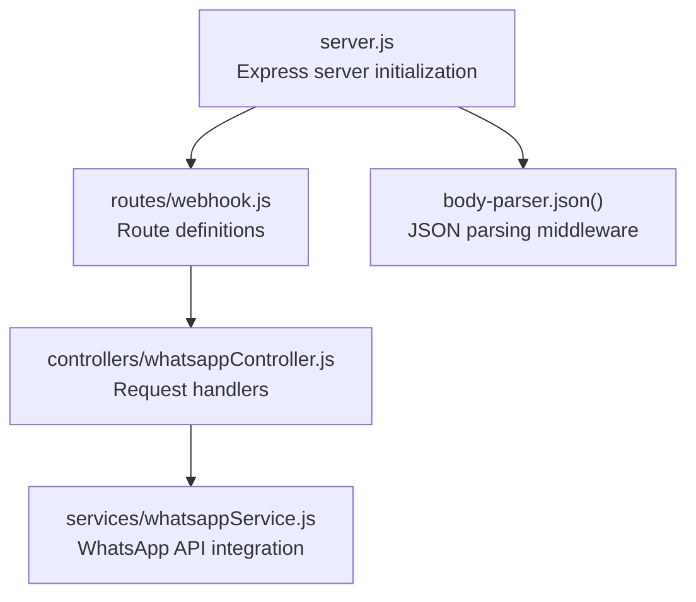
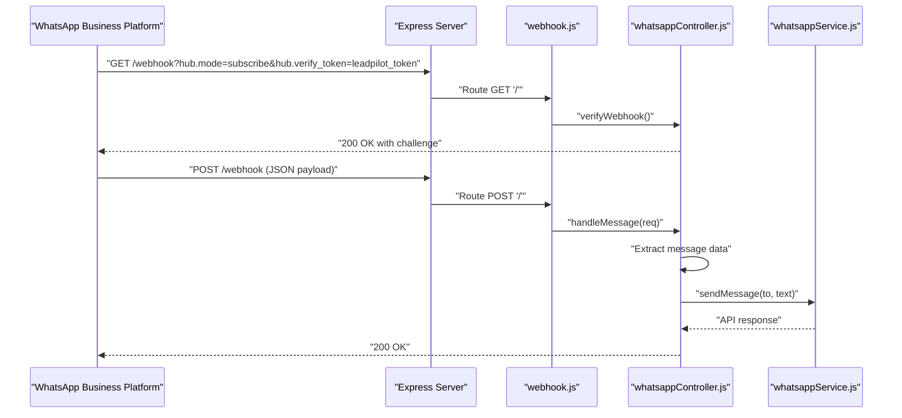
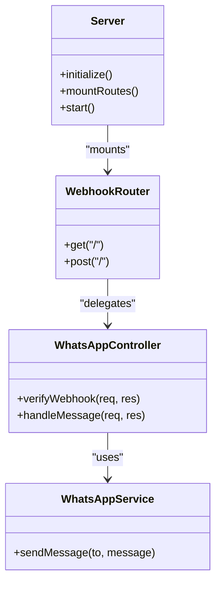
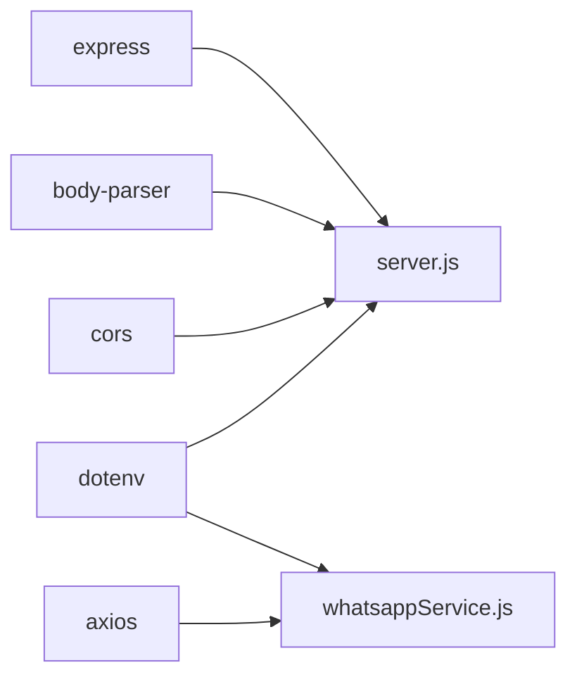

# Development Guide

<cite>
**Referenced Files in This Document**
- [package.json](file://leadpilot-ai/package.json)
- [server.js](file://leadpilot-ai/server.js)
- [webhook.js](file://leadpilot-ai/routes/webhook.js)
- [whatsappController.js](file://leadpilot-ai/controllers/whatsappController.js)
- [whatsappService.js](file://leadpilot-ai/services/whatsappService.js)
</cite>

## Table of Contents
1. [Introduction](#introduction)
2. [Project Structure](#project-structure)
3. [Core Components](#core-components)
4. [Architecture Overview](#architecture-overview)
5. [Detailed Component Analysis](#detailed-component-analysis)
6. [Dependency Analysis](#dependency-analysis)
7. [Performance Considerations](#performance-considerations)
8. [Testing Strategies](#testing-strategies)
9. [Debugging and Logging](#debugging-and-logging)
10. [Error Handling Patterns](#error-handling-patterns)
11. [Extending Existing Functionality](#extending-existing-functionality)
12. [Code Quality Standards and Contribution Guidelines](#code-quality-standards-and-contribution-guidelines)
13. [Conclusion](#conclusion)

## Introduction
This development guide documents the LeadPilot AI codebase, focusing on the Express.js server configuration, middleware setup, request processing pipeline, and modular design patterns. It provides practical guidance for adding new features, extending existing functionality, implementing custom business logic, and integrating with the WhatsApp Business API. It also covers testing strategies, debugging techniques, logging, error handling, and code quality standards.

## Project Structure
The project follows a layered architecture with clear separation of concerns:
- Entry point initializes the Express server and loads environment variables.
- Routes define endpoint handlers for the webhook.
- Controllers encapsulate request handling logic and orchestrate service calls.
- Services abstract external API integrations (WhatsApp Business API).

**Diagram sources**
- [server.js:1-19](file://leadpilot-ai/server.js#L1-L19)
- [webhook.js:1-12](file://leadpilot-ai/routes/webhook.js#L1-L12)
- [whatsappController.js:1-40](file://leadpilot-ai/controllers/whatsappController.js#L1-L40)
- [whatsappService.js:1-23](file://leadpilot-ai/services/whatsappService.js#L1-L23)

**Section sources**
- [server.js:1-19](file://leadpilot-ai/server.js#L1-L19)
- [webhook.js:1-12](file://leadpilot-ai/routes/webhook.js#L1-L12)
- [whatsappController.js:1-40](file://leadpilot-ai/controllers/whatsappController.js#L1-L40)
- [whatsappService.js:1-23](file://leadpilot-ai/services/whatsappService.js#L1-L23)

## Core Components
- Express server: Initializes the application, loads environment variables, registers middleware, mounts routes, and starts the HTTP listener.
- Webhook route: Exposes GET and POST endpoints for verification and message delivery.
- WhatsApp controller: Implements webhook verification and incoming message handling with auto-reply logic.
- WhatsApp service: Encapsulates the WhatsApp Business API integration for sending messages.

Key implementation patterns:
- Layered architecture: Clear separation between server, routes, controllers, and services.
- Environment-driven configuration: Uses environment variables for tokens and identifiers.
- Minimal middleware: JSON body parsing is enabled globally for all routes.

**Section sources**
- [server.js:1-19](file://leadpilot-ai/server.js#L1-L19)
- [webhook.js:1-12](file://leadpilot-ai/routes/webhook.js#L1-L12)
- [whatsappController.js:1-40](file://leadpilot-ai/controllers/whatsappController.js#L1-L40)
- [whatsappService.js:1-23](file://leadpilot-ai/services/whatsappService.js#L1-L23)

## Architecture Overview
The system processes inbound webhook requests through a predictable pipeline:
- Express server receives HTTP requests.
- Body parser middleware parses JSON payloads.
- Route handler delegates to the controller.
- Controller validates the webhook and extracts message data.
- Service sends a response via the WhatsApp Business API.

**Diagram sources**
- [server.js:1-19](file://leadpilot-ai/server.js#L1-L19)
- [webhook.js:1-12](file://leadpilot-ai/routes/webhook.js#L1-L12)
- [whatsappController.js:1-40](file://leadpilot-ai/controllers/whatsappController.js#L1-L40)
- [whatsappService.js:1-23](file://leadpilot-ai/services/whatsappService.js#L1-L23)

## Detailed Component Analysis

### Express Server Initialization
- Loads environment variables using dotenv.
- Creates an Express app instance.
- Registers JSON body parsing middleware globally.
- Mounts the webhook route under "/webhook".
- Serves a health check at "/".
- Starts the server on a fixed port.

Operational notes:
- Global JSON parsing enables downstream controllers to access parsed bodies.
- Health check endpoint confirms server availability.

**Section sources**
- [server.js:1-19](file://leadpilot-ai/server.js#L1-L19)

### Route Layer: Webhook Routes
- Defines GET and POST handlers for the webhook endpoint.
- GET handler performs webhook verification.
- POST handler processes incoming messages.

Design considerations:
- Single route module centralizes endpoint definitions.
- Delegation to controller keeps routes thin.

**Section sources**
- [webhook.js:1-12](file://leadpilot-ai/routes/webhook.js#L1-L12)

### Controller Layer: WhatsApp Controller
Responsibilities:
- Verification: Validates subscription mode and verify token to confirm webhook ownership.
- Message handling: Extracts sender and message body, logs activity, and triggers an auto-reply via the service layer.

Error handling:
- Try/catch around message processing to prevent unhandled exceptions.
- Returns appropriate HTTP status codes for success and failure scenarios.

Logging:
- Console logs for new messages during development.

**Section sources**
- [whatsappController.js:1-40](file://leadpilot-ai/controllers/whatsappController.js#L1-L40)

### Service Layer: WhatsApp Service
Responsibilities:
- Sends text messages to the WhatsApp Business API using Axios.
- Reads credentials and target phone ID from environment variables.
- Constructs the API request with required headers and payload.

External integration:
- Calls the Graph API endpoint for messaging.
- Uses Bearer token authentication.

**Section sources**
- [whatsappService.js:1-23](file://leadpilot-ai/services/whatsappService.js#L1-L23)

### Class Model of Key Components

**Diagram sources**
- [server.js:1-19](file://leadpilot-ai/server.js#L1-L19)
- [webhook.js:1-12](file://leadpilot-ai/routes/webhook.js#L1-L12)
- [whatsappController.js:1-40](file://leadpilot-ai/controllers/whatsappController.js#L1-L40)
- [whatsappService.js:1-23](file://leadpilot-ai/services/whatsappService.js#L1-L23)

## Dependency Analysis
Primary runtime dependencies:
- Express: Web framework for routing and HTTP handling.
- Body-parser: Parses JSON request bodies.
- Axios: HTTP client for external API calls.
- Dotenv: Loads environment variables from a .env file.
- CORS: Cross-origin support (available but not mounted in current server).

**Diagram sources**
- [package.json:13-19](file://leadpilot-ai/package.json#L13-L19)
- [server.js:1-19](file://leadpilot-ai/server.js#L1-L19)
- [whatsappService.js:1-23](file://leadpilot-ai/services/whatsappService.js#L1-L23)

**Section sources**
- [package.json:13-19](file://leadpilot-ai/package.json#L13-L19)
- [server.js:1-19](file://leadpilot-ai/server.js#L1-L19)
- [whatsappService.js:1-23](file://leadpilot-ai/services/whatsappService.js#L1-L23)

## Performance Considerations
- Request parsing: Body parser is enabled globally; ensure only necessary routes parse JSON to reduce overhead.
- Asynchronous operations: Service calls are asynchronous; avoid blocking operations in controllers.
- Concurrency: Express handles concurrent requests by default; ensure service calls are non-blocking.
- Environment configuration: Externalize secrets and identifiers to environment variables to avoid repeated parsing costs.

[No sources needed since this section provides general guidance]

## Testing Strategies
Current state:
- No dedicated test scripts are configured in the package manifest.

Recommended strategies:
- Unit testing:
  - Test controller logic for webhook verification and message handling.
  - Mock service layer to isolate controller behavior.
  - Verify error handling paths and status codes.
- Integration testing:
  - Use a local proxy or mock WhatsApp Business API to simulate real responses.
  - Validate end-to-end flows from route to service.
- Webhook testing:
  - Use ngrok or a similar tunneling service to expose the local server for webhook testing.
  - Verify challenge response and message delivery flows.

[No sources needed since this section provides general guidance]

## Debugging and Logging
Current logging:
- Console logs are used in the controller for message events.

Enhancement recommendations:
- Centralized logger (e.g., Winston or Pino) for structured logs.
- Log levels: info, warn, error, debug.
- Include correlation IDs for request tracing across layers.
- Environment-based log verbosity.

[No sources needed since this section provides general guidance]

## Error Handling Patterns
Observed patterns:
- Try/catch around message processing in the controller.
- Explicit status code returns for success and error conditions.
- Basic console error logging.

Recommended improvements:
- Centralized error middleware to handle uncaught exceptions.
- Standardized error responses with consistent structure.
- Validation middleware for input sanitization and schema checks.
- Circuit breaker or retry logic for external API calls.

**Section sources**
- [whatsappController.js:16-39](file://leadpilot-ai/controllers/whatsappController.js#L16-L39)

## Extending Existing Functionality
Add new features by following the established patterns:
- Add a new route in the route module and mount it in the server.
- Implement a controller method to handle the new endpoint logic.
- Extend the service layer to integrate with additional APIs or databases.
- Keep business logic in controllers and external integrations in services.

Examples of extensions:
- Multi-language auto-replies: Enhance controller logic to select responses based on detected language.
- Message templates: Introduce a template engine and persist templates in a database via a new service.
- Rich media support: Add new service methods for images, documents, and interactive components.

[No sources needed since this section provides general guidance]

## Code Quality Standards and Contribution Guidelines
Standards to adopt:
- Linting: Configure ESLint with a shared preset (e.g., Airbnb or Standard) and enforce in CI.
- Formatting: Use Prettier consistently across the codebase.
- Commit hygiene: Enforce conventional commits for clear changelogs.
- Pull requests: Require reviews and passing tests before merging.
- Documentation: Keep README updated with setup, environment variables, and deployment steps.

[No sources needed since this section provides general guidance]

## Conclusion
LeadPilot AI demonstrates a clean, modular architecture with a clear separation between server initialization, routing, controllers, and services. By adhering to the patterns shown here—layered design, environment-driven configuration, and service abstraction—you can confidently extend functionality, integrate with the WhatsApp Business API, and maintain high code quality. Adopt robust testing, logging, and error handling practices to ensure reliability and scalability.

[No sources needed since this section summarizes without analyzing specific files]