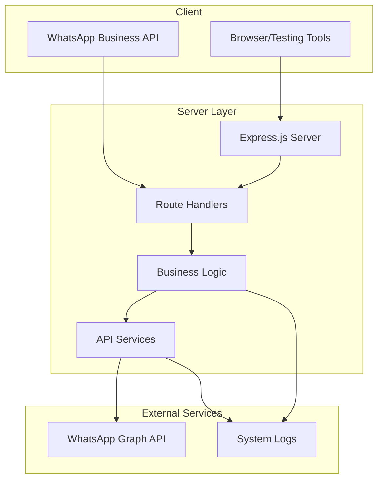

# Getting Started

<cite>
**Referenced Files in This Document**
- [server.js](file://leadpilot-ai/server.js)
- [package.json](file://leadpilot-ai/package.json)
- [routes/webhook.js](file://leadpilot-ai/routes/webhook.js)
- [controllers/whatsappController.js](file://leadpilot-ai/controllers/whatsappController.js)
- [services/whatsappService.js](file://leadpilot-ai/services/whatsappService.js)
- [node_modules/dotenv/README.md](file://leadpilot-ai/node_modules/dotenv/README.md)
</cite>

## Table of Contents
1. [Introduction](#introduction)
2. [Prerequisites](#prerequisites)
3. [Installation](#installation)
4. [Environment Variables](#environment-variables)
5. [Application Startup](#application-startup)
6. [Basic Health Checks](#basic-health-checks)
7. [Initial Setup Procedures](#initial-setup-procedures)
8. [Architecture Overview](#architecture-overview)
9. [Troubleshooting Guide](#troubleshooting-guide)
10. [Conclusion](#conclusion)

## Introduction
LeadPilot AI is a Node.js-based webhook receiver for WhatsApp Business API. It listens for incoming messages, verifies webhook subscriptions, and automatically replies to contacts. The application uses Express.js for routing, Axios for outbound API calls, and Dotenv for environment configuration.

## Prerequisites
- Node.js runtime environment
- npm package manager
- WhatsApp Business API credentials (token, phone number ID)
- Basic understanding of environment variables and HTTP webhooks

**Section sources**
- [package.json:13-19](file://leadpilot-ai/package.json#L13-L19)
- [server.js:1](file://leadpilot-ai/server.js#L1)

## Installation
Follow these step-by-step instructions to install and run LeadPilot AI:

### Step 1: Install Dependencies
Navigate to the project directory and install all required packages:
- Run: `npm install`

### Step 2: Configure Environment Variables
Create a `.env` file in the project root with your WhatsApp Business API credentials:
- WHATSAPP_TOKEN: Your WhatsApp Business API access token
- PHONE_ID: Your WhatsApp phone number ID
- Optional: WHATSAPP_VERIFY_TOKEN: Custom verification token (defaults to internal value)

### Step 3: Start the Application
Launch the server using:
- Run: `node server.js`

### Step 4: Verify Installation
Check that the server is running:
- Visit: `http://localhost:3000`
- Expected response: "Server is running 🚀"

**Section sources**
- [server.js:15-18](file://leadpilot-ai/server.js#L15-L18)
- [package.json:6](file://leadpilot-ai/package.json#L6)

## Environment Variables
The application requires specific environment variables for WhatsApp Business API integration:

### Required Variables
- `WHATSAPP_TOKEN`: Access token for WhatsApp Business API authentication
- `PHONE_ID`: Your WhatsApp phone number ID

### Optional Variables
- `WHATSAPP_VERIFY_TOKEN`: Custom verification token for webhook validation (defaults to internal value)

### Configuration Example
Create a `.env` file in the project root with the following format:
```
WHATSAPP_TOKEN=your_access_token_here
PHONE_ID=your_phone_number_id_here
```

**Section sources**
- [services/whatsappService.js:3-4](file://leadpilot-ai/services/whatsappService.js#L3-L4)
- [controllers/whatsappController.js:1](file://leadpilot-ai/controllers/whatsappController.js#L1)

## Application Startup
The application initializes with the following process:

### Server Initialization
1. Dotenv loads environment variables from `.env` file
2. Express.js creates the HTTP server
3. Body parser middleware enables JSON request parsing
4. Webhook routes are registered under `/webhook`
5. Health check route responds to root path

### Port Configuration
- Default port: 3000
- Changeable by modifying the PORT constant in server.js

### Route Structure
- GET `/` - Health check endpoint
- GET `/webhook` - WhatsApp webhook verification
- POST `/webhook` - Message handling endpoint

**Section sources**
- [server.js:1-18](file://leadpilot-ai/server.js#L1-L18)
- [routes/webhook.js:8-9](file://leadpilot-ai/routes/webhook.js#L8-L9)

## Basic Health Checks
Perform these verification steps to ensure proper installation:

### 1. Server Status Check
- Endpoint: `GET http://localhost:3000/`
- Expected: "Server is running 🚀"

### 2. Webhook Verification
- Endpoint: `GET http://localhost:3000/webhook?hub.mode=subscribe&hub.verify_token=leadpilot_token&hub.challenge=challenge_value`
- Expected: HTTP 200 with challenge response

### 3. Message Endpoint Test
- Endpoint: `POST http://localhost:3000/webhook`
- Expected: HTTP 200 on successful processing

### 4. Environment Variable Validation
- Confirm `.env` file exists in project root
- Verify required variables are present
- Check server logs for successful dotenv loading

**Section sources**
- [server.js:11-13](file://leadpilot-ai/server.js#L11-L13)
- [controllers/whatsappController.js:4-14](file://leadpilot-ai/controllers/whatsappController.js#L4-L14)

## Initial Setup Procedures
Complete these essential setup steps for production deployment:

### 1. Environment Configuration
- Create `.env` file with required credentials
- Set appropriate permissions to protect sensitive data
- Add `.env` to `.gitignore` to prevent accidental commits

### 2. Webhook Registration
- Register webhook endpoint with WhatsApp Business API
- Configure callback URL pointing to your deployed server
- Set verification token matching your environment configuration

### 3. Security Hardening
- Use HTTPS for production deployments
- Implement rate limiting for webhook endpoints
- Monitor and log webhook activity
- Regularly rotate access tokens

### 4. Monitoring Setup
- Implement health check monitoring
- Set up error logging for webhook failures
- Monitor auto-reply message delivery status

**Section sources**
- [services/whatsappService.js:6-22](file://leadpilot-ai/services/whatsappService.js#L6-L22)
- [controllers/whatsappController.js:16-39](file://leadpilot-ai/controllers/whatsappController.js#L16-L39)

## Architecture Overview
The application follows a modular architecture with clear separation of concerns:



**Diagram sources**
- [server.js:1-18](file://leadpilot-ai/server.js#L1-L18)
- [routes/webhook.js:1-12](file://leadpilot-ai/routes/webhook.js#L1-L12)
- [controllers/whatsappController.js:1-40](file://leadpilot-ai/controllers/whatsappController.js#L1-L40)
- [services/whatsappService.js:1-23](file://leadpilot-ai/services/whatsappService.js#L1-L23)

### Component Relationships
- **Server.js**: Application entry point and HTTP server configuration
- **routes/webhook.js**: Route definitions and request routing
- **controllers/whatsappController.js**: Business logic for webhook verification and message handling
- **services/whatsappService.js**: External API communication for WhatsApp messaging

**Section sources**
- [server.js:1-18](file://leadpilot-ai/server.js#L1-L18)
- [routes/webhook.js:1-12](file://leadpilot-ai/routes/webhook.js#L1-L12)
- [controllers/whatsappController.js:1-40](file://leadpilot-ai/controllers/whatsappController.js#L1-L40)
- [services/whatsappService.js:1-23](file://leadpilot-ai/services/whatsappService.js#L1-L23)

## Troubleshooting Guide

### Common Issues and Solutions

#### 1. Environment Variables Not Loading
**Problem**: Application starts but WhatsApp API calls fail
**Solution**: 
- Verify `.env` file exists in project root
- Check variable names match expected format
- Restart server after .env modifications

#### 2. Webhook Verification Failures
**Problem**: WhatsApp webhook verification returns 403 error
**Solution**:
- Ensure verification token matches between WhatsApp and server
- Verify webhook URL is publicly accessible
- Check network connectivity to external APIs

#### 3. Port Already in Use
**Problem**: Server fails to start with port binding error
**Solution**:
- Change PORT constant in server.js
- Kill processes using the port: `netstat -ano | findstr :3000`
- Use alternative port (e.g., 3001)

#### 4. CORS Issues
**Problem**: Cross-origin requests blocked
**Solution**:
- Add CORS middleware to server configuration
- Configure allowed origins for production deployments

#### 5. Auto-reply Messages Not Sent
**Problem**: Incoming messages processed but no replies sent
**Solution**:
- Verify WHATSAPP_TOKEN and PHONE_ID are correct
- Check WhatsApp Business API account status
- Review service logs for API errors

### Debugging Steps
1. Enable verbose logging in development
2. Test individual endpoints with curl commands
3. Verify network connectivity to WhatsApp Graph API
4. Check firewall and proxy configurations
5. Monitor application logs for error messages

**Section sources**
- [controllers/whatsappController.js:35-38](file://leadpilot-ai/controllers/whatsappController.js#L35-L38)
- [services/whatsappService.js:3-4](file://leadpilot-ai/services/whatsappService.js#L3-L4)

## Conclusion
LeadPilot AI provides a streamlined solution for integrating WhatsApp Business API with Node.js applications. The modular architecture ensures maintainability while the webhook-based design enables real-time message processing. Follow the setup procedures carefully, implement proper security measures, and monitor the application continuously for reliable operation.

The application is designed for developers with varying experience levels, featuring clear separation of concerns and straightforward configuration requirements. For production deployments, ensure proper environment variable management, secure credential storage, and robust error handling mechanisms.