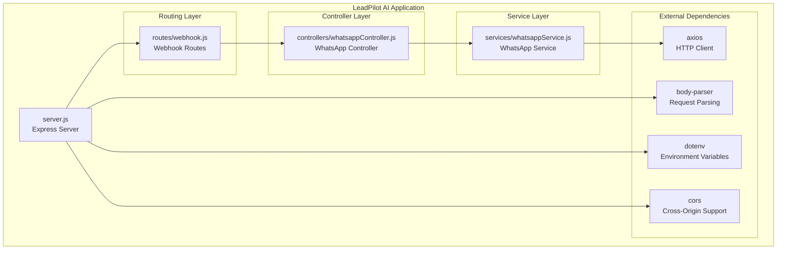
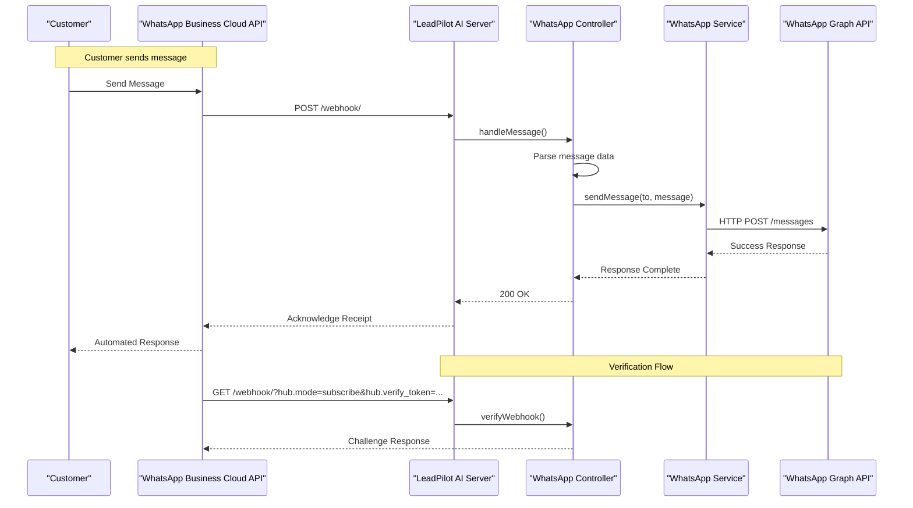
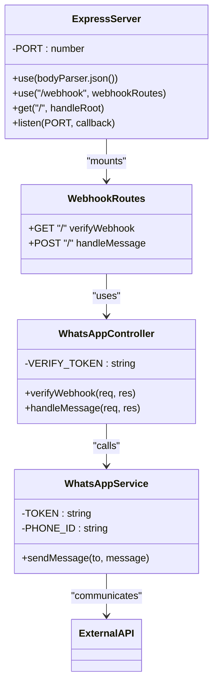
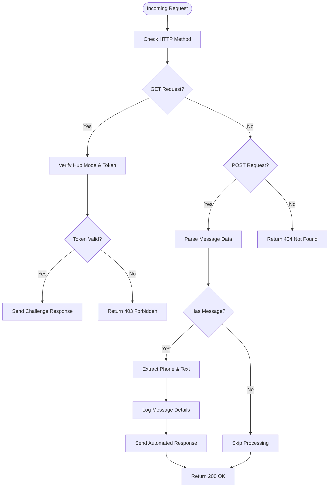
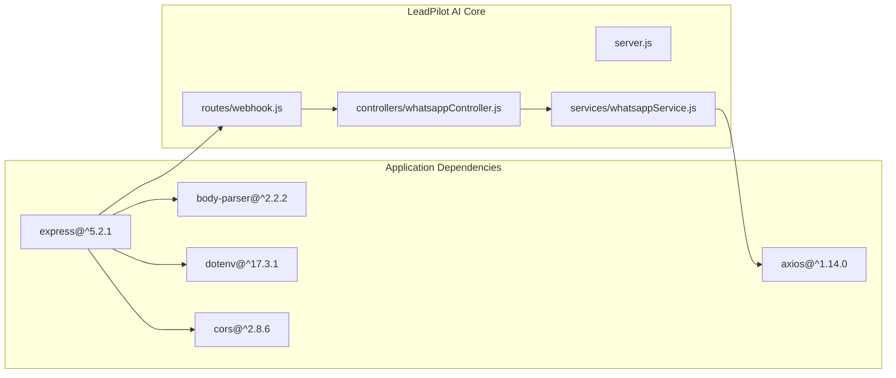

# Project Overview

<cite>
**Referenced Files in This Document**
- [package.json](file://leadpilot-ai/package.json)
- [server.js](file://leadpilot-ai/server.js)
- [webhook.js](file://leadpilot-ai/routes/webhook.js)
- [whatsappController.js](file://leadpilot-ai/controllers/whatsappController.js)
- [whatsappService.js](file://leadpilot-ai/services/whatsappService.js)
</cite>

## Table of Contents
1. [Introduction](#introduction)
2. [Project Structure](#project-structure)
3. [Core Components](#core-components)
4. [Architecture Overview](#architecture-overview)
5. [Detailed Component Analysis](#detailed-component-analysis)
6. [Dependency Analysis](#dependency-analysis)
7. [Performance Considerations](#performance-considerations)
8. [Troubleshooting Guide](#troubleshooting-guide)
9. [Conclusion](#conclusion)

## Introduction
LeadPilot AI is a WhatsApp Business automation SaaS platform designed to streamline customer engagement by automatically processing incoming messages and generating timely, contextual responses. The platform aims to improve lead conversion rates by ensuring customers receive immediate acknowledgment and guidance, reducing response latency and enhancing the overall customer experience on WhatsApp Business.

The system operates as a webhook-based service that integrates seamlessly with the WhatsApp Business Cloud API, enabling businesses to automate their customer communication workflows without manual intervention. By providing instant responses to customer inquiries, LeadPilot AI helps businesses capture leads more effectively and maintain consistent communication standards.

## Project Structure
The LeadPilot AI project follows a clean, modular architecture organized around the Model-View-Controller (MVC) pattern with clear separation of concerns:

**Diagram sources**
- [server.js:1-19](file://leadpilot-ai/server.js#L1-L19)
- [webhook.js:1-12](file://leadpilot-ai/routes/webhook.js#L1-L12)
- [whatsappController.js:1-40](file://leadpilot-ai/controllers/whatsappController.js#L1-L40)
- [whatsappService.js:1-23](file://leadpilot-ai/services/whatsappService.js#L1-L23)

**Section sources**
- [server.js:1-19](file://leadpilot-ai/server.js#L1-L19)
- [package.json:13-19](file://leadpilot-ai/package.json#L13-L19)

## Core Components
LeadPilot AI consists of four primary components that work together to deliver automated WhatsApp responses:

### Technology Stack Overview
The platform leverages modern JavaScript technologies to provide a robust, scalable solution:

- **Runtime Environment**: Node.js (CommonJS module system)
- **Web Framework**: Express.js for HTTP request handling and routing
- **API Communication**: Axios for external API interactions
- **Request Processing**: Body-parser for JSON payload parsing
- **Environment Management**: Dotenv for secure configuration management
- **Cross-Origin Support**: CORS middleware for flexible deployment

### Core Value Proposition
LeadPilot AI addresses the critical challenge of customer response delays in WhatsApp Business communication. By automating message processing and response generation, businesses can:
- Reduce customer wait times from hours to seconds
- Capture leads more effectively through immediate acknowledgment
- Maintain consistent brand messaging across all customer interactions
- Scale customer support without proportional increases in staff

### Target Audience
The platform serves businesses utilizing WhatsApp Business for customer engagement, including:
- E-commerce companies seeking to enhance customer service
- Real estate agencies managing property inquiries
- Service-based businesses requiring appointment scheduling
- Customer support teams handling high-volume inquiries
- Marketing departments automating lead qualification processes

### Key Benefits
- **Instant Response Capability**: Automated acknowledgments ensure customers never experience long wait times
- **Scalable Automation**: Handle unlimited concurrent conversations without additional human resources
- **Brand Consistency**: Standardized responses maintain professional communication standards
- **Lead Generation**: Immediate engagement increases conversion rates and customer satisfaction
- **Cost Efficiency**: Reduces operational costs while improving response quality

## Architecture Overview
The system employs a webhook-based architecture that responds to real-time events from the WhatsApp Business Cloud API:

**Diagram sources**
- [whatsappController.js:16-39](file://leadpilot-ai/controllers/whatsappController.js#L16-L39)
- [whatsappService.js:6-22](file://leadpilot-ai/services/whatsappService.js#L6-L22)
- [webhook.js:8-9](file://leadpilot-ai/routes/webhook.js#L8-L9)

### Business Workflow
The automated response workflow follows a streamlined process:

1. **Message Reception**: Customer sends message via WhatsApp Business
2. **Webhook Trigger**: WhatsApp Business Cloud API triggers webhook to LeadPilot
3. **Message Parsing**: Controller extracts relevant message data (phone number, text content)
4. **Response Generation**: Automated response template is prepared
5. **API Communication**: Service sends response through WhatsApp Graph API
6. **Confirmation**: System acknowledges successful delivery

**Section sources**
- [whatsappController.js:16-39](file://leadpilot-ai/controllers/whatsappController.js#L16-L39)
- [whatsappService.js:6-22](file://leadpilot-ai/services/whatsappService.js#L6-L22)

## Detailed Component Analysis

### Server Configuration
The Express server serves as the central hub for all application functionality:

**Diagram sources**
- [server.js:6-18](file://leadpilot-ai/server.js#L6-L18)
- [webhook.js:3-6](file://leadpilot-ai/routes/webhook.js#L3-L6)
- [whatsappController.js:1,27-31](file://leadpilot-ai/controllers/whatsappController.js#L1,L27-L31)
- [whatsappService.js:3-4](file://leadpilot-ai/services/whatsappService.js#L3-L4)

### Webhook Route Management
The routing layer handles both verification and message processing requests:

**Section sources**
- [webhook.js:8-9](file://leadpilot-ai/routes/webhook.js#L8-L9)

### Message Processing Logic
The controller implements a two-stage verification and processing flow:

**Diagram sources**
- [whatsappController.js:4-14](file://leadpilot-ai/controllers/whatsappController.js#L4-L14)
- [whatsappController.js:16-39](file://leadpilot-ai/controllers/whatsappController.js#L16-L39)

**Section sources**
- [whatsappController.js:4-14](file://leadpilot-ai/controllers/whatsappController.js#L4-L14)
- [whatsappController.js:16-39](file://leadpilot-ai/controllers/whatsappController.js#L16-L39)

### WhatsApp API Integration
The service layer manages all external communications with the WhatsApp Business Cloud API:

**Section sources**
- [whatsappService.js:6-22](file://leadpilot-ai/services/whatsappService.js#L6-L22)

## Dependency Analysis
The application maintains minimal, focused dependencies that support its core functionality:

**Diagram sources**
- [package.json:13-19](file://leadpilot-ai/package.json#L13-L19)
- [server.js:2-4](file://leadpilot-ai/server.js#L2-L4)

**Section sources**
- [package.json:13-19](file://leadpilot-ai/package.json#L13-L19)

## Performance Considerations
The current implementation prioritizes simplicity and reliability over advanced optimization features. Key performance characteristics include:

- **Request Processing**: Single-threaded event loop handling ensures efficient resource utilization
- **Memory Management**: Minimal memory footprint with automatic garbage collection
- **Network Efficiency**: Direct API calls minimize intermediate processing overhead
- **Scalability**: Stateless design enables horizontal scaling across multiple instances

## Troubleshooting Guide
Common issues and their resolutions:

### Webhook Verification Failures
- **Issue**: 403 Forbidden responses during webhook setup
- **Cause**: Incorrect verify token or hub mode mismatch
- **Solution**: Ensure verify token matches exactly and hub mode is set to "subscribe"

### Message Processing Errors
- **Issue**: Messages not being processed despite successful webhook reception
- **Cause**: Malformed message structure or missing required fields
- **Solution**: Verify message object contains expected properties (entry.changes.messages)

### API Communication Issues
- **Issue**: Failed responses from WhatsApp Graph API
- **Cause**: Invalid token, phone ID, or network connectivity problems
- **Solution**: Check environment variable configuration and network accessibility

**Section sources**
- [whatsappController.js:4-14](file://leadpilot-ai/controllers/whatsappController.js#L4-L14)
- [whatsappController.js:35-38](file://leadpilot-ai/controllers/whatsappController.js#L35-L38)
- [whatsappService.js:3-4](file://leadpilot-ai/services/whatsappService.js#L3-L4)

## Conclusion
LeadPilot AI represents a focused, efficient solution for WhatsApp Business automation. Its clean architecture, minimal dependencies, and straightforward webhook-based processing model provide a solid foundation for businesses seeking to enhance their customer engagement capabilities. The platform's emphasis on immediate response generation positions it to significantly improve lead conversion rates while maintaining operational efficiency.

The current implementation demonstrates core functionality with room for expansion in areas such as message templating, analytics reporting, and advanced conversation management. Future enhancements could include support for media responses, interactive message templates, and integration with CRM systems to provide even more comprehensive automation solutions.