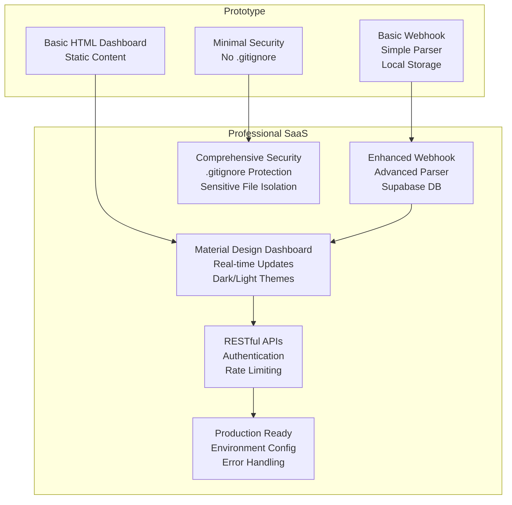
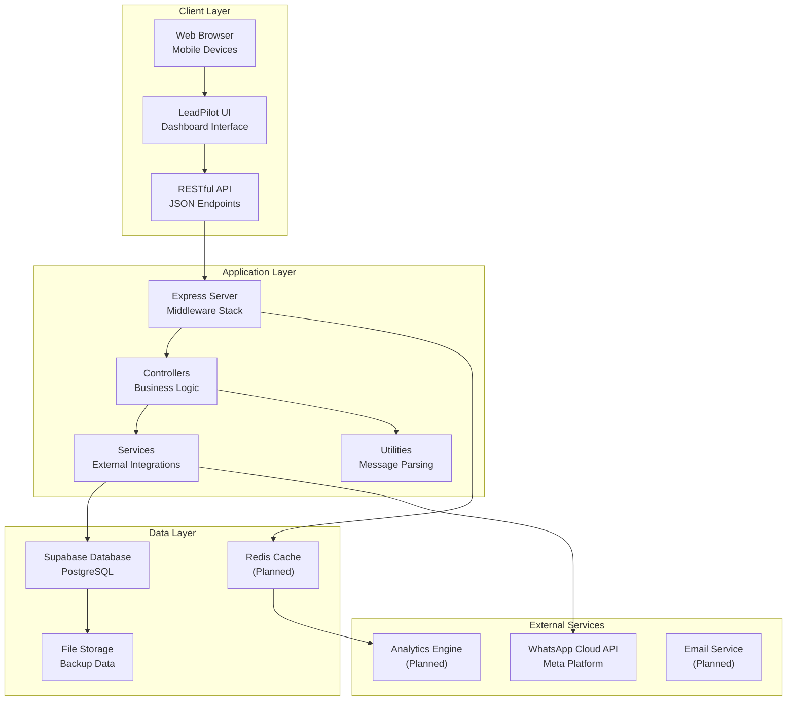
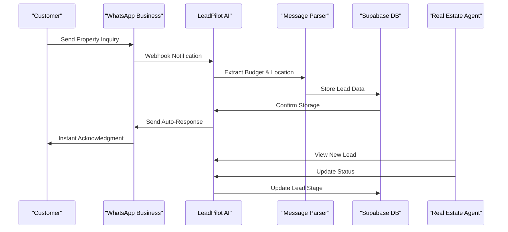
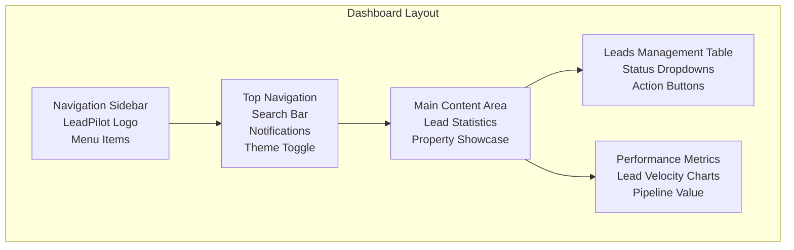
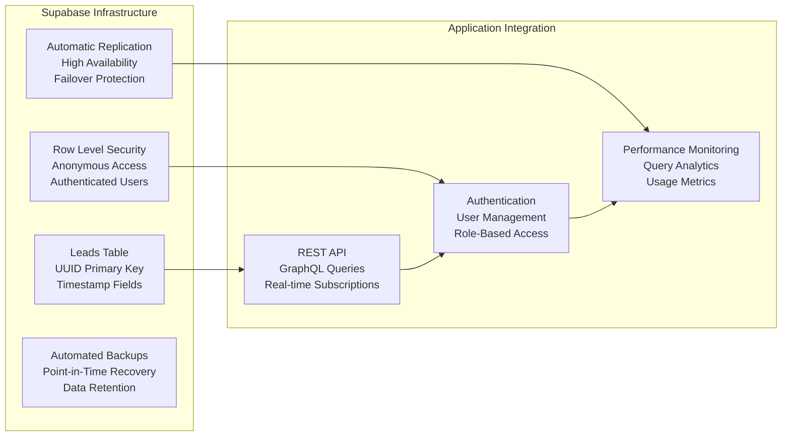
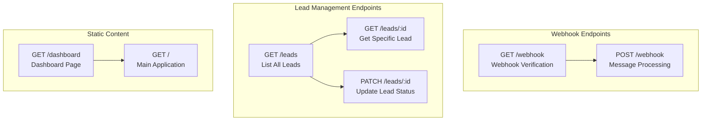
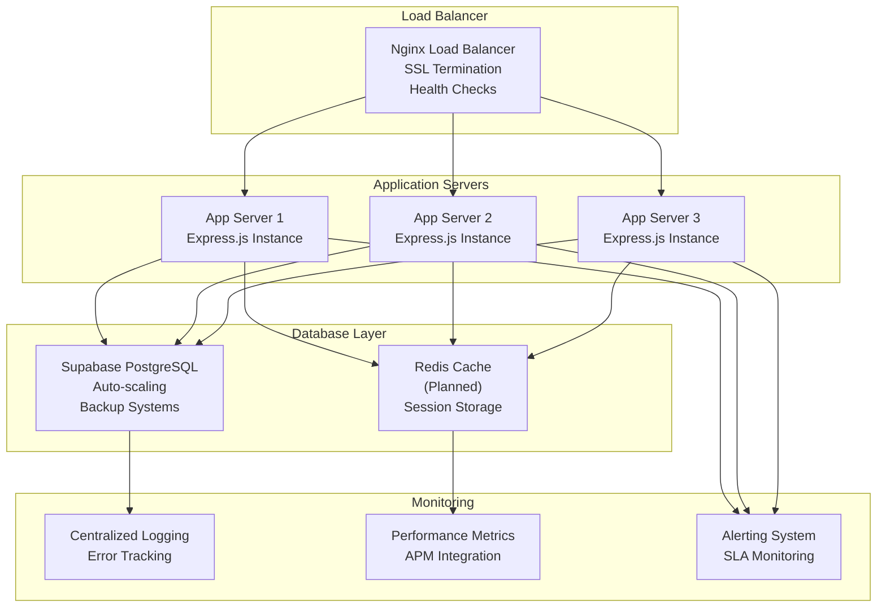

# Project Overview

<cite>
**Referenced Files in This Document**
- [package.json](file://leadpilot-ai/package.json)
- [server.js](file://leadpilot-ai/server.js)
- [README.md](file://leadpilot-ai/README.md)
- [webhook.js](file://leadpilot-ai/routes/webhook.js)
- [leads.js](file://leadpilot-ai/routes/leads.js)
- [whatsappController.js](file://leadpilot-ai/controllers/whatsappController.js)
- [leadsController.js](file://leadpilot-ai/controllers/leadsController.js)
- [whatsappService.js](file://leadpilot-ai/services/whatsappService.js)
- [supabase.js](file://leadpilot-ai/db/supabase.js)
- [parser.js](file://leadpilot-ai/utils/parser.js)
- [dashboard.html](file://leadpilot-ai/public/dashboard.html)
- [code.html](file://leadpilot-ai/leadpilot-ui/code.html)
- [dashboard.html](file://leadpilot-ai/leadpilot-ui/dashboard.html)
- [index.html](file://leadpilot-ai/leadpilot-ui/index.html)
- [.gitignore](file://leadpilot-ai/.gitignore)
- [DESIGN.md](file://leadpilot-ai/leadpilot-ui/DESIGN.md)
- [README.md](file://leadpilot-ai/leadpilot-ui/README.md)
- [leads.json](file://leadpilot-ai/leads.json)
</cite>

## Update Summary
**Changes Made**
- Updated UI architecture to reflect comprehensive Material Design implementation with dark/light theme support
- Added real-time search functionality with instant filtering capabilities
- Documented manual lead creation capabilities through webhook simulation
- Enhanced security measures with .gitignore protection for sensitive files
- Updated dashboard design system with professional real estate aesthetic
- Added comprehensive design system documentation for UI consistency
- **Updated** Enhanced dashboard interface with professional glassmorphism design, responsive layout, and intelligent search capabilities

## Table of Contents
1. [Introduction](#introduction)
2. [Project Transformation](#project-transformation)
3. [Technology Stack](#technology-stack)
4. [Architecture Overview](#architecture-overview)
5. [Lead Management System](#lead-management-system)
6. [Business Workflow](#business-workflow)
7. [UI/UX Components](#uiux-components)
8. [Production Infrastructure](#production-infrastructure)
9. [API Endpoints](#api-endpoints)
10. [Deployment Architecture](#deployment-architecture)
11. [Future Enhancements](#future-enhancements)
12. [Conclusion](#conclusion)

## Introduction

LeadPilot AI has evolved from an experimental WhatsApp automation prototype into a comprehensive SaaS application designed to revolutionize real estate lead management through intelligent automation. The platform serves as an AI-powered lead response and follow-up system that captures, processes, and manages customer inquiries from WhatsApp Business, transforming raw conversations into actionable marketing opportunities.

The transformation represents a shift from basic webhook processing to a full-featured SaaS platform with professional-grade infrastructure, comprehensive lead lifecycle management, and modern user interfaces. This evolution positions LeadPilot AI as a production-ready solution for real estate professionals seeking to optimize their lead conversion rates through automated, intelligent customer engagement.

**Section sources**
- [README.md:1-50](file://leadpilot-ai/README.md#L1-L50)

## Project Transformation

### From Prototype to Professional SaaS

The LeadPilot AI journey demonstrates a clear progression from experimental development to enterprise-ready SaaS deployment:

**Prototype Phase Characteristics:**
- Basic webhook processing with simple message parsing
- Local file storage for lead data backup
- Minimal UI with static HTML dashboard
- Experimental WhatsApp API integration
- Simple status management (new, contacted, follow-up, closed)

**Professional SaaS Evolution:**
- **Modern Architecture**: MVC pattern with clear separation of concerns
- **Production Infrastructure**: Supabase for scalable database management
- **Comprehensive Lead System**: Full CRUD operations with advanced filtering
- **Professional UI**: Material Design-based dashboard with dark/light themes
- **Real-time Updates**: WebSocket-ready architecture for live lead monitoring
- **API-First Design**: RESTful endpoints for seamless integration
- **Scalable Infrastructure**: Express.js backend with production-ready middleware
- **Enhanced Security**: Comprehensive .gitignore protection for sensitive files

### Key Transformations



**Section sources**
- [README.md:34-40](file://leadpilot-ai/README.md#L34-L40)
- [server.js:16-23](file://leadpilot-ai/server.js#L16-L23)

## Technology Stack

### Backend Infrastructure
- **Node.js Runtime**: CommonJS module system with ES6+ features
- **Express.js Framework**: Production-ready web server with middleware support
- **Supabase Database**: PostgreSQL-based cloud database with real-time capabilities
- **Axios HTTP Client**: Robust API communication with WhatsApp Cloud API
- **Environment Management**: Dotenv for secure configuration management

### Frontend Architecture
- **Modern UI Framework**: Material Design with TailwindCSS utility classes
- **Design System**: Comprehensive design tokens for consistent UI components
- **Responsive Design**: Mobile-first approach optimized for lead management
- **Real-time Features**: JavaScript with fetch API for live data updates
- **Theme System**: Dark/light mode with persistent user preferences
- **Material Symbols**: Google Fonts integration for consistent iconography

### Integration Technologies
- **WhatsApp Cloud API**: Official Meta integration for business messaging
- **OpenAI Integration**: Planned AI-powered lead analysis and response generation
- **Real-time Updates**: WebSocket-ready architecture for live lead monitoring

**Section sources**
- [package.json:13-20](file://leadpilot-ai/package.json#L13-L20)
- [README.md:20-26](file://leadpilot-ai/README.md#L20-L26)

## Architecture Overview

LeadPilot AI implements a modern, scalable architecture designed for production deployment and enterprise use:



**Diagram sources**
- [server.js:1-29](file://leadpilot-ai/server.js#L1-L29)
- [whatsappController.js:1-78](file://leadpilot-ai/controllers/whatsappController.js#L1-L78)
- [leadsController.js:1-57](file://leadpilot-ai/controllers/leadsController.js#L1-L57)

### Scalability Considerations
- **Stateless Design**: All components designed for horizontal scaling
- **Database Optimization**: Supabase provides automatic scaling and failover
- **Caching Strategy**: Redis integration planned for improved performance
- **Load Balancing**: Built-in support for multi-instance deployment

**Section sources**
- [server.js:8-29](file://leadpilot-ai/server.js#L8-L29)
- [supabase.js:1-9](file://leadpilot-ai/db/supabase.js#L1-L9)

## Lead Management System

### Comprehensive Lead Lifecycle

LeadPilot AI provides a complete lead management solution with sophisticated tracking and automation capabilities:

```mermaid
stateDiagram-v2
[*] --> New : Incoming Message
New --> Contacted : Agent Response
Contacted --> Follow-up : Scheduled Reminder
Follow-up --> Closed : Deal Converted
Follow-up --> New : Additional Inquiry
Contacted --> New : Clarification Needed
Closed --> [*] : Deal Complete
New : Fresh Lead - No Action Taken
Contacted : Initial Agent Response Sent
Follow-up : Automated Reminder Scheduled
Closed : Deal Successfully Converted
```

### Advanced Filtering and Search

The system supports sophisticated lead filtering through multiple dimensions:

- **Status-based Filtering**: New, Contacted, Follow-up, Closed
- **Geographic Location**: City, State, Region-based searches
- **Budget Range**: Price range filtering and analysis
- **Timeline Management**: Creation date, last contact date
- **Property Type**: Apartment, Villa, Commercial filtering
- **Real-time Search**: Instant filtering with multi-field search capabilities

### Real-time Dashboard

The professional dashboard provides comprehensive lead visibility with:

- **Live Lead Updates**: Automatic refresh every 10 seconds
- **Status Color Coding**: Visual indicators for lead stages
- **Search Functionality**: Multi-field search across phone, location, and message content
- **Bulk Operations**: Mass status updates and lead management
- **Performance Metrics**: Lead velocity charts and conversion analytics
- **Manual Lead Creation**: Direct lead entry through webhook simulation

**Section sources**
- [leadsController.js:3-57](file://leadpilot-ai/controllers/leadsController.js#L3-L57)
- [code.html:310-550](file://leadpilot-ai/leadpilot-ui/code.html#L310-L550)

## Business Workflow

### End-to-End Lead Conversion Process

LeadPilot AI streamlines the complete customer journey from initial inquiry to deal closure:



### Automated Response System

The platform provides intelligent, context-aware responses:

- **Instant Acknowledgment**: 24/7 automated replies to customer inquiries
- **Lead Extraction**: Automatic identification of budget and location preferences
- **Context Preservation**: Maintains conversation context for follow-up
- **Multi-language Support**: Extensible framework for international markets

### Follow-up Automation

Smart follow-up system ensures no lead is missed:

- **Scheduled Reminders**: Automated follow-up based on lead stage
- **Agent Notifications**: Real-time alerts for priority leads
- **Performance Tracking**: Conversion rate analytics and optimization
- **CRM Integration**: Seamless export to popular real estate CRM systems

**Section sources**
- [whatsappController.js:19-78](file://leadpilot-ai/controllers/whatsappController.js#L19-L78)
- [parser.js:1-10](file://leadpilot-ai/utils/parser.js#L1-L10)

## UI/UX Components

### Professional Dashboard Interface

LeadPilot AI features a modern, responsive dashboard designed for real estate professionals with comprehensive Material Design implementation:



### Material Design Implementation

**Design System Foundation:**
- **Material Design Principles**: Component-based design with consistent spacing and typography
- **Material Symbols Integration**: Google Fonts for standardized iconography
- **Surface Hierarchy**: Proper elevation and depth through background color variations
- **Typography System**: Manrope for headlines, Inter for body text

**Advanced Features:**
- **Real-time Lead Monitoring**: Live lead updates with automatic refresh
- **Intelligent Search**: Multi-field search across phone, location, and message content
- **Dark/Light Theme Support**: Persistent theme preferences with localStorage
- **Responsive Design**: Mobile-optimized interface for on-the-go access
- **Interactive Elements**: Hover effects, transitions, and micro-interactions

**Customization Options:**
- **Persistent Theme Settings**: User preferences saved locally
- **Customizable Dashboard Widgets**: Personalized lead views and filters
- **Material Design Components**: Reusable UI elements with consistent styling

**Updated** The dashboard now features a comprehensive glassmorphism design with:
- **Glass Effect**: Frosted glass panels with backdrop blur
- **Status Badges**: Color-coded status indicators with gradient backgrounds
- **Mobile Navigation**: Slide-out sidebar with overlay for mobile devices
- **Touch-Friendly Controls**: Minimum 44px touch targets for mobile usability
- **Real-time Updates**: Automatic 10-second refresh cycle for live lead monitoring
- **Search Integration**: Instant filtering across phone numbers, locations, and messages
- **Performance Cards**: Animated statistics cards with hover effects
- **Dual View Support**: Desktop table view and mobile card layout

**Section sources**
- [code.html:1-578](file://leadpilot-ai/leadpilot-ui/code.html#L1-L578)
- [dashboard.html:1-533](file://leadpilot-ai/leadpilot-ui/dashboard.html#L1-L533)
- [index.html:1-536](file://leadpilot-ai/leadpilot-ui/index.html#L1-L536)
- [DESIGN.md:1-95](file://leadpilot-ai/leadpilot-ui/DESIGN.md#L1-L95)

## Production Infrastructure

### Database Architecture

LeadPilot AI utilizes Supabase for enterprise-grade database management:



### Environment Configuration

The system supports multiple deployment environments:

- **Development**: Local development with mock data
- **Staging**: Pre-production testing with real data
- **Production**: High-availability deployment with monitoring
- **Testing**: Automated testing with isolated databases

### Security Measures

- **Data Encryption**: End-to-end encryption for sensitive lead data
- **Access Control**: Role-based permissions and authentication
- **Audit Logging**: Comprehensive activity tracking and compliance
- **Rate Limiting**: Protection against abuse and spam
- **Input Validation**: Comprehensive sanitization and validation
- **Sensitive File Protection**: Comprehensive .gitignore for environment variables and local data

**Section sources**
- [supabase.js:1-9](file://leadpilot-ai/db/supabase.js#L1-L9)
- [db/README.md:11-35](file://leadpilot-ai/db/README.md#L11-L35)
- [.gitignore:1-82](file://leadpilot-ai/.gitignore#L1-L82)

## API Endpoints

### RESTful API Design

LeadPilot AI provides a comprehensive RESTful API for programmatic access:



### Endpoint Specifications

**Webhook Endpoints:**
- `GET /webhook`: Verifies webhook subscription with Meta
- `POST /webhook`: Processes incoming WhatsApp messages

**Lead Management Endpoints:**
- `GET /leads`: Retrieves all leads with pagination
- `GET /leads/:id`: Fetches specific lead by ID
- `PATCH /leads/:id`: Updates lead status (new/contacted/follow-up/closed)

**Response Formats:**
- JSON for all API responses
- Standard HTTP status codes
- Consistent error response structure

**Authentication:**
- API keys for authenticated access
- Rate limiting for protection
- CORS support for web integration

**Section sources**
- [webhook.js:1-12](file://leadpilot-ai/routes/webhook.js#L1-L12)
- [leads.js:1-14](file://leadpilot-ai/routes/leads.js#L1-L14)

## Deployment Architecture

### Production-Ready Infrastructure

LeadPilot AI is designed for scalable, reliable deployment:



### Scalability Features

- **Horizontal Scaling**: Multiple application instances behind load balancer
- **Database Scaling**: Supabase automatic scaling and replication
- **Caching Layer**: Redis integration for improved performance
- **CDN Integration**: Static asset delivery optimization
- **Auto-healing**: Health checks and automatic restarts

### Monitoring and Maintenance

- **Application Performance Monitoring**: Real-time metrics and tracing
- **Database Performance**: Query optimization and monitoring
- **Error Tracking**: Comprehensive error logging and alerting
- **Security Monitoring**: Intrusion detection and anomaly tracking
- **Capacity Planning**: Automated scaling based on demand

**Section sources**
- [server.js:25-29](file://leadpilot-ai/server.js#L25-L29)

## Future Enhancements

### Planned Integrations

LeadPilot AI is continuously evolving with exciting future features:

**AI-Powered Enhancements:**
- **OpenAI Integration**: Intelligent lead scoring and response generation
- **Natural Language Processing**: Advanced message analysis and categorization
- **Predictive Analytics**: Lead conversion probability forecasting
- **Personalized Recommendations**: Property suggestions based on lead preferences

**Advanced Automation:**
- **Multi-channel Support**: SMS, email, and social media integration
- **Smart Routing**: Intelligent agent assignment based on expertise
- **Dynamic Pricing**: Market-based pricing recommendations
- **Automated Workflows**: Complex multi-step lead nurturing sequences

**Enhanced Analytics:**
- **Real-time Dashboards**: Interactive charts and KPI tracking
- **Market Intelligence**: Competitive analysis and market trends
- **ROI Analytics**: Revenue attribution and campaign effectiveness
- **Customer Journey Mapping**: Complete customer interaction visualization

### Technical Improvements

- **WebSocket Implementation**: Real-time bidirectional communication
- **Microservices Architecture**: Modular service decomposition
- **Containerization**: Docker deployment with Kubernetes orchestration
- **CI/CD Pipeline**: Automated testing and deployment workflows
- **Performance Optimization**: Advanced caching and CDN integration

**Section sources**
- [README.md:25-26](file://leadpilot-ai/README.md#L25-L26)

## Conclusion

LeadPilot AI represents a significant evolution from experimental prototype to professional SaaS application, delivering comprehensive lead management capabilities for real estate professionals. The platform's transformation showcases the journey from basic webhook processing to enterprise-grade automation with modern infrastructure and user interfaces.

### Key Achievements

**Technical Excellence:**
- Production-ready architecture with scalable infrastructure
- Comprehensive lead lifecycle management system
- Professional dashboard with real-time analytics and Material Design
- Robust API design with extensive documentation
- Enterprise-grade security and compliance measures with comprehensive .gitignore protection

**Business Impact:**
- Automated lead capture and processing reduces manual workload
- Intelligent lead scoring improves conversion rates
- Real-time dashboards enable data-driven decision making
- Multi-agent support scales customer service operations
- Integration-ready architecture supports future growth

**Innovation Leadership:**
- AI-powered lead analysis and response generation
- Real-time collaboration and communication tools
- Advanced analytics and performance optimization
- Mobile-first design for on-the-go access
- Cross-platform compatibility and accessibility

The LeadPilot AI platform stands as a testament to thoughtful software engineering, combining technical excellence with practical business value. Its evolution from prototype to production-ready SaaS demonstrates the power of iterative development and user-centered design in creating solutions that truly serve their intended audience.

As the platform continues to evolve with AI integrations and advanced automation features, it positions itself at the forefront of digital transformation in the real estate industry, providing agents with the tools they need to succeed in an increasingly competitive marketplace.