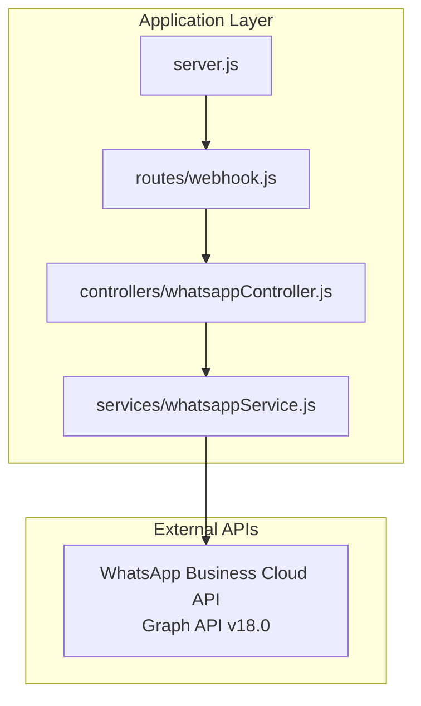
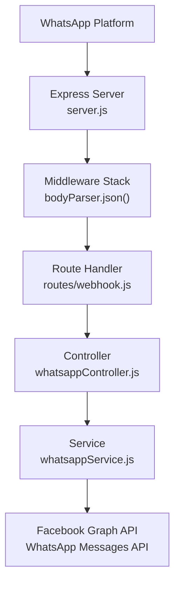
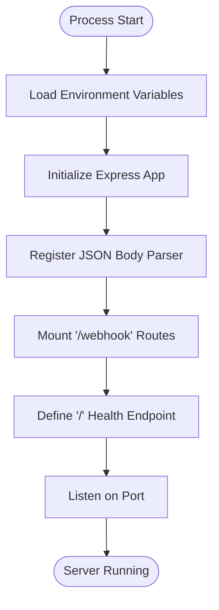
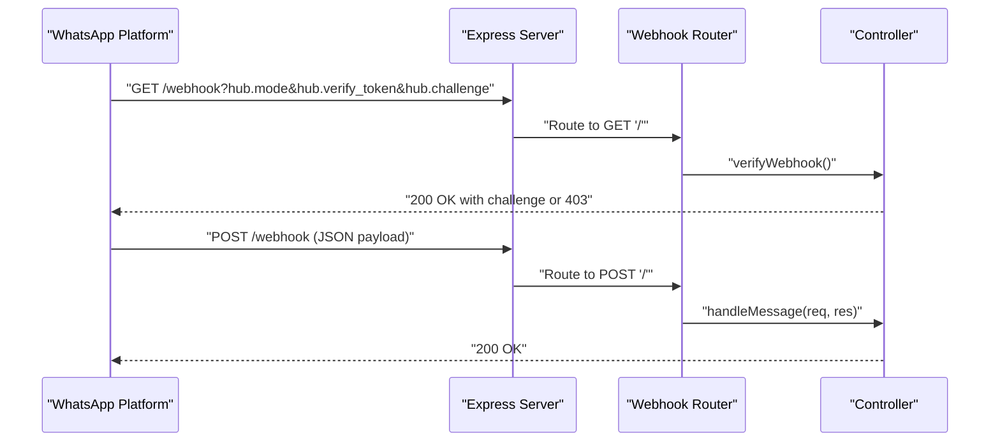
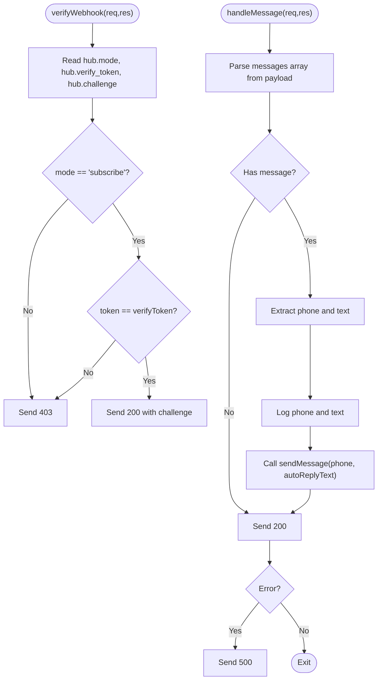
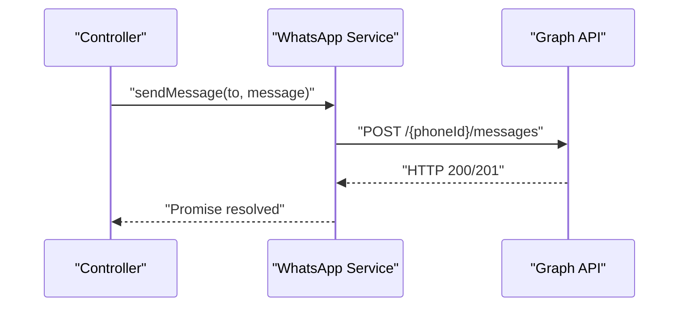
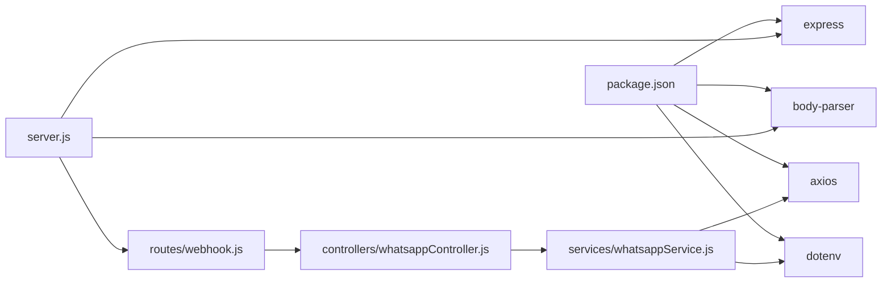

# System Architecture

<cite>
**Referenced Files in This Document**
- [server.js](file://leadpilot-ai/server.js)
- [webhook.js](file://leadpilot-ai/routes/webhook.js)
- [whatsappController.js](file://leadpilot-ai/controllers/whatsappController.js)
- [whatsappService.js](file://leadpilot-ai/services/whatsappService.js)
- [package.json](file://leadpilot-ai/package.json)
</cite>

## Table of Contents
1. [Introduction](#introduction)
2. [Project Structure](#project-structure)
3. [Core Components](#core-components)
4. [Architecture Overview](#architecture-overview)
5. [Detailed Component Analysis](#detailed-component-analysis)
6. [Dependency Analysis](#dependency-analysis)
7. [Performance Considerations](#performance-considerations)
8. [Security Considerations](#security-considerations)
9. [Scalability and Deployment Topology](#scalability-and-deployment-topology)
10. [Troubleshooting Guide](#troubleshooting-guide)
11. [Conclusion](#conclusion)

## Introduction
This document describes the system architecture of LeadPilot AI’s webhook integration with the WhatsApp Business Cloud API. The system follows a layered architecture with clear separation between server configuration, routing, controllers, and services. It implements an MVC-like pattern where routes define endpoints, controllers handle request/response logic and orchestrate service calls, and services encapsulate external API interactions. The document also covers the Express.js middleware stack, webhook verification and message handling flows, error handling strategy, and integration points with the WhatsApp Business Cloud API and Facebook Graph API.

## Project Structure
The project is organized into four primary layers:
- Server bootstrap and middleware configuration
- Routing layer exposing webhook endpoints
- Controller layer handling verification and message events
- Service layer interacting with the WhatsApp Business Cloud API

**Diagram sources**
- [server.js:1-19](file://leadpilot-ai/server.js#L1-L19)
- [webhook.js:1-12](file://leadpilot-ai/routes/webhook.js#L1-L12)
- [whatsappController.js:1-40](file://leadpilot-ai/controllers/whatsappController.js#L1-L40)
- [whatsappService.js:1-23](file://leadpilot-ai/services/whatsappService.js#L1-L23)

**Section sources**
- [server.js:1-19](file://leadpilot-ai/server.js#L1-L19)
- [webhook.js:1-12](file://leadpilot-ai/routes/webhook.js#L1-L12)
- [whatsappController.js:1-40](file://leadpilot-ai/controllers/whatsappController.js#L1-L40)
- [whatsappService.js:1-23](file://leadpilot-ai/services/whatsappService.js#L1-L23)
- [package.json:1-21](file://leadpilot-ai/package.json#L1-L21)

## Core Components
- Server bootstrap: Initializes Express, loads environment variables, registers middleware, mounts routes, and starts the HTTP server.
- Webhook route: Exposes GET and POST endpoints for webhook verification and inbound message handling.
- WhatsApp controller: Implements verification logic and message event handler with basic auto-reply functionality.
- WhatsApp service: Encapsulates outbound message sending to the Graph API using environment-provisioned credentials.

Key responsibilities:
- server.js: Application lifecycle, middleware stack, and endpoint exposure.
- routes/webhook.js: Endpoint mapping and HTTP verb routing.
- controllers/whatsappController.js: Request parsing, verification, and orchestration of automated responses.
- services/whatsappService.js: External API communication with error propagation.

**Section sources**
- [server.js:1-19](file://leadpilot-ai/server.js#L1-L19)
- [webhook.js:1-12](file://leadpilot-ai/routes/webhook.js#L1-L12)
- [whatsappController.js:1-40](file://leadpilot-ai/controllers/whatsappController.js#L1-L40)
- [whatsappService.js:1-23](file://leadpilot-ai/services/whatsappService.js#L1-L23)

## Architecture Overview
The system follows a layered MVC-like pattern:
- Server configuration and middleware stack are defined in server.js.
- Routes define the endpoint surface and delegate to controllers.
- Controllers interpret requests, validate parameters, and call services.
- Services encapsulate external API interactions and return results to controllers.

**Diagram sources**
- [server.js:1-19](file://leadpilot-ai/server.js#L1-L19)
- [webhook.js:1-12](file://leadpilot-ai/routes/webhook.js#L1-L12)
- [whatsappController.js:1-40](file://leadpilot-ai/controllers/whatsappController.js#L1-L40)
- [whatsappService.js:1-23](file://leadpilot-ai/services/whatsappService.js#L1-L23)

## Detailed Component Analysis

### Server Bootstrap and Middleware Stack
- Loads environment variables via dotenv.
- Initializes Express application.
- Registers JSON body parser middleware to parse incoming request bodies.
- Mounts webhook routes under the "/webhook" path.
- Serves a health check at "/" and listens on a configurable port.

**Diagram sources**
- [server.js:1-19](file://leadpilot-ai/server.js#L1-L19)

**Section sources**
- [server.js:1-19](file://leadpilot-ai/server.js#L1-L19)

### Route Layer: Webhook Endpoints
- Defines GET "/" for webhook verification.
- Defines POST "/" for inbound message events.
- Delegates to controller functions for verification and message handling.

**Diagram sources**
- [webhook.js:1-12](file://leadpilot-ai/routes/webhook.js#L1-L12)
- [whatsappController.js:1-40](file://leadpilot-ai/controllers/whatsappController.js#L1-L40)

**Section sources**
- [webhook.js:1-12](file://leadpilot-ai/routes/webhook.js#L1-L12)

### Controller Layer: Verification and Message Handling
- Verification:
  - Reads hub.mode, hub.verify_token, and hub.challenge from query parameters.
  - Validates mode equals "subscribe" and token equals configured verify token.
  - Returns challenge on success or 403 on mismatch.
- Message handling:
  - Extracts message details from nested payload structure.
  - Logs incoming message metadata.
  - Triggers automated response via service layer.
  - Returns 200 on successful processing or 500 on error.

**Diagram sources**
- [whatsappController.js:1-40](file://leadpilot-ai/controllers/whatsappController.js#L1-L40)

**Section sources**
- [whatsappController.js:1-40](file://leadpilot-ai/controllers/whatsappController.js#L1-L40)

### Service Layer: Outbound Messaging
- Sends outbound text messages to the Graph API using configured credentials.
- Uses environment variables for token and phone ID.
- Performs HTTP POST with required headers and message payload.

**Diagram sources**
- [whatsappService.js:1-23](file://leadpilot-ai/services/whatsappService.js#L1-L23)

**Section sources**
- [whatsappService.js:1-23](file://leadpilot-ai/services/whatsappService.js#L1-L23)

## Dependency Analysis
The application depends on Express for HTTP handling and axios for outbound API calls. The dependency graph is straightforward with clear directional dependencies from server to routes to controllers to services.

**Diagram sources**
- [package.json:1-21](file://leadpilot-ai/package.json#L1-L21)
- [server.js:1-19](file://leadpilot-ai/server.js#L1-L19)
- [webhook.js:1-12](file://leadpilot-ai/routes/webhook.js#L1-L12)
- [whatsappController.js:1-40](file://leadpilot-ai/controllers/whatsappController.js#L1-L40)
- [whatsappService.js:1-23](file://leadpilot-ai/services/whatsappService.js#L1-L23)

**Section sources**
- [package.json:1-21](file://leadpilot-ai/package.json#L1-L21)

## Performance Considerations
- Asynchronous processing: The controller uses async/await for outbound messaging, preventing blocking the event loop during network calls.
- Minimal middleware: Only JSON body parsing is enabled, reducing overhead.
- Single-threaded nature: Express applications are single-threaded by default; consider clustering for CPU-bound tasks.
- External API latency: Network latency dominates performance; implement retries and timeouts at the service layer if needed.
- Payload parsing: Ensure message payload sizes remain reasonable; consider streaming or chunking for large content.

[No sources needed since this section provides general guidance]

## Security Considerations
- Verification token: The controller validates the hub.verify_token against a hard-coded token. For production, store tokens securely and avoid hardcoded values.
- Environment variables: Credentials are loaded via dotenv; ensure .env is excluded from version control and secrets are managed via secure secret stores.
- CORS: The project does not explicitly configure CORS; consider adding a dedicated CORS middleware for cross-origin protection if the platform requires it.
- Input sanitization: Validate and sanitize inbound message payloads before processing to prevent injection or abuse.
- Transport security: Use HTTPS in production to protect traffic between WhatsApp and your server.
- Error handling: Avoid leaking sensitive information in error responses; log errors internally and return generic responses to clients.

**Section sources**
- [whatsappController.js:1-40](file://leadpilot-ai/controllers/whatsappController.js#L1-L40)
- [whatsappService.js:1-23](file://leadpilot-ai/services/whatsappService.js#L1-L23)
- [server.js:1-19](file://leadpilot-ai/server.js#L1-L19)

## Scalability and Deployment Topology
- Horizontal scaling: Deploy multiple instances behind a load balancer; ensure sticky sessions are not required for webhook endpoints.
- Health checks: Use the root endpoint for liveness/readiness probes.
- Secrets management: Externalize environment variables and tokens; rotate credentials regularly.
- Rate limiting: Implement rate limits at the service layer to avoid exceeding Graph API quotas.
- Observability: Add structured logging, metrics, and tracing for webhook verification and message handling.
- Containerization: Package the application in containers with minimal base images and non-root user execution.
- CDN and proxy: Place a reverse proxy or CDN in front of the application for DDoS mitigation and SSL termination.

[No sources needed since this section provides general guidance]

## Troubleshooting Guide
Common issues and resolutions:
- Verification failures:
  - Ensure hub.mode equals "subscribe".
  - Verify hub.verify_token matches the configured token.
  - Confirm hub.challenge is present and returned on success.
- Message handling errors:
  - Validate inbound payload structure and presence of messages array.
  - Check service credentials and phone ID.
  - Inspect logs for error messages and stack traces.
- Network connectivity:
  - Confirm outbound connectivity to Graph API endpoints.
  - Verify firewall and proxy configurations.
- Environment configuration:
  - Ensure dotenv is loading variables correctly.
  - Check for typos in environment variable names.

**Section sources**
- [whatsappController.js:1-40](file://leadpilot-ai/controllers/whatsappController.js#L1-L40)
- [whatsappService.js:1-23](file://leadpilot-ai/services/whatsappService.js#L1-L23)
- [server.js:1-19](file://leadpilot-ai/server.js#L1-L19)

## Conclusion
LeadPilot AI implements a clean, layered architecture that separates concerns across server configuration, routing, controllers, and services. The webhook integration follows the standard verification and event handling patterns for the WhatsApp Business Cloud API. While the current implementation is minimalistic, it provides a solid foundation for extending functionality, adding robust error handling, securing credentials, and scaling horizontally.

[No sources needed since this section summarizes without analyzing specific files]