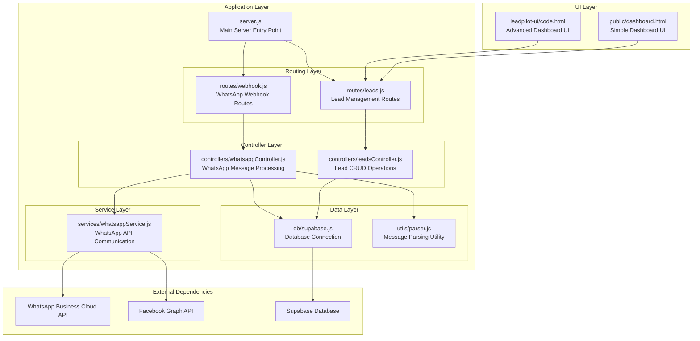
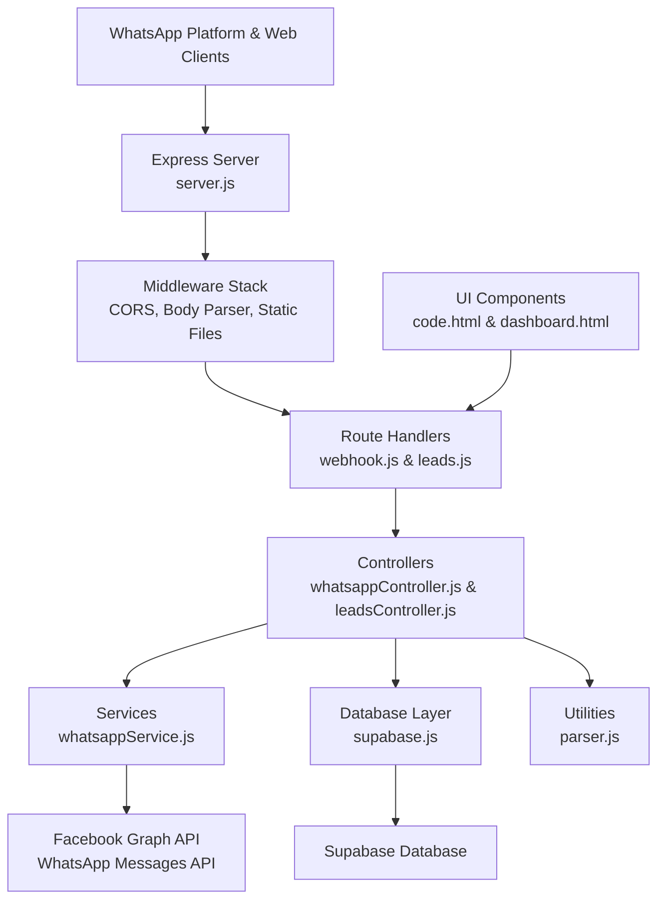
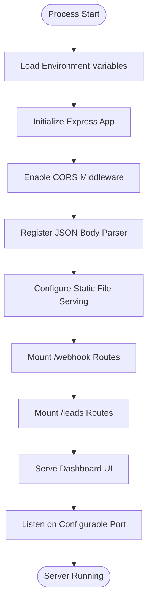
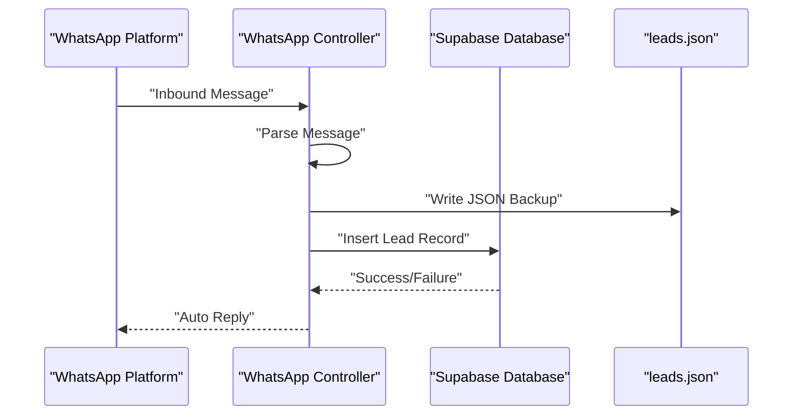
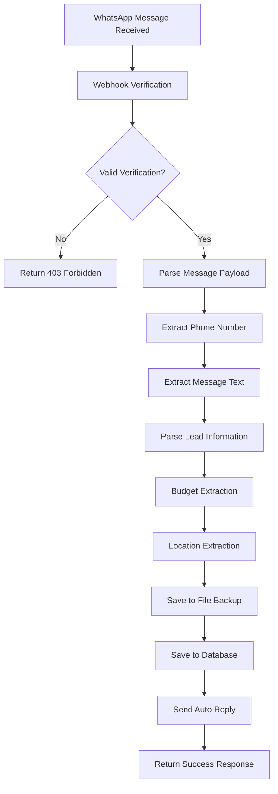
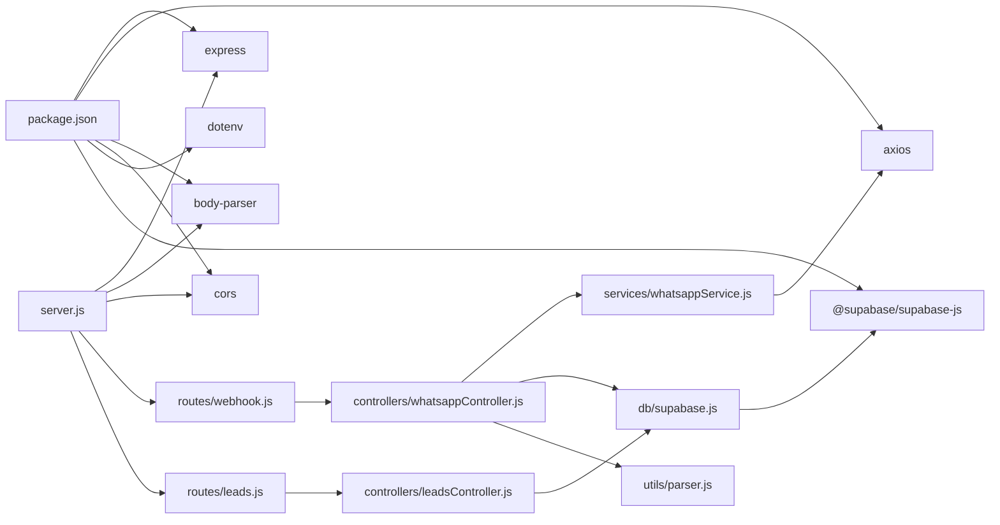

# System Architecture

<cite>
**Referenced Files in This Document**
- [server.js](file://leadpilot-ai/server.js)
- [webhook.js](file://leadpilot-ai/routes/webhook.js)
- [leads.js](file://leadpilot-ai/routes/leads.js)
- [whatsappController.js](file://leadpilot-ai/controllers/whatsappController.js)
- [leadsController.js](file://leadpilot-ai/controllers/leadsController.js)
- [whatsappService.js](file://leadpilot-ai/services/whatsappService.js)
- [supabase.js](file://leadpilot-ai/db/supabase.js)
- [parser.js](file://leadpilot-ai/utils/parser.js)
- [package.json](file://leadpilot-ai/package.json)
- [code.html](file://leadpilot-ai/leadpilot-ui/code.html)
- [dashboard.html](file://leadpilot-ai/public/dashboard.html)
- [leads.json](file://leadpilot-ai/leads.json)
</cite>

## Update Summary
**Changes Made**
- Updated architecture to reflect comprehensive migration from webhook-only system to modular Express.js architecture
- Added documentation for new directory structure with controllers, routes, services, and database layers
- Documented Supabase integration for lead management system
- Added UI components documentation with two different frontend implementations
- Enhanced lead management system with CRUD operations and advanced filtering
- Updated message parsing capabilities and automated response generation

## Table of Contents
1. [Introduction](#introduction)
2. [Project Structure](#project-structure)
3. [Core Components](#core-components)
4. [Architecture Overview](#architecture-overview)
5. [Detailed Component Analysis](#detailed-component-analysis)
6. [Database Integration](#database-integration)
7. [UI Components](#ui-components)
8. [Message Processing Pipeline](#message-processing-pipeline)
9. [Dependency Analysis](#dependency-analysis)
10. [Performance Considerations](#performance-considerations)
11. [Security Considerations](#security-considerations)
12. [Scalability and Deployment Topology](#scalability-and-deployment-topology)
13. [Troubleshooting Guide](#troubleshooting-guide)
14. [Conclusion](#conclusion)

## Introduction
This document describes the comprehensive system architecture of LeadPilot AI's integrated solution that has evolved from a simple webhook-only system to a full-featured SaaS platform. The system now implements a modern layered architecture with clear separation between server configuration, routing, controllers, services, database integration, and rich UI components. It provides automated WhatsApp lead capture, intelligent lead parsing, database-backed lead management, and sophisticated dashboard visualization with real-time updates.

## Project Structure
The project is organized into a comprehensive layered architecture with specialized directories for each component:

**Diagram sources**
- [server.js:1-29](file://leadpilot-ai/server.js#L1-L29)
- [webhook.js:1-12](file://leadpilot-ai/routes/webhook.js#L1-L12)
- [leads.js:1-14](file://leadpilot-ai/routes/leads.js#L1-L14)
- [whatsappController.js:1-78](file://leadpilot-ai/controllers/whatsappController.js#L1-L78)
- [leadsController.js:1-57](file://leadpilot-ai/controllers/leadsController.js#L1-L57)
- [whatsappService.js:1-23](file://leadpilot-ai/services/whatsappService.js#L1-L23)
- [supabase.js:1-9](file://leadpilot-ai/db/supabase.js#L1-L9)
- [parser.js:1-10](file://leadpilot-ai/utils/parser.js#L1-L10)
- [code.html:1-550](file://leadpilot-ai/leadpilot-ui/code.html#L1-L550)
- [dashboard.html:1-138](file://leadpilot-ai/public/dashboard.html#L1-L138)

**Section sources**
- [server.js:1-29](file://leadpilot-ai/server.js#L1-L29)
- [package.json:1-22](file://leadpilot-ai/package.json#L1-L22)

## Core Components
The system consists of several interconnected layers that work together to provide comprehensive lead management capabilities:

### Server Bootstrap and Middleware
- **Express Application**: Central server initialization with CORS support and JSON body parsing
- **Static File Serving**: Dual UI serving from both leadpilot-ui and public directories
- **Route Mounting**: Modular routing for webhook and leads endpoints

### Routing Layer
- **Webhook Routes**: Dedicated routes for WhatsApp webhook verification and message handling
- **Leads Routes**: RESTful endpoints for lead management operations

### Controller Layer
- **WhatsApp Controller**: Handles webhook verification, message parsing, lead extraction, and automated responses
- **Leads Controller**: Manages CRUD operations for lead records with Supabase integration

### Service Layer
- **WhatsApp Service**: Encapsulates outbound message sending to Facebook Graph API
- **Database Service**: Provides Supabase client configuration and connection management

### Utility Layer
- **Message Parser**: Extracts budget and location information from WhatsApp messages
- **File Backup**: Maintains JSON backup of leads alongside database storage

**Section sources**
- [server.js:1-29](file://leadpilot-ai/server.js#L1-L29)
- [webhook.js:1-12](file://leadpilot-ai/routes/webhook.js#L1-L12)
- [leads.js:1-14](file://leadpilot-ai/routes/leads.js#L1-L14)
- [whatsappController.js:1-78](file://leadpilot-ai/controllers/whatsappController.js#L1-L78)
- [leadsController.js:1-57](file://leadpilot-ai/controllers/leadsController.js#L1-L57)
- [whatsappService.js:1-23](file://leadpilot-ai/services/whatsappService.js#L1-L23)
- [supabase.js:1-9](file://leadpilot-ai/db/supabase.js#L1-L9)
- [parser.js:1-10](file://leadpilot-ai/utils/parser.js#L1-L10)

## Architecture Overview
The system follows a comprehensive layered MVC pattern with clear separation of concerns:

**Diagram sources**
- [server.js:1-29](file://leadpilot-ai/server.js#L1-L29)
- [whatsappController.js:1-78](file://leadpilot-ai/controllers/whatsappController.js#L1-L78)
- [leadsController.js:1-57](file://leadpilot-ai/controllers/leadsController.js#L1-L57)
- [whatsappService.js:1-23](file://leadpilot-ai/services/whatsappService.js#L1-L23)
- [supabase.js:1-9](file://leadpilot-ai/db/supabase.js#L1-L9)
- [code.html:1-550](file://leadpilot-ai/leadpilot-ui/code.html#L1-L550)
- [dashboard.html:1-138](file://leadpilot-ai/public/dashboard.html#L1-L138)

## Detailed Component Analysis

### Server Bootstrap and Middleware Stack
The server initialization provides a robust foundation with essential middleware and routing:

**Diagram sources**
- [server.js:1-29](file://leadpilot-ai/server.js#L1-L29)

**Section sources**
- [server.js:1-29](file://leadpilot-ai/server.js#L1-L29)

### Route Layer: Modular Endpoint Organization
The routing system provides clean separation between webhook and leads management:

#### Webhook Routes
- **GET /**: Handles webhook verification with challenge-response mechanism
- **POST /**: Processes inbound WhatsApp messages with comprehensive error handling

#### Leads Routes  
- **GET /**: Retrieves all leads with sorting by creation timestamp
- **GET /:id**: Fetches individual lead by ID
- **PATCH /:id**: Updates lead status with validation

**Section sources**
- [webhook.js:1-12](file://leadpilot-ai/routes/webhook.js#L1-L12)
- [leads.js:1-14](file://leadpilot-ai/routes/leads.js#L1-L14)

### Controller Layer: Business Logic Implementation

#### WhatsApp Controller
The controller orchestrates the complete message processing pipeline:

**Verification Process**:
- Validates webhook subscription with hub.mode, hub.verify_token, and hub.challenge
- Implements strict token validation for security
- Returns appropriate HTTP status codes

**Message Processing Pipeline**:
1. **Message Extraction**: Parses incoming message from complex nested payload structure
2. **Lead Parsing**: Uses utility parser to extract budget and location information
3. **Data Persistence**: Writes lead data to both JSON file and Supabase database
4. **Automated Response**: Sends acknowledgment message via WhatsApp API
5. **Error Handling**: Comprehensive error catching with graceful degradation

**Section sources**
- [whatsappController.js:1-78](file://leadpilot-ai/controllers/whatsappController.js#L1-L78)

#### Leads Controller
Provides complete CRUD operations for lead management:

**Get All Leads**: 
- Retrieves all leads sorted by creation timestamp (newest first)
- Implements comprehensive error handling

**Get Single Lead**:
- Fetches specific lead by ID with single result validation

**Update Lead Status**:
- Updates lead status with validation
- Supports status transitions: new → contacted → follow-up → closed

**Section sources**
- [leadsController.js:1-57](file://leadpilot-ai/controllers/leadsController.js#L1-L57)

### Service Layer: External API Integration

#### WhatsApp Service
Encapsulates all outbound messaging functionality:

**Configuration**:
- Uses environment variables for authentication tokens
- Configures Facebook Graph API endpoint for v18.0

**Message Sending**:
- Supports text messages with proper JSON payload structure
- Implements comprehensive error handling
- Returns Promise-based asynchronous operations

**Section sources**
- [whatsappService.js:1-23](file://leadpilot-ai/services/whatsappService.js#L1-L23)

## Database Integration
The system implements a dual-storage approach combining file-based backup with cloud database integration:

### Supabase Integration
- **Connection Management**: Centralized Supabase client configuration
- **Environment Configuration**: Secure credential management via environment variables
- **CRUD Operations**: Full database interaction capabilities

### Data Storage Strategy
**Primary Storage**: Supabase database for production data
**Backup Storage**: JSON file system for local backup and development
**Data Synchronization**: Automatic dual-write for reliability

**Diagram sources**
- [whatsappController.js:44-59](file://leadpilot-ai/controllers/whatsappController.js#L44-L59)
- [leads.json:1-6](file://leadpilot-ai/leads.json#L1-L6)

**Section sources**
- [supabase.js:1-9](file://leadpilot-ai/db/supabase.js#L1-L9)
- [leads.json:1-6](file://leadpilot-ai/leads.json#L1-L6)

## UI Components
The system provides two distinct user interface implementations to serve different use cases:

### Advanced Dashboard UI (leadpilot-ui/code.html)
A sophisticated Tailwind CSS-based interface with:

**Features**:
- Real-time lead table with dynamic status updates
- Advanced filtering by lead status (new, contacted, follow-up, closed)
- Dark/light theme toggle with localStorage persistence
- Live data refresh every 10 seconds
- Comprehensive search functionality across phone, location, message, and budget
- Interactive status dropdown for lead management
- Responsive design with Material Symbols icons
- Professional color scheme with gradient accents

**Technical Implementation**:
- Modern JavaScript ES6+ with async/await
- Comprehensive error handling and user feedback
- Local storage for theme preferences
- Real-time data synchronization

### Simple Dashboard UI (public/dashboard.html)
A lightweight HTML interface focused on basic functionality:

**Features**:
- Clean table-based lead display
- Basic status dropdown with immediate updates
- Simple loading states and error handling
- Direct API integration without complex JavaScript

**Section sources**
- [code.html:1-550](file://leadpilot-ai/leadpilot-ui/code.html#L1-L550)
- [dashboard.html:1-138](file://leadpilot-ai/public/dashboard.html#L1-L138)

## Message Processing Pipeline
The system implements a sophisticated message processing pipeline that transforms raw WhatsApp messages into actionable leads:

**Diagram sources**
- [whatsappController.js:19-77](file://leadpilot-ai/controllers/whatsappController.js#L19-L77)
- [parser.js:1-10](file://leadpilot-ai/utils/parser.js#L1-L10)

### Message Parsing Capabilities
The parser extracts structured information from unstructured WhatsApp messages:

**Pattern Matching**:
- **Budget Detection**: Supports various formats (digits, "L" for lakhs, "lakh" variations)
- **Location Detection**: Extracts city names following "in" or similar prepositions
- **Flexible Formatting**: Handles multiple budget representations and location formats

**Parsing Logic**:
- Uses regular expressions for pattern matching
- Returns structured object with budget and location fields
- Graceful fallback for unmatched patterns

**Section sources**
- [whatsappController.js:30-32](file://leadpilot-ai/controllers/whatsappController.js#L30-L32)
- [parser.js:1-10](file://leadpilot-ai/utils/parser.js#L1-L10)

## Dependency Analysis
The application maintains a clean dependency structure with clear directional relationships:

**Diagram sources**
- [package.json:13-20](file://leadpilot-ai/package.json#L13-L20)
- [server.js:1-6](file://leadpilot-ai/server.js#L1-L6)
- [whatsappController.js:3-5](file://leadpilot-ai/controllers/whatsappController.js#L3-L5)
- [leadsController.js:1](file://leadpilot-ai/controllers/leadsController.js#L1)

**Section sources**
- [package.json:1-22](file://leadpilot-ai/package.json#L1-L22)

## Performance Considerations
The system implements several performance optimization strategies:

### Asynchronous Processing
- **Non-blocking Operations**: All database and API calls use async/await
- **Parallel Processing**: Message parsing and database writes occur concurrently
- **Graceful Degradation**: Auto-reply failures don't block message processing

### Caching and Optimization
- **Live Updates**: Frontend automatically refreshes every 10 seconds
- **Efficient Filtering**: Client-side search with debounced input handling
- **Minimal Payloads**: Database queries use selective field retrieval

### Resource Management
- **Connection Pooling**: Supabase handles connection pooling efficiently
- **Memory Management**: File-based backup uses append-only operations
- **Network Optimization**: Single API call per message processing

## Security Considerations
The system implements multiple layers of security:

### Authentication and Authorization
- **Webhook Verification**: Strict hub.verify_token validation prevents unauthorized access
- **Environment Variables**: All credentials stored in environment variables
- **Secret Management**: Tokens and API keys loaded from secure environment configuration

### Input Validation and Sanitization
- **Payload Validation**: Comprehensive checking of incoming message structure
- **Parameter Validation**: Strict validation of route parameters and request bodies
- **SQL Injection Prevention**: Supabase ORM handles parameter binding safely

### Transport Security
- **HTTPS Requirement**: Production deployment should use HTTPS
- **CORS Configuration**: Controlled cross-origin resource sharing
- **Secure Headers**: Implementation of security best practices

### Error Handling and Logging
- **Sensitive Data Protection**: Error responses don't expose internal details
- **Audit Trail**: All lead operations logged for compliance
- **Graceful Degradation**: System continues operating even with partial failures

**Section sources**
- [whatsappController.js:7-16](file://leadpilot-ai/controllers/whatsappController.js#L7-L16)
- [whatsappService.js:3-4](file://leadpilot-ai/services/whatsappService.js#L3-L4)

## Scalability and Deployment Topology
The system is designed for horizontal scalability and flexible deployment:

### Horizontal Scaling
- **Stateless Design**: Controllers and services don't maintain session state
- **Database Independence**: Supabase provides managed scaling
- **Load Balancing**: Multiple instances can be deployed behind load balancers

### Microservice Architecture
- **Separation of Concerns**: Clear boundaries between components
- **Independent Scaling**: Database, API, and UI can scale independently
- **Technology Diversity**: Different components can use optimal technologies

### Deployment Options
- **Containerized Deployment**: Docker-compatible with environment variable configuration
- **Cloud-Native**: Designed for Kubernetes and cloud platform deployment
- **Serverless Options**: API endpoints can potentially run on serverless platforms

### Monitoring and Observability
- **Structured Logging**: Comprehensive logging for debugging and monitoring
- **Metrics Collection**: Database and API performance metrics
- **Health Checks**: Built-in health endpoints for monitoring systems

## Troubleshooting Guide
Comprehensive troubleshooting for common issues:

### Webhook Issues
- **Verification Failures**: Check hub.mode equals "subscribe", verify hub.verify_token matches configured token
- **Challenge Response**: Ensure hub.challenge is present and returned correctly
- **Endpoint Accessibility**: Verify webhook URL is publicly accessible and HTTPS-enabled

### Database Connectivity
- **Supabase Connection**: Verify SUPABASE_URL and SUPABASE_KEY environment variables
- **Network Connectivity**: Test database connectivity from server environment
- **Rate Limiting**: Monitor Supabase quota usage and adjust accordingly

### Message Processing Errors
- **Parser Failures**: Check message format and parser regex patterns
- **Auto-reply Issues**: Verify WhatsApp API credentials and phone ID configuration
- **File Backup**: Ensure write permissions for leads.json file

### UI and Frontend Issues
- **Static File Serving**: Verify public and leadpilot-ui directories are accessible
- **API Connectivity**: Check localhost API endpoints from browser
- **CORS Issues**: Verify CORS configuration allows frontend access

**Section sources**
- [whatsappController.js:7-16](file://leadpilot-ai/controllers/whatsappController.js#L7-L16)
- [leadsController.js:14-16](file://leadpilot-ai/controllers/leadsController.js#L14-L16)
- [whatsappService.js:6-21](file://leadpilot-ai/services/whatsappService.js#L6-L21)

## Conclusion
LeadPilot AI has evolved from a simple webhook integration to a comprehensive SaaS platform demonstrating modern architectural principles. The system successfully implements a layered architecture with clear separation of concerns, robust database integration, sophisticated UI components, and scalable deployment architecture. The modular design enables easy extension and maintenance while providing reliable lead management capabilities. The combination of automated message processing, intelligent lead parsing, and comprehensive dashboard visualization creates a powerful solution for real estate lead management.