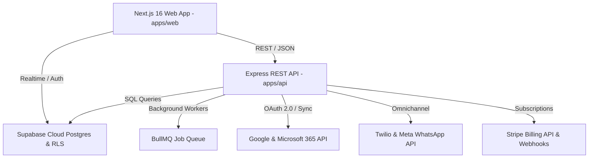

# LeadPilot AI CRM — Complete System Architecture Overview

**Version:** v4.0.0 GA  
**Architecture Pattern:** Monorepo Domain-Driven SaaS Architecture  

---

## Architecture Topology Diagram

---

## Module Directory Structure

- `apps/web/src/app/(dashboard)/`: 64 Next.js dashboard pages (`/leads`, `/deals`, `/properties`, `/tasks`, `/appointments`, `/communication`, `/automation`, `/integrations`, `/reports`, `/ai`, `/admin`).
- `apps/web/src/domain/`: Enterprise domain models & business engines (`AiIntelligenceEngine`, `ReportingEngine`, `ConnectorRegistry`, `AdminService`).
- `apps/api/controllers/`: 18 Express API controllers with Zod input validation.
- `apps/api/tests/`: 72 Jest contract test suites (363 tests).
