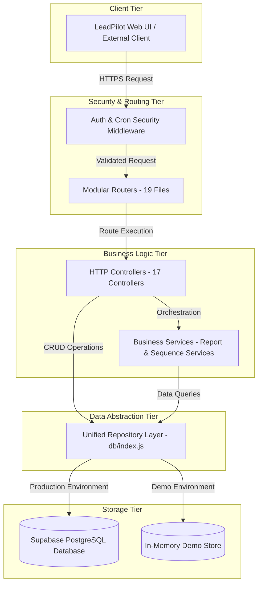
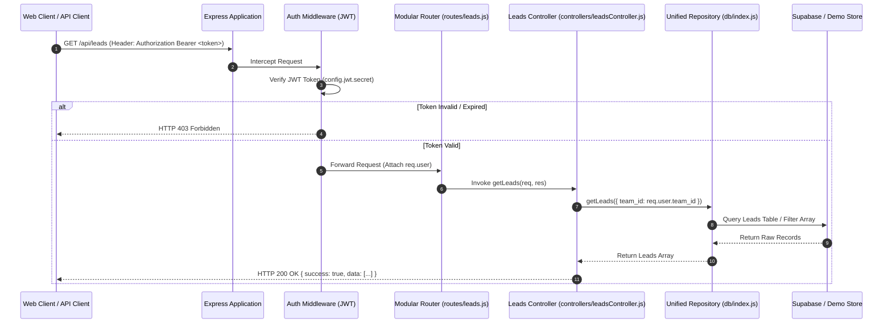
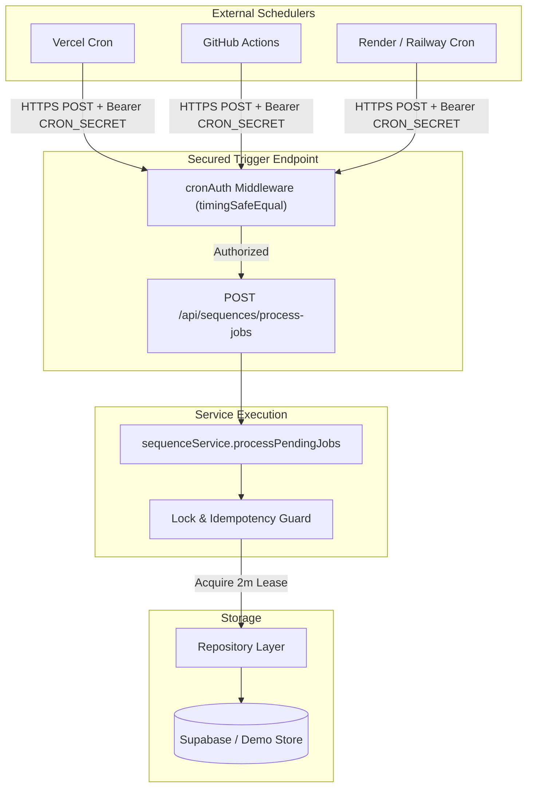
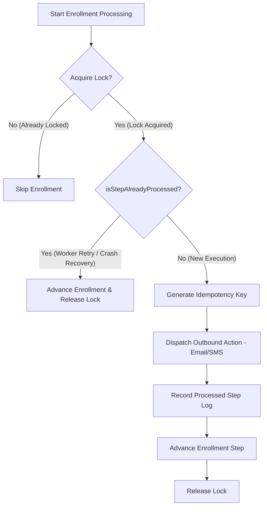

# LeadPilot AI — System Architecture & Engineering Documentation

This document provides a detailed technical overview of the architecture, design patterns, security mechanisms, and data access layers implemented in LeadPilot AI Version 1.0.

---

## 1. System Architecture Overview

LeadPilot AI follows a strict **Layered Component Architecture** with a **Repository Pattern** data abstraction. High-level requests pass through security and routing layers before reaching business logic controllers and services.



---

## 2. Component Responsibilities

| Architectural Layer | Core Directory | Responsibilities |
| :--- | :--- | :--- |
| **Configuration** | `config/` | Centralizes environment variables, validates startup parameters, throws fail-fast errors in production. |
| **Routing** | `routes/` | Defines API endpoints, maps HTTP verbs, attaches authentication middleware to specific endpoint groups. |
| **Middleware** | `middleware/` | Enforces authentication (JWT), multi-tenant isolation, rate limiting, and CRON header verification. |
| **Controllers** | `controllers/` | Validates request payloads, calls repository methods, formats HTTP JSON responses. **Contains ZERO direct database calls.** |
| **Services** | `services/` | Encapsulates complex multi-entity business workflows (PDF reporting, sequence execution). |
| **Repository** | `db/` | Hides underlying storage implementation (`Supabase` vs `Demo Store`). Exposes uniform CRUD interfaces. |
| **Persistence** | Supabase / DemoStore | Physical database (PostgreSQL) or in-memory arrays for demo execution. |

---

## 3. Detailed Request Lifecycle Flow



---

## 4. Background Job & Cron Architecture

To ensure 100% compatibility with serverless runtimes (Vercel, AWS Lambda) and containerized clusters (Render, Railway), in-process timers (`setInterval`) are completely replaced by an external HTTP Cron trigger architecture:



---

## 5. Concurrency Control, Locking & Idempotency

LeadPilot AI employs two complementary reliability mechanisms to guarantee zero duplicate communications (Email/SMS/WhatsApp) during worker retries or concurrent cron executions:

### A. Atomic Lease Locking (`acquireEnrollmentLock`)
Before processing a sequence enrollment, the worker attempts to acquire an atomic lock:
```sql
UPDATE sequence_enrollments
SET status = 'processing', locked_until = NOW() + INTERVAL '2 minutes'
WHERE id = $1 AND (locked_until IS NULL OR locked_until < NOW())
RETURNING *;
```
If another worker holds an active lease (`locked_until > NOW()`), the query returns `null` and the current worker skips the enrollment.

### B. Step-Level Idempotency (`recordProcessedStep`)
Immediately after a side-effect (e.g. sending an email via SendGrid) completes, the service records an idempotency log entry:
* **Deterministic Idempotency Key**: `seq_<sequence_id>_lead_<lead_id>_step_<step_index>`
* **Duplicate Detection**: Prior to executing a step, `repository.isStepAlreadyProcessed(enrollment_id, step_index)` is checked. If `true`, the step is skipped and the enrollment safely advances.



---

## 6. Execution Modes & Configuration Hardening

### Configuration Matrix

| Feature | Demo Mode | Development Mode | Production Mode |
| :--- | :--- | :--- | :--- |
| **Trigger Criteria** | `SUPABASE_SERVICE_KEY == 'demo_mode'` | `NODE_ENV == 'development'` | `NODE_ENV == 'production'` |
| **Storage Backend** | In-Memory `demoStore.js` | Supabase PostgreSQL | Supabase PostgreSQL |
| **JWT Secret** | `leadpilot_demo_secret_2024` | `leadpilot_dev_secret_key` | `process.env.JWT_SECRET` |
| **Cron Secret** | `leadpilot_demo_cron_secret_2024` | `leadpilot_demo_cron_secret_2024` | `process.env.CRON_SECRET` |
| **Startup Behavior** | Pre-seeds demo data | Validates config with dev warnings | **Fails fast & halts if secrets missing** |
