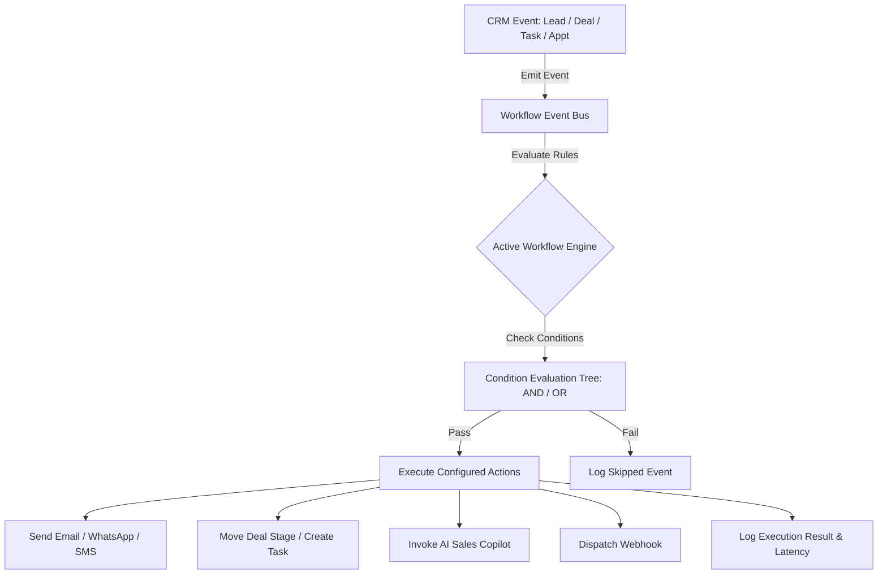

# LeadPilot AI CRM — Automation Bus & Execution Architecture

**Module:** Event Bus & Rule Execution Pipeline  
**Version:** v3.4.0  

---

## 1. Execution Flow Diagram

---

## 2. Condition Evaluation Engine

Supports recursive AND / OR trees evaluating:
- **Field Comparisons:** `EQUALS`, `NOT_EQUALS`, `CONTAINS`
- **Numeric Thresholds:** `GREATER_THAN`, `LESS_THAN`
- **Set Membership:** `IN`, `NOT_IN`
