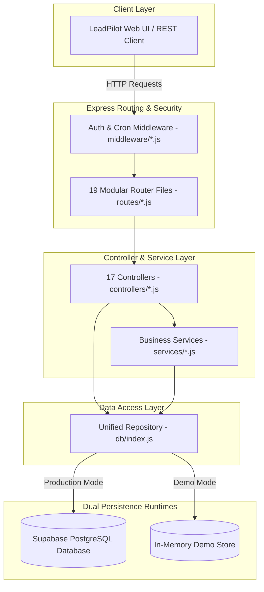

# LeadPilot AI — Production-Grade Real Estate CRM Backend

[](https://nodejs.org/)
[](LICENSE)
[](RELEASE_NOTES_v1.0.0.md)
[](ARCHITECTURE.md)

LeadPilot AI is a production-ready, enterprise-grade AI-powered Real Estate CRM backend built with Node.js, Express, and Supabase (PostgreSQL). Designed specifically to scale from local prototype to high-concurrency cloud environments (Vercel, Render, Railway, AWS), LeadPilot AI features a decoupled Repository Architecture, atomic lease locking, step-level idempotency, and serverless-compatible background job scheduling.

---

## 🌟 Key Features

* 📊 **Lead Management**: Full CRUD lead tracking with AI priority scoring (hot/warm/cold), budget tracking, and status pipeline.
* 🏷️ **Property Inventory**: Manage residential and commercial properties with location, pricing, and availability states.
* 💼 **Deal Pipeline**: Track deals across negotiation stages with automatic commission calculation and pipeline metrics.
* 📅 **Task & Appointment Scheduler**: Calendar-integrated appointment scheduling and task assignment for sales teams.
* 💬 **Omnichannel Messaging**: Integrated support for WhatsApp Business API, Twilio SMS, and SendGrid Email templates.
* 🔄 **Automated Sequence Workflows**: Multi-step automated lead follow-up sequences with delay timers and step execution.
* 📈 **Analytics & PDF Reporting**: Dynamic reporting dashboard with leads/deals conversion rates and downloadable HTML/PDF reports.
* 🛡️ **Multi-Tenant Team System**: Built-in multi-tenant organization support with team-isolated data access.
* 🧪 **Zero-Setup Demo Mode**: Operates out-of-the-box in 100% in-memory Demo Mode without requiring database installation or external API keys.
* 🔐 **Enterprise Security**: JWT-based authentication, timing-safe CRON header validation (`crypto.timingSafeEqual`), and production fail-fast environment checks.

---

## 📐 Architecture Overview

LeadPilot AI strictly enforces a decoupled, layered software architecture where business controllers never interact with storage implementations directly:



---

## 🛠️ Technology Stack

* **Core Runtime**: Node.js (v18+)
* **Web Framework**: Express.js (v4.18)
* **Database & BaaS**: Supabase (PostgreSQL 15+)
* **Authentication**: JSON Web Tokens (`jsonwebtoken`, `bcryptjs`)
* **Security & Hardening**: `helmet`, `cors`, `express-rate-limit`, `crypto.timingSafeEqual`
* **Integrations**: SendGrid Mail, Twilio SMS, WhatsApp Business API (Graph API v18.0)
* **Performance**: `compression`, `morgan`
* **Deployment Compatibility**: Vercel Serverless Functions, Render, Railway, AWS Lambda, Docker

---

## 🚀 Quick Start & Installation

### Prerequisites
* Node.js v18.0.0 or higher
* npm or yarn
* Supabase account *(optional — Demo Mode requires no database)*

### 1. Clone & Install Dependencies
```bash
git clone https://github.com/hariom-wdsadhunik/SaaS-Project.git
cd leadpilot-ai
npm install
```

### 2. Configure Environment Variables
Copy `.env.example` to `.env`:
```bash
cp .env.example .env
```

---

## ⚙️ Execution Modes

LeadPilot AI supports three primary execution environments:

### 1. Demo Mode (Zero Setup)
Runs out-of-the-box with pre-seeded in-memory data. No database or API keys required:
```bash
# Starts server in Demo Mode on port 3000
npm start
```
* **Demo Login**: `admin@leadpilot.ai` / `admin123`

### 2. Development Mode (Local Database)
Connects to your local or staging Supabase PostgreSQL instance:
```bash
NODE_ENV=development PORT=3000 npm start
```

### 3. Production Mode (Cloud / Container)
Enforces strict startup security validation:
```bash
NODE_ENV=production PORT=3000 JWT_SECRET=your_secure_secret CRON_SECRET=your_cron_secret npm start
```
> [!IMPORTANT]
> In `production` mode, `validateConfig()` will immediately throw a startup error and halt launch if `JWT_SECRET` or `CRON_SECRET` is missing.

---

## 🔑 Environment Variables Reference

| Variable | Description | Required in Prod? | Default / Fallback |
| :--- | :--- | :-: | :--- |
| `NODE_ENV` | Application environment (`development`, `production`, `test`) | Yes | `development` |
| `PORT` | Server listening port | No | `3000` |
| `JWT_SECRET` | Secret key for signing and verifying user JWT tokens | **YES** | Internal Demo Secret (Dev only) |
| `CRON_SECRET` | Bearer token for securing background cron endpoints | **YES** | Internal Demo Cron Secret (Dev only) |
| `SUPABASE_URL` | Supabase project URL | Yes (unless Demo) | `demo_mode` |
| `SUPABASE_SERVICE_KEY` | Supabase service role API key | Yes (unless Demo) | `demo_mode` |
| `WHATSAPP_ACCESS_TOKEN` | Meta Graph API access token for WhatsApp messaging | Optional | Gracefully Disabled |
| `EMAIL_API_KEY` | SendGrid API key for automated email delivery | Optional | Gracefully Disabled |
| `SEQUENCE_BATCH_SIZE` | Max enrollments processed per background cron execution | No | `50` |

---

## 🔌 API Summary

| Category | Endpoint | Method | Description | Auth Required |
| :--- | :--- | :-: | :--- | :-: |
| **Auth** | `/api/auth/login` | `POST` | User login & JWT issuance | Public |
| **Auth** | `/api/auth/me` | `GET` | Get current user profile | JWT |
| **Leads** | `/api/leads` | `GET` | List/filter leads | JWT |
| **Leads** | `/api/leads` | `POST` | Create new lead with AI priority | JWT |
| **Properties** | `/api/properties` | `GET` | List property inventory | JWT |
| **Deals** | `/api/deals` | `GET` | List sales pipeline deals | JWT |
| **Tasks** | `/api/tasks` | `GET` | List task assignments | JWT |
| **Reports** | `/api/reports/generate` | `POST` | Generate PDF/HTML performance report | JWT |
| **Sequences**| `/api/sequences` | `GET` | List lead sequence workflows | JWT |
| **Cron** | `/api/sequences/process-jobs` | `POST` | External trigger for background sequence execution | **CRON_SECRET** |
| **System** | `/health` | `GET` | Health check endpoint | Public |

---

## 📁 Repository Structure

```
leadpilot-ai/
├── config/             # Centralized configuration & startup validation (index.js)
├── controllers/        # 17 HTTP Controllers (Request validation & JSON response)
├── db/                 # Data Access Layer (index.js unified repository, demoStore.js)
├── middleware/         # Auth (auth.js), Tenant (tenant.js), Cron Auth (cronAuth.js)
├── routes/             # 19 Express Modular Routers
├── services/           # Business logic services (reportService, sequenceService)
├── leadpilot-ui/       # Frontend UI pages & assets
├── server.js           # Lightweight application bootstrap (108 LOC)
├── ARCHITECTURE.md     # In-depth system architecture documentation
├── CONTRIBUTING.md     # Open-source contribution guidelines
├── CHANGELOG.md        # Version changelog history
├── RELEASE_NOTES_v1.0.0.md # Version 1.0 Release Notes
└── LICENSE             # MIT License
```

---

## 🛡️ Production & Reliability Features

1. **Repository Abstraction Layer**: Controllers never issue database queries or check `if (isDemoMode)`. The repository (`db/index.js`) seamlessly routes calls to Supabase or the Demo Store.
2. **Atomic Lease Locking**: Prevents concurrent cron triggers from processing the same sequence enrollment simultaneously using 2-minute lease locks (`acquireEnrollmentLock` / `releaseEnrollmentLock`).
3. **Step-Level Idempotency**: Generates deterministic idempotency keys (`seq_<seq_id>_lead_<lead_id>_step_<step_idx>`) to prevent duplicate email, SMS, or WhatsApp dispatches during worker retries or crashes.
4. **Decoupled Serverless Cron Architecture**: Replaced in-process `setInterval` timers with an external HTTP cron trigger (`POST /api/sequences/process-jobs`) compatible with Vercel Cron, GitHub Actions, and Railway Cron.
5. **Constant-Time Verification**: Uses `crypto.timingSafeEqual` for CRON authorization to prevent timing side-channel attacks.

---

## 🧪 Testing & Verification

LeadPilot AI includes automated verification scripts covering runtime API smoke tests, concurrency simulations, and crash recovery:

```bash
# Run runtime API verification audit (21 tests)
node scratch/test_runtime.js

# Run worker concurrency lock simulation
node scratch/test_concurrency.js

# Run idempotency & crash recovery test suite
node scratch/test_idempotency.js
```

> [!NOTE]
> Fully automated Jest/Supertest unit and integration test suites are scheduled for **Version 1.1**.

---

## 🗺️ Product Roadmap

* **Version 1.0 (Current)**: Production Backend Architecture, Repository Pattern, Dual-Mode Store, Atomic Locking, Step Idempotency, Decoupled Cron Jobs.
* **Version 1.1 (Next Release)**: Automated Jest/Supertest Suite, GitHub Actions CI/CD Pipeline, Sentry Observability, Pino JSON Logging, Zod Schema Validation.
* **Version 1.2**: Advanced AI Lead Scoring Models, Dynamic Webhooks Engine, Multi-Currency Support.
* **Version 2.0**: Next.js 14 React Frontend Application, Real-Time WebSocket Collaboration.

---

## 📄 License

This project is licensed under the **MIT License** — see the [LICENSE](LICENSE) file for details.

Copyright (c) 2026 Hari Om Kumar
