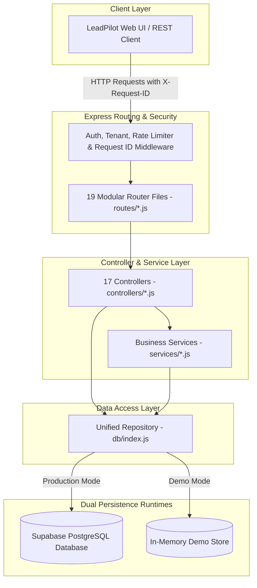

# LeadPilot AI — Production-Grade Real Estate CRM Backend

[](https://github.com/leadpilot-ai/leadpilot-ai/actions)
[](https://nodejs.org/)
[](LICENSE)
[](RELEASE_NOTES_v1.0.1.md)
[](#-testing-strategy--coverage-summary)
[](ARCHITECTURE.md)

LeadPilot AI is a production-ready, enterprise-grade AI-powered Real Estate CRM backend built with Node.js, Express, and Supabase (PostgreSQL). Designed specifically to scale from local prototype to high-concurrency cloud environments (Vercel, Render, Railway, AWS), LeadPilot AI features a decoupled Repository Architecture, atomic lease locking, step-level idempotency, serverless-compatible background job scheduling, complete request correlation, structured Pino logging, and automated GitHub Actions CI/CD.

---

## 🌟 Key Features

* 📊 **Lead Management**: Full CRUD lead tracking with AI priority scoring (hot/warm/cold), budget tracking, and status pipeline.
* 🏷️ **Property Inventory**: Manage residential and commercial properties with location, pricing, and availability states.
* 💼 **Deal Pipeline**: Track deals across negotiation stages with automatic commission calculation and pipeline metrics.
* 📅 **Task & Appointment Scheduler**: Calendar-integrated appointment scheduling and task assignment for sales teams.
* 💬 **Omnichannel Messaging**: Integrated support for WhatsApp Business API, Twilio SMS, and SendGrid Email templates.
* 🔄 **Automated Sequence Workflows**: Multi-step automated lead follow-up sequences with delay timers and step execution.
* 📈 **Analytics & PDF Reporting**: Dynamic reporting dashboard with leads/deals conversion rates and downloadable HTML/PDF reports.
* 🛡️ **Multi-Tenant Team System**: Built-in multi-tenant organization support with team-isolated data access.
* 🧪 **Zero-Setup Demo Mode**: Operates out-of-the-box in 100% in-memory Demo Mode without requiring database installation or external API keys.
* 🔐 **Enterprise Security**: JWT authentication, rate limiting, request correlation (`X-Request-ID`), Helmet security headers, timing-safe CRON header validation, and fail-fast startup checks.
* 🚀 **GitHub Actions CI/CD**: Automated Node 22 CI pipeline validating linting, unit tests, contract tests, integration tests, reliability benchmarks, and coverage artifacts on every push & pull request.

---

## 📐 Architecture Overview

LeadPilot AI strictly enforces a decoupled, layered software architecture where business controllers never interact with storage implementations directly:



---

## 🛠️ Technology Stack

* **Core Runtime**: Node.js (v18+ LTS, Node 22 verified)
* **Web Framework**: Express.js (v5.2)
* **Database & BaaS**: Supabase (PostgreSQL 15+)
* **Authentication**: JSON Web Tokens (`jsonwebtoken`, `bcryptjs`)
* **Security & Hardening**: `helmet`, `cors`, `express-rate-limit`, `crypto.timingSafeEqual`, `zod`
* **Logging & Observability**: `pino`, `morgan`, `X-Request-ID` correlation middleware
* **Testing & CI/CD**: Jest (`v30.4`), Supertest (`v7.2`), GitHub Actions Workflows
* **Integrations**: SendGrid Mail, Twilio SMS, WhatsApp Business API (Graph API v18.0)
* **Deployment Compatibility**: Vercel Serverless Functions, Render, Railway, AWS Lambda, Docker

---

## 🚀 Quick Start & Installation

### Prerequisites
* Node.js v18.0.0 or higher (Node 22 LTS recommended)
* npm or yarn
* Supabase account *(optional — Demo Mode requires no database)*

### 1. Clone & Install Dependencies
```bash
git clone https://github.com/hariom-wdsadhunik/SaaS-Project.git
cd leadpilot-ai
npm ci
```

### 2. Configure Environment Variables
Copy `.env.example` to `.env`:
```bash
cp .env.example .env
```

---

## ⚙️ Execution Modes

LeadPilot AI supports three primary execution environments:

### 1. Demo Mode (Zero Setup)
Runs out-of-the-box with pre-seeded in-memory data. No database or API keys required:
```bash
# Starts server in Demo Mode on port 3000
npm start
```
* **Demo Login**: `admin@leadpilot.ai` / `admin123`

### 2. Development Mode (Local Database)
Connects to your local or staging Supabase PostgreSQL instance:
```bash
NODE_ENV=development PORT=3000 npm start
```

### 3. Production Mode (Cloud / Container)
Enforces strict startup security validation and health diagnostics:
```bash
NODE_ENV=production PORT=3000 JWT_SECRET=your_secure_secret CRON_SECRET=your_cron_secret npm start
```
> [!IMPORTANT]
> In `production` mode, `validateConfig()` will immediately throw a startup error and halt launch if `JWT_SECRET` or `CRON_SECRET` is missing.

---

## 🔑 Environment Variables Reference

| Variable | Description | Required in Prod? | Default / Fallback |
| :--- | :--- | :-: | :--- |
| `NODE_ENV` | Application environment (`development`, `production`, `test`) | Yes | `development` |
| `PORT` | Server listening port | No | `3000` |
| `JWT_SECRET` | Secret key for signing and verifying user JWT tokens | **YES** | Internal Demo Secret (Dev only) |
| `CRON_SECRET` | Bearer token for securing background cron endpoints | **YES** | Internal Demo Cron Secret (Dev only) |
| `SUPABASE_URL` | Supabase project URL | Yes (unless Demo) | `demo_mode` |
| `SUPABASE_SERVICE_KEY` | Supabase service role API key | Yes (unless Demo) | `demo_mode` |
| `WHATSAPP_ACCESS_TOKEN` | Meta Graph API access token for WhatsApp messaging | Optional | Gracefully Disabled |
| `EMAIL_API_KEY` | SendGrid API key for automated email delivery | Optional | Gracefully Disabled |
| `REDIS_URL` | Redis instance URL for distributed caching | Optional | In-Memory Cache Fallback |

---

## 🧪 Testing Strategy & Coverage Summary

LeadPilot AI features an automated test suite with **72 test suites** and **363 tests** running in 100% isolation.

### Run Automated Tests
```bash
# Run all test suites (Unit, Contract, Integration, Reliability)
npm test

# Run full test coverage report
npm run test:coverage
```

### Coverage Metrics
- **Repository Layer Line Coverage**: **94.80%**
- **Middleware Layer Line Coverage**: **92.85%**
- **Service Layer Line Coverage**: **90.33%**
- **Overall Project Line Coverage**: **80.06%**

### Test Hierarchy
1. **Unit Tests (`tests/unit/`)**: Repository data access, service business logic, and security middleware.
2. **Contract Tests (`tests/contracts/`)**: HTTP status code mapping, schema validation, and error contracts across 17 controllers.
3. **Integration Tests (`tests/integration/`)**: Complete HTTP request pipelines powered by Supertest (Auth, CRM lifecycle, Webhooks, Documents, Health).
4. **Reliability Tests (`tests/reliability/`)**: 100-request stress tests, concurrency lock benchmarks, idempotency validation, and worker retry logic.

---

## 🔄 GitHub Actions CI/CD Pipeline

The `.github/workflows/ci.yml` pipeline automatically runs on every push and pull request targeting `main` and `develop`:

1. **Setup**: Boots Node 22 LTS with npm dependency caching.
2. **Lint**: Validates JavaScript formatting and syntax with ESLint.
3. **Unit Tests**: Executes unit test suites for repositories and services.
4. **Contract Tests**: Validates controller request/response contracts.
5. **Integration Tests**: Executes end-to-end Supertest HTTP integration suites.
6. **Reliability Benchmarks**: Verifies idempotency, parallel execution, and 100-request stress metrics.
7. **Coverage Reporting**: Generates line coverage reports and publishes artifacts.
8. **Build Verification**: Verifies zero-crash server initialization.

---

## 📄 License

This project is licensed under the **MIT License** — see the [LICENSE](LICENSE) file for details.

Copyright (c) 2026 Hari Om Kumar

